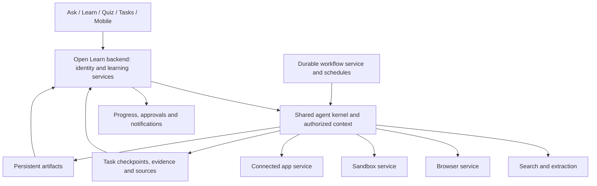

# General-purpose agent execution and learner integration

Status: planned scope extension requested 3 October 2026. Source: the user's supplied general-purpose agent proposal. This supplements the 30 September implementation brief; it does not describe shipped functionality or verified provider integrations.

## Product outcome and architecture

Open Learn teaches, researches, creates, executes, and acts while maintaining a persistent, evidence-backed understanding of the learner. Agent execution is a shared capability underneath Ask, Learn, and Quiz. A Tasks / Work surface also supports longer general requests; it uses the same kernel and identity, rather than a separate intelligence system.

Keep the existing Python FastAPI modular monolith and model-provider adapter. The backend owns identity, permissions, courses, conversations, learner state, sources, tasks, billing policy, and files. The agent kernel owns planning, context compilation, tool routing, the model/tool loop, checkpoints, interruption, recovery, and budget enforcement. Workflow infrastructure coordinates durable execution; it does not own pedagogy or tool policy.

Dependencies: [foundation](01_application_foundation.md), [shared contracts](02_shared_data_contracts.md), [identity](03_identity_and_device_sync.md), [evidence](04_evidence_ledger.md), [learner state](06_learner_state_and_retention.md), [source memory](08_source_memory.md), [context](09_shared_context_compiler.md), and [control plane](10_learning_control_plane.md). Integrate [study tasks](19_task_generation.md), [planning](21_study_planning.md), [frontend](23_api_and_frontend.md), [operations](24_production_operations.md), and [migration](25_migration_and_cutover.md).

Before adding abstractions, inspect journey_service.py, context_engine.py, model_provider.py, generation lifecycle, route ownership, durable jobs, and backend/app/browser_assistant. Inspect the existing browser UI, connection controls, reminder infrastructure, and browser assistant architecture documents. Reuse compatible contracts and record differences. Existing working-tree code is not evidence that this entire track is complete.

## Canonical contracts and lifecycle

An execution task is distinct from a chat message and from a planned study task. Reconcile naming with existing TaskSpec and browser task types. A study task may launch an execution task through an explicit execution_task_id; neither administrative completion nor an agent-produced answer establishes learner mastery.

ExecutionTask owns id, verified user_id, conversation_id, optional course_id and parent_task_id, goal, origin workflow, state, revision, creation/start/completion timestamps, checkpoint reference, budget and usage, authorized grant references, resources, artifact/source/approval references, and a safe error. Child tasks inherit narrower permissions and consume the parent's aggregate resource envelope.

States are queued, running, waiting_for_user, waiting_for_tool, sleeping, retrying, completed, failed, and cancelled. Resume is a revision-checked command that returns an eligible waiting task to queued/running; the UI may display resuming while dispatch completes. Define legal transitions, reasons, actors, leases, and terminal behavior outside the model. Failed tasks require an explicit retry decision; completed/cancelled tasks cannot silently restart. Check cancellation before every iteration and external operation, fence stale workers, release resources, and preserve already committed output.

Persist versioned checkpoints after validated iterations: model context references, tool operations/results, pending approvals, durable resource handles, and event cursor. Stream durable ordered events with reconnect/replay and owner checks. Never keep a database transaction open across a provider call. Reuse transactional outbox and job claims from the foundation; local SQLite and hosted PostgreSQL need compatible behavior with their respective concurrency limits.

## Capability services and routing

Define vendor-neutral SearchService, BrowserService, SandboxService, StorageService, ConnectedAppService, and WorkflowService with typed requests/results, deadlines, cancellation, safe errors, and provenance. Tools declare schemas, capability requirements, side-effect classification, approval requirements, resource/cost estimates, and result limits. The registry validates both arguments and results. The backend enforces policy before dispatch and again before committing a side effect.

Prefer an official connected API, then a connected-app provider, then browser automation for the same authorized operation. Use search/extraction for public research before opening a browser. Simple questions can use the model alone. Allocate no remote environment at task creation; acquire only the resources a chosen tool needs.

Search tools: search_web, fetch_url, extract_page. Preserve source URL, retrieval timestamp, immutable content/version reference, supporting passage, and claim-to-source links. Bound extraction size; enforce network destination policy, redirect checks, and private-network restrictions. Treat retrieved instructions as untrusted content rather than grants or system policy.

Sandbox tools: create_sandbox, run_command, run_python, read_file, write_file, install_package, collect_artifact, destroy_sandbox. Provide /workspace/uploads, /workspace/working, and /workspace/outputs, with Python, Node, shell, analysis, document generation, image processing, and bounded Git operations as permitted capabilities. Keep sandbox paths contained, restrict network and package policy, and pass only task-scoped inputs. Do not run model-generated shell commands in the trusted API/worker host. A local adapter must provide actual isolation or remain disabled; deterministic fake adapters support tests without cloud spend.

Browser tools: session creation, navigate, click, type, select, scroll, extract, screenshot, download, upload, and cleanup. Prefer DOM/Playwright operations and fall back to visual interpretation when appropriate. Downloads enter the artifact/source pipeline; uploads require explicit authorized file selection. Scope saved profiles to account and approved origins. Show Open Browser, Take Control, Return Control, Continue, and Stop. Authentication takeover enters waiting_for_user; suspend agent input while the user controls the browser. Keep passwords, cookies, tokens, and authentication screenshots out of model context and logs.

The [local Canvas reader](17_canvas_reader.md) remains the supported read-only ingestion path. General browser capabilities do not expand its grants, permit assignment submission, or bypass timed-quiz restrictions. Cloud browsing is an additional task-scoped capability subject to separate policy and product support decisions.

## Authorization, approvals, and reliable side effects

CapabilityGrant records verified owner, provider, capability, scope, creation, expiry, revocation, and credential broker reference. Examples include drive.read/write, gmail.read/send, calendar.read/write, github.read/write, and browser.authenticated. The model may request a capability but cannot create or widen grants. Authorize every task, event stream, resource, source, artifact, approval, and notification against the verified owner.

Require concrete previews and approval for email sends, publication, assignment submission where policy permits it, purchases, deletion, account creation, booking cancellation, calendar changes, and Git pushes. Bind approval to task, operation, normalized payload hash, scope, revision, expiry, and approving user. A changed payload invalidates approval. Rejecting an action must have a clear continuation or cancellation path. Existing narrower integration rules always apply.

Use a durable operation record keyed by task_id + operation_id, with normalized input hash, claim/fencing state, provider idempotency key, result reference, and reconciliation status. A database marker alone cannot close the crash window between an external action and its result commit. Use provider-supported idempotency or reconcile uncertain outcomes before retrying; require user recovery when neither is possible. Never promise exactly-once provider execution. Test the crash after external success and before local acknowledgment.

The backend and a credential broker own secrets. Workers receive short-lived scoped credentials; sandboxes receive only approved task inputs; browsers receive only authorized sessions. Redact tool output, traces, and checkpoints. Handle grant expiry/revocation during execution and prevent stale workers from continuing after Stop.

## Resources, artifacts, and learner evidence

TaskBudget specifies max_model_cost, max_searches, max_browser_minutes, max_sandbox_minutes, max_runtime, and max_tool_calls. Track usage and reservations atomically, including child tasks and retries. Enforce deadlines and limits in application code and provider calls, not only in prompts. Show remaining budget to the agent so it can choose cheaper tools or finish from existing evidence. Unknown pricing must have a bounded policy rather than count as free.

Resource records track provider handle, owner/task, lease, creation, last activity, timeout, cleanup state, and safe resume metadata. Use idle expiry, cleanup on terminal states, and a sweeper for failed cleanup and abandoned leases. Persist useful outputs before termination. Expiring browser profiles or sandbox snapshots are optimizations; relational task state and persistent object storage remain authoritative.

Artifact owns id, task_id, conversation_id, user_id, type, storage_key, mime_type, size/hash, source_provenance, version, created_at, and metadata. Support PDF, DOCX, PPTX, XLSX, CSV, charts, images, code, notes, flashcards, and datasets. Collect only verified files; commit durable storage metadata before presenting a download. Apply owner checks, safe previews, retention, export, deletion, and source-revision invalidation. Files shows Recent, Generated, Uploaded, and Course materials. Preserve lineage from source content through analysis to output, including generated analysis dependencies.

Use the shared context compiler to adapt explanations to current capability, prerequisites, uncertainty, and course scope. Agent output or lecture exposure can establish exposure only. Assisted learner work can establish assisted_success; independent_understanding requires a qualifying independent learner response accepted through the existing evidence/grading pipeline. Do not invent a second evidence ledger. Corrections and source deletion must propagate to derived memory and dependent outputs according to existing retention policy.

## User experience, scheduling, and operations

Tasks shows Running, Waiting for you, Completed, and Scheduled, with meaningful progress, sources, artifacts, error recovery, Stop, and Resume. Ask/Learn/Quiz can launch and link the same tasks. Reconnection restores canonical state, pending approvals, and event position. Closing the client must not cancel a hosted durable task; local-only execution clearly reports device availability and missed work.

Schedules own timezone, recurrence, next run, overlap/missed-run policy, owner, grant references, budget, and cancellation. Examples: Sunday study plans, daily announcements, pre-exam revision, and weekly learning summaries. Generate plans using the learner graph, confirmed exams, and availability through the planning service. Recheck authorization at each scheduled run. Deduplicate triggers and notification delivery; show last successful execution and actionable failures.

Trace task/model/tool/resource/approval/artifact events, duration, cost, tokens, retries, failures, takeover rate, and completion quality. Redact personal content and secrets. Completion, required approvals, and actionable failures can notify the user according to preferences. Native mobile via Expo is a later client of the same API, supporting Quick Ask, voice, camera/file uploads, artifact review, study reminders, approvals, and tested browser takeover.

## Provider candidates and decisions

Preserve the existing model adapter and hosting unless measured requirements justify changes. Candidate adapters from the supplied proposal are Tavily for initial search, Exa for research comparison, search-provider extraction before Firecrawl, E2B for sandboxing with Daytona comparison, Browserbase for cloud browsing with local Playwright support, Temporal for Python durable execution, PostgreSQL plus existing object storage (local filesystem, S3/R2, or Supabase Storage), Composio for broader app coverage, Langfuse for traces, and Expo/Expo Push for mobile. LangGraph is optional if its interruption/state machinery demonstrably simplifies the existing kernel. Trigger.dev is an alternative if workers move to TypeScript.

These are evaluation candidates, not purchases, current feature guarantees, or required dependencies for foundation tests. Validate current official documentation, pricing, retention, regional policy, isolation, mobile keyboard/takeover behavior, and recovery on actual workloads before selection. Keep provider SDKs inside adapters and credentials outside the model.

## Dependency-ordered delivery and acceptance

| Phase | Deliver together | Acceptance gate |
| --- | --- | --- |
| A — Kernel | Tasks, loop, registry, permissions, approvals, events, checkpoints, Stop/Resume, budgets, sources and artifacts; fake adapters | Run a task, pause for payload-bound approval, resume, cancel, deny another owner, exhaust budget, replay events, and recover a checkpoint without cloud services |
| B — Search | Search/extraction adapters, source storage, citations and research UX | Research whether spaced repetition improves retention and produce a sourced answer with inspectable supporting passages |
| C — Sandbox | Lazy isolated execution, input transfer, file collection and cleanup | Upload CSV, analyze it, produce a chart and downloadable XLSX/PDF, preserve outputs after environment termination |
| D — Browser | DOM controls, visual fallback, scoped profiles, uploads/downloads and takeover | Extract data from a JS-heavy site; pause for login, return control, resume, and terminate without logging authentication secrets |
| E — Durability | Workflow adapter, durable hosted worker, signals, retries, fencing and reconciliation | Kill/restart worker mid-task and after external success; continue from checkpoint without repeating side effects |
| F — Connected apps | Settings connections, scoped OAuth, revocation and preview/approval flows | Start with Drive, Gmail and Calendar; demonstrate read access, approved writes, denial/revocation, and uncertain-outcome recovery |
| G — Scheduling | Recurrence, learner-aware planning, missed/overlap policy and notifications | Run a study-plan schedule once per trigger, survive a retry, deliver deduplicated completion, and expose a waiting approval |
| H — Mobile | Expo client, notifications, approvals, takeover and artifacts | Complete the supported device matrix for reconnect, push, upload, review and mobile browser takeover |

Durable checkpoint and idempotency contracts begin in Phase A; Phase E adds the selected hosted workflow runtime. Identity, storage, frontend, observability, deletion, and migration integrate throughout. Each phase requires usable recovery paths and evidence of its acceptance gate, not just endpoints.

The golden integrated journey is: research inflation and unemployment, collect real data, analyze it with Python, create a chart and short report, explain at the learner's current level, quiz the learner afterward, survive a worker interruption, preserve all sources/artifacts, and notify on completion. Confirm that generated results establish no independent mastery and that the qualifying quiz response updates the canonical learner state. Repeat with account isolation, revoked grants, exhausted budget, cancellation, interrupted takeover, provider outage, and deleted source.
