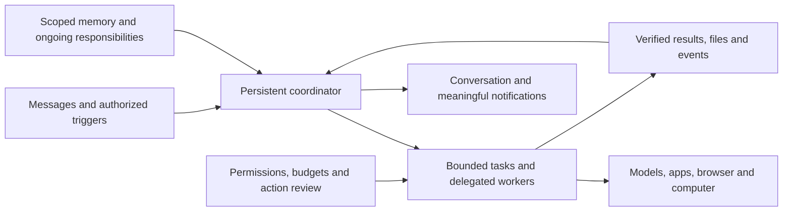
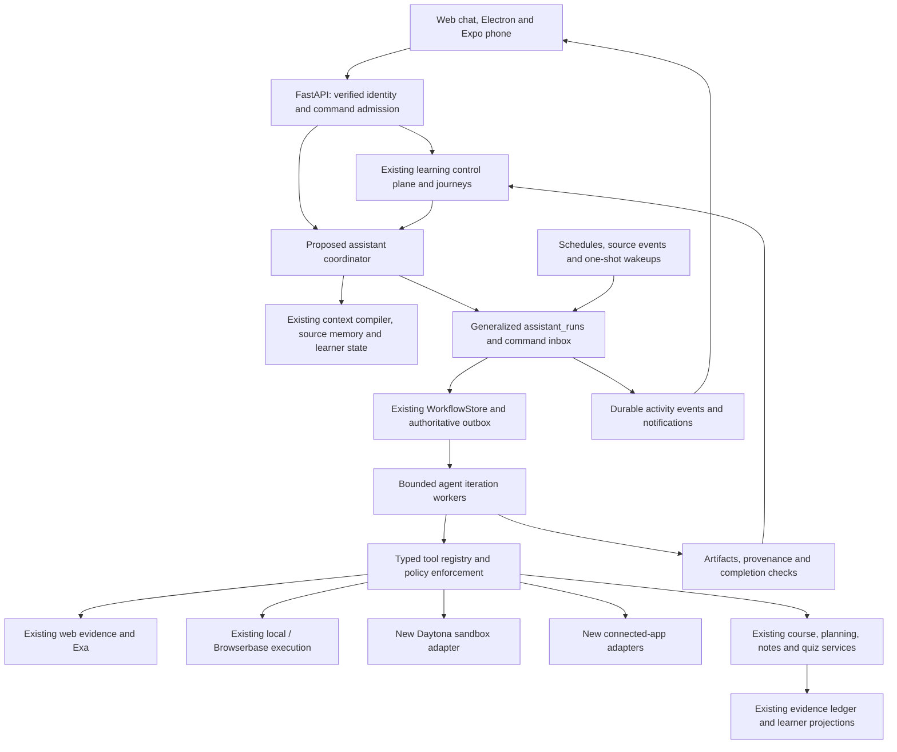

# General-purpose agent execution and learner integration

Milestone 4 progress (4 October 2026): browser handoff/control and observation UI are implemented locally, with 89 selected backend cases, 17 frontend cases, three controlled Chrome cases, TypeScript, targeted ESLint and production build passing. Full live provider/mobile acceptance, cloud crash handoff reconciliation and the complete application/companion journey remain open; this milestone is not fully accepted. See [milestone 4 record](../docs/AGENT_BROWSER_MILESTONE4.md).

Status: implementation authorized 4 October 2026. The first backend/web milestone now implements durable conversational execution with deterministic lab analysis; the concurrently authorized research milestone extends existing evidence retrieval and durable source-backed outputs. Slice 3 now implements bounded Daytona-backed CSV analysis, durable sandbox cleanup and explicit Journey teaching/QuizService practice continuation; local deterministic/API/UI verification is recorded in [Daytona implementation](../docs/AGENT_DAYTONA_IMPLEMENTATION.md). Live provider acceptance remains gated. Evidence and precise remaining gates are in [foundation implementation](../docs/AGENT_EXECUTION_FOUNDATION.md) and [research implementation](../docs/AGENT_RESEARCH_IMPLEMENTATION.md). The full slices 0–7 feature is not complete: live Daytona, native capture, hosted PostgreSQL acceptance and later capabilities remain unverified/unbuilt. Daytona is the user's preferred sandbox provider. Section 16 records proposed build defaults and remaining release decisions without presenting them as approved purchases or production policy.

Reading order for an implementing agent: sections 3–6 for existing ownership and execution; sections 7–9 for feature/UI contracts; section 16 for scope; sections 17–21 for implementation details; sections 12, 13 and 22 for sequencing and completion evidence. Sections 1–2 explain the research and critique. Where earlier options are broad, the build defaults below define the proposed initial implementation; existing compatibility and authorization constraints still apply.

## 1. What the research establishes

The useful lesson is continuity: a learner should be able to give Open Learn a responsibility, continue talking while work runs, and return later to inspect the result. A model with browser and terminal tools is only one part of that product.

| Public source | Documented behavior | Implication proposed for Open Learn |
| --- | --- | --- |
| [Grok Bot design](https://x.ai/news/designing-grok-bot) | Persistent bots; role-specific memory/routines; shared capabilities; inline objects; computer status, preview, and takeover | One learner-facing assistant, typed activity cards, scoped memory, and optional computer inspection |
| [Grok Bot 101](https://x.ai/bot/guides/grok-bot-101) | A cloud computer, app connections, event/schedule triggers, specialist delegation, and action review | Separate ongoing coordination from bounded execution; authorize actions at the backend |
| [Meet ChatGPT Dots](https://learn.chatgpt.com/docs/dots) | Ongoing work between conversations, saved context, cloud execution, and requests for user judgment | Introduce an explicit ongoing responsibility above individual tasks |
| [Dots tasks and memory](https://learn.chatgpt.com/docs/dots/tasks-and-memory) | Concurrent delegated work, later wakeups, recurring tasks, scoped task context, and distinct persistent notes | Durable wakeups, a command inbox, bounded child-task context, and inspectable operational memory |
| [Dots computers and apps](https://learn.chatgpt.com/docs/dots/computers-and-apps) | Cloud work can continue while devices are off; local work depends on the connected computer; takeover transfers control | Model execution location and control ownership explicitly |
| [Dots controls](https://learn.chatgpt.com/docs/dots/controls) | Permission review and different effects for pausing work, stopping a delegated task, and cancelling schedules | Give each control a precise backend command and explain its scope in the UI |
| [OpenAI Agents API overview](https://developers.openai.com/api/docs/guides/agents-api/overview) | A public managed runtime with agents, environments, durable sessions, events, and recovery | Evaluate runtime outsourcing separately from Open Learn's learning policies and data ownership |
| [xAI tools overview](https://docs.x.ai/developers/tools/overview) | Public model tools include search, code execution, function calling, and remote MCP | A model/tool API is distinct from the complete persistent-assistant product |

These sources establish product behavior and public API contracts. They do not establish either company's private database schema, scheduler implementation, sandbox vendor, message bus, or memory algorithm. We cannot conclude that Grok Bot or Dots uses Temporal, Daytona, LangGraph, or a particular database. The following conceptual architecture is an inference that explains the observed behavior, not a reverse-engineered implementation:



For Open Learn, the coordinator is a proposed backend service. It need not be a continuously running LLM or a permanently allocated VM. Durable responsibility records and wakeup events provide continuity; compute is leased when needed. This preserves the user's experience of an ongoing assistant without committing us to the competitors' undisclosed infrastructure.

## 2. Critique of the previous brief

| Gap in the initial proposal | Why it matters here | Revision |
| --- | --- | --- |
| Tasks were the highest-level object | A task cannot by itself represent “help me stay on top of this course all semester” | Add Responsibility and AssistantProfile; each responsibility creates bounded task runs |
| Most components were described as greenfield services | Open Learn already has browser runs, jobs, retrieval tools, memory, and evidence services | Specify reuse and migration boundaries against actual code |
| Tavily was recommended without inventorying search | The checkout already has Exa, quotas, tool validation, citations, and retention | Keep WebEvidenceService; evaluate Tavily behind its provider interface |
| E2B remained the first candidate | The user selected Daytona and its connection has now passed a live smoke test | Daytona becomes the first SandboxService adapter; integration remains unbuilt |
| Streaming and background lifetime were conflated | GenerationManager cancels disconnected interactive generations after a grace period | Keep task execution independent from subscribers and link its output to existing generations |
| “Memory” combined preferences, plans, and learning | Agent notes could become an accidental source of mastery or unsupported academic facts | Separate operational notes, source knowledge, user preferences, and learner evidence |
| Approval requirements were a blanket list | Repeated prompts can defeat useful ongoing delegation; login authority differs from action authority | Add explicit grant and standing-authorization scopes, with concrete review when required |
| A disposable sandbox implied disposable continuity | Files, installed dependencies, checkpoints, and browser state have different lifetimes | Persist manifests and objects; resume or reconstruct compute under policy |
| Mobile came last | Message-first phone use and lecture recording are central user requirements | Design and prototype mobile capture and chat alongside the foundation |
| No command or delegation contract | Follow-up messages can race with workers or create duplicate work | Add steering inboxes, dependency records, revision checks, and result verification |
| No definition of verified completion | A worker can exit successfully without producing a valid report or delivering it | Separate execution status, acceptance checks, delivery status, and learning outcome |
| Hosted prerequisites were implicit | A Vercel frontend cannot run the existing local database and background workers | Define web/API/worker/storage/mobile boundaries and readiness gates |

Retain the strongest original decisions: one intelligence layer under Ask/Learn/Quiz, vendor-neutral capabilities, lazy resource allocation, owner-scoped data, provenance, backend-enforced permissions, and no mastery credit for work performed by the agent.

## 3. Current code: reuse, extend, and reconcile

Baseline: commit `b71458c` plus the pre-existing working-tree changes inspected on 3 October. Browser assistant files and their integration edits are present locally but were not included in that commit. Code presence is not evidence of hosted readiness. This revision is based on inspection, not a new full regression run.

| Existing boundary | What the checkout contains | Integration decision |
| --- | --- | --- |
| [main.py](../backend/app/main.py), [identity.py](../backend/app/identity.py), [identity_middleware.py](../backend/app/identity_middleware.py) | FastAPI composition, verified principals, owner/device boundaries | New task/routine/artifact endpoints use the same principal; never accept a model-supplied owner |
| [journey_service.py](../backend/app/journey_service.py), [learning_control_plane.py](../backend/app/learning_control_plane.py) | Ask/Learn preparation, pedagogical decisions, delivery recording and commit validation | Preserve teaching ownership; add an execution handoff and consume verified task results |
| [context_compiler.py](../backend/app/context_compiler.py), [context_engine.py](../backend/app/context_engine.py) | Authorized source/state manifests and bounded model context | Extend approved purposes and budgets; do not build a competing retrieval/context store |
| [model_provider.py](../backend/app/model_provider.py) | Existing model transport and structured generation | Add capability-aware tool-step adaptation while keeping tutor/quiz provider compatibility |
| [web_evidence/service.py](../backend/app/web_evidence/service.py), [tools.py](../backend/app/web_evidence/tools.py), [loop.py](../backend/app/web_evidence/loop.py), [exa.py](../backend/app/web_evidence/exa.py) | Exa provider, search/open tools, material retrieval, bounded loop, citations, quotas and audit | Register these existing tools with the agent kernel; keep policy and source aliases authoritative |
| [browser_assistant/service.py](../backend/app/browser_assistant/service.py), [store.py](../backend/app/browser_assistant/store.py), [workers.py](../backend/app/browser_assistant/workers.py) | assistant_runs, steps/events, revision checks, jobs, bounded website execution and recovery | Generalize the run envelope incrementally; browser execution remains a typed capability |
| [browser_assistant/connections.py](../backend/app/browser_assistant/connections.py), [policy.py](../backend/app/browser_assistant/policy.py), [executors/cloud.py](../backend/app/browser_assistant/executors/cloud.py) | Local/public/cloud connections, Browserbase adapter, Playwright, scoped origins and login gates | Reuse adapters; do not silently relax the existing read policy when adding other capabilities |
| [workflow_store.py](../backend/app/workflow_store.py), [execution.py](../backend/app/execution.py), [execution_outbox.py](../backend/app/execution_outbox.py) | Durable jobs, claims, lease validation, retry/cancel, outbox support | Run bounded agent iterations through existing jobs first; choose one authoritative outbox path |
| [worker.py](../backend/app/worker.py), [execution_worker.py](../backend/app/execution_worker.py), browser assistant workers | Overlapping worker entrypoints and different job-kind dispatch paths | Inventory live startup/dispatch ownership before adding a worker; one handler/claim owner per kind |
| [generation_service.py](../backend/app/generation_service.py), [generation_store.py](../backend/app/generation_store.py), [generation-stream.ts](../web/lib/generation-stream.ts) | Replayable generation events and explicit cancellation/disconnect handling | Keep generation IDs separate from execution task IDs; project task progress into chat |
| [source_memory.py](../backend/app/source_memory.py), [evidence_ledger.py](../backend/app/evidence_ledger.py), [unified_learner_state.py](../backend/app/unified_learner_state.py) | Revisioned memory, dependent invalidation, evidence admission, canonical state reduction | Agent notes use memory; learner performance enters only through the existing evidence owners |
| [academic_planning.py](../backend/app/academic_planning.py), [browser_assistant/reconciliation.py](../backend/app/browser_assistant/reconciliation.py) | Academic ingestion, fact reconciliation, study tasks, readiness and planning | Tools call these services; never directly overwrite course facts or planning projections |
| [lecture_service.py](../backend/app/lecture_service.py), [lecture_pipeline.py](../backend/app/lecture_pipeline.py), [lecture-upload-queue.ts](../web/lib/lecture-upload-queue.ts) | Recording lifecycle, chunk uploads, transcription/derivation and recovery | Mobile adds a native capture/upload client to the same contract |
| [object_store.py](../backend/app/object_store.py), [identity_data.py](../backend/app/identity_data.py), [identity_import.py](../backend/app/identity_import.py) | Local/S3 object abstraction, export/delete and import exclusions | Add agent artifact and resource cleanup coverage to the same lifecycle |
| [browser-assistant.ts](../web/lib/browser-assistant.ts), [browser-task-card.tsx](../web/components/browser-task-card.tsx), [learn-chat.tsx](../web/components/learn-chat.tsx), [compact-tutor-chat.tsx](../web/components/compact-tutor-chat.tsx) | Website intent interception, task cards and polling alongside tutor chat | Replace client-side website-only routing with one server admission decision and unified activity items |
| [browser_assistant/reminders.py](../backend/app/browser_assistant/reminders.py) | Academic reminders, notification delivery, browser push and refresh scheduling | Extend the trigger/delivery contracts; Expo push is an additional channel |

Two concrete compatibility issues need explicit work. ContextCompileRequest and SourceMemory.retrieve currently recognize teaching, assessment, readiness, and planning; a generic “execution” purpose cannot simply be passed today. Browser TaskIntent is likewise a restricted list of website/academic operations and explicitly refuses external writes. Generalization requires versioned contracts and tests, not just a longer prompt.

The existing GenerationDescriptor is for Ask/Learn. Quiz continues through its assessment pipeline. The shared execution capability must preserve these distinctions instead of forcing every workflow through an incompatible generation record.

## 4. Target architecture and ownership

Open Learn presents one learning assistant across web, desktop, and phone. Ask, Learn, and Quiz remain supported workflows. A learner can also assign ongoing responsibilities and general work. Specialist workers are implementation roles first; a visible roster of named bots is optional future UX.



The coordinator handles intent, responsibilities, delegation, incoming steering, and communication. The kernel executes one bounded step and returns typed results. The learning control plane chooses teaching and assessment behavior. Application policy owns authorization, quotas, revisions, and admission. None of these responsibilities is delegated to a provider's prompt alone.

## 5. Domain objects and state

Use current owner_id and session_id naming; session_id refers to the existing learning conversation. New names below are proposed logical contracts. Prefer additive columns/related tables over duplicate stores.

| Object | Purpose and essential fields |
| --- | --- |
| AssistantProfile | Owner, name/preferences, enabled capabilities, default notification policy, revision; one default profile initially |
| Responsibility | Owner/profile, goal, course/scope, desired outcome, start/end, authorized actions, budget period, notification rules, status, revision; examples include weekly course preparation |
| ExecutionTask | Generalized assistant_runs envelope: existing ID, owner, session, kind, responsibility/parent IDs, request, desired outputs, state, wait reason, input revisions, budget, checkpoint and execution location |
| StudyTask | Existing academic planning task describing learner work; references an execution task or quiz activity when launched, but retains independent completion semantics |
| TaskCommand | Durable command ID, actor, task, expected revision, type, payload and acknowledgment; supports steering while workers are active |
| TaskOperation | Stable operation ID, input hash, tool/version, authorization reference, reservation, state, provider receipt and result; survives retries |
| TaskCheckpoint | Schema version, completed operations, pending work, verified result references, compacted context manifest and command cursor; excludes secrets and hidden reasoning |
| ResponsibilityTrigger | Schedule/event/wakeup type, timezone/due time, source event ID, dedupe key, overlap/missed policy, authorization and next evaluation |
| TaskArtifact / TaskSource | Owner/task, immutable object/version reference, content hash, lineage, access/retention metadata; link current sources instead of copying entire files into task JSON |
| ResourceLease | Owner/task, provider handle, location, control owner, generation/fencing token, expiry, cleanup state and safe resume reference |
| CompletionReport | Requested outputs, verification checks, unresolved issues, delivery state and source freshness; distinct from worker exit status |

Preserve current states through a compatibility mapper: resolving is running with phase=intent_resolution; waiting_for_login and waiting_for_device map to waiting with explicit wait reasons; completed_partial remains a visible incomplete outcome. A tool wait is waiting with waitReason=tool, not an additional canonical status. Add sleeping and retrying where needed, and retain paused. Do not erase old status meaning in legacy responses during migration.

A responsibility can be active, paused, completed or cancelled. A run can be queued, running, waiting, sleeping, retrying, paused, completed, completed_partial, failed or cancelled. Store wait_reason separately for login, approval, user answer, device, resource, or child result. A revision-checked resume wakes an eligible task; it does not create a duplicate operation or grant new permissions.

Use one operation writer per task and a single control owner per browser. Multiple users/devices may watch, but only the holder of a valid control lease may send input. Independent child tasks can run concurrently under owner and parent limits. Failed or cancelled runs require an explicit retry/new-run command; a scheduler cannot silently revive them.

## 6. How a message becomes useful work

1. The client submits one command with a stable client-generated idempotency key, conversation, attachments and explicit scope. The API authenticates the owner and verifies every referenced resource. Persist the learner message once.
2. Admission selects direct teaching/assessment, execution, or a combination. Fast simple answers keep the existing path. “Analyze this CSV and teach me the result” creates an execution task with an eventual teaching continuation. Attachments must not bypass agent routing merely because the existing website hook skips attached messages.
3. The coordinator records a short plan with acceptance criteria, permitted tools, relevant sources and constraints. It asks for missing information only when the answer changes scope or safe execution. Unsupported capabilities return a concrete setup or alternate path.
4. In one transaction, save the task, initial event and durable job request. Return 202 with the task ID. The client can immediately display an activity card and keep accepting messages.
5. A worker claims the next iteration using WorkflowStore, loads unprocessed commands, rechecks owner/grants and compiles a bounded context packet. A model may propose a tool, clarification, delegated subtask, wait, or candidate final result.
6. Application code validates the proposed schema, policy, expected source revisions, resource availability and budget reservation. An approval requirement creates a payload-bound pending operation and releases the worker; it does not hold a socket, transaction, or VM indefinitely.
7. The adapter executes outside the database transaction. The worker validates the result and then commits the operation receipt, task checkpoint, usage, event and next job under lease/revision fencing. Large tool output becomes an object reference with a bounded excerpt.
8. A completion evaluator checks requested outputs and limitations. The result returns to the conversation; a teaching continuation goes through LearningControlPlane again with fresh state. Notification delivery is queued transactionally and retried separately from the task.

A model's “done” is a proposed result. Completing the job does not establish artifact validity, source support, successful external delivery, or learning. CompletionReport records these separately. If some criteria cannot be satisfied, show completed_partial with the missing result, not a green success banner.

### Steering and cancellation

A message such as “use US data only” enters the task's command inbox and increments its desired-input revision. The worker applies it at the next safe boundary, invalidates incompatible plans and approvals, and acknowledges the change in chat. A short conversational reply can be generated while work continues. If several tasks match “change that,” ask which one rather than guessing.

Use distinct controls: Stop this task; Pause this responsibility; Disable future runs; Stop all work for this responsibility. The last command cancels descendants, invalidates pending approvals and blocks future triggers. Pause can preserve resumable work while releasing expensive resources. Cancellation cannot undo an already completed external action; expose the receipt and any supported compensating action.

Task execution does not depend on an open SSE subscription. Reconnect loads the current task snapshot and resumes events from a cursor. The existing GenerationManager disconnect timer continues to govern ordinary interactive generations; a background task receives an explicit execution policy and never inherits cancellation merely because its progress panel closed. Linking a final answer to chat must be idempotent across reconnects and retries.

## 7. Feature behavior and integration contracts

### 7.1 Research, browsing sources, and citations

Example: “Does spaced repetition improve retention? Compare the evidence.” The coordinator first checks attached course material and relevant authorized source memory. When external evidence is needed, it invokes existing search_materials/get_source_blocks/search_web_evidence/open_web_evidence tools through WebEvidenceService. Exa is the initial implemented adapter; Tavily is an optional benchmarked replacement behind WebEvidenceProvider.

The research task tracks subquestions, coverage and conflicting findings. Each retrieved result retains provider reference, URL, retrieval time, permitted excerpt, source revision and task lineage. The existing per-response W1/M1 aliases remain response-local presentation handles, never global identities. Long-lived tasks need a durable source-reference mapping that survives cache/response-bundle expiry, respects provider retention rights, and revalidates deleted or changed sources.

The model proposes a synthesis with claim-to-source links. Citation validation rejects invented aliases, inaccessible sources and unsupported references. Opening an arbitrary URL uses the existing URL-ingestion/network policy rather than granting shell or browser access by default. Research progress shows actual sources inspected; the answer distinguishes disagreement, outdated data and missing evidence. Search outage can yield a sourced partial answer or a recoverable task error.

Extend the current bounded research loop through checkpoints and explicit task limits. Do not just increase max_tool_rounds globally for every Ask message. Keep assessment source filtering, private-solution exclusions, quotas, circuit breakers, cancellation and auditing when tools enter the larger registry.

### 7.2 Daytona analysis, code and file generation

Example: “Analyze this CSV, make a chart, and give me an Excel workbook.” Resolve the uploaded material by owner and version, create a task workspace manifest, reserve compute, and request a private Daytona sandbox only when execution is needed. Use a curated runtime image with pinned Python/Node and document libraries. The initial hello-world connection test confirmed authentication, execution and deletion only; isolation, artifacts, pause/recovery and concurrency still require acceptance tests.

SandboxService exposes bounded run_python/run_command and file-transfer operations to the kernel. Resource creation/destruction is primarily service-owned so a model cannot evade cleanup or create unlimited machines. Use /workspace/uploads, /workspace/working and /workspace/outputs; mount/copy only authorized inputs, with content hashes. Credentials for mail, calendars and storage remain in backend adapters. Network/package installation uses an explicit task policy and brokered downloads where practical.

Record code, runtime/image version, sanitized execution output, input hashes and output manifests for reproducibility. Enforce execution timeout, output size, CPU/memory policy and stop/delete limits outside prompts. A process exit of zero does not verify a chart or workbook: check file format, readability, required sheets/columns, units, missing values and the requested result. Generated code and documents remain untrusted input when previewed.

Persist collected artifacts through ObjectStore before publishing download links. Record their lineage to source versions and code output; return only approved files, never arbitrary paths or symlinks outside the workspace. Retry a failed analysis step from stable inputs; retain prior output versions rather than overwrite a downloaded artifact.

The default environment is disposable at task end. During an active task it can be leased or paused for a bounded time. A durable WorkspaceManifest records inputs, installed environment version and exported outputs; provider snapshots can speed resumption but must not be the only copy. If the sandbox expires, reconstruct it and rerun only safe/idempotent analysis operations. Do not rerun external side effects embedded in arbitrary shell commands. Provider handles and orphan cleanup obligations must be saved even when result commit fails.

### 7.3 Browser work and user takeover

Example: “Find the assessment dates on my university portal.” Reuse site_connections, BrowserAction schemas, observations, browser snapshots, local companion commands and the existing Browserbase/Playwright executor. The current implementation is a constrained reader: consequential actions and sensitive fields are blocked. Keep that contract as a supported capability profile while adding broader browser work as a separately authorized profile.

The UI has three levels: a concise status in chat, an optional live browser panel, and full-screen takeover. Browser observation and human input are separate permissions. Before takeover, fence the agent's input lease, acknowledge that automation is paused, and withhold authentication fields/screens from model capture. After Return Control, rotate the lease generation, reobserve the page and validate the current origin before another action. A stale worker or stale element reference cannot click after the user changed the page.

Persist browser login contexts per owner and explicitly approved connection. Sharing a provider account or adding a specialist does not automatically share every logged-in profile. The browser provider's recording/logging behavior, subresource egress and login privacy must pass verification; the existing readiness flags are gates, not proof that a setting works. Browserbase mobile keyboard/takeover is a prototype acceptance requirement.

For Canvas, continue academic reconciliation through existing services. Keep local availability truthful: a phone can request a task that waits for the paired desktop/browser. A hosted authenticated browser requires its own approved session and supported policy; it cannot inherit the user's local login by assumption. Generalizing the agent does not enable quiz entry, assignment submission or other previously blocked Canvas operations.

Downloads use the source/artifact intake pipeline. Uploads refer to explicitly allowed object IDs and destinations. A timeout after an action becomes an uncertain operation: reobserve and reconcile rather than replay the click blindly. Prefer official app APIs when an equivalent, authorized operation is available.

#### Full desktop capability and continuity

The initial Computer panel should identify which capabilities are available: browser, files, code execution, or full desktop. A browser session alone does not provide the complete computer experience described by Grok Bot and Dots. Daytona documents [Computer Use](https://www.daytona.io/docs/en/computer-use/) for mouse, keyboard, screenshots and desktop operations, alongside [VNC access](https://www.daytona.io/docs/en/vnc-access/) for human interaction. This makes Daytona a candidate for a later desktop adapter; the successful code smoke test did not test these capabilities.

Prototype desktop control behind a ComputerService capability using a curated image, task-scoped resource lease and the same exclusive human/agent control protocol as browser takeover. Keep backend credentials outside the desktop; redact sensitive input and restrict exposed preview sessions. Verify application startup, screenshot latency, reconnect, mobile input, output export and cleanup before enabling it for learners. Compare that prototype with the existing Browserbase adapter before deciding whether one provider can serve both needs.

Continuity belongs to the responsibility's authorized workspace: versioned files, manifests and selected operational notes can carry into later tasks. Each task receives an explicit subset and writes new artifact versions. A live machine or authenticated browser session is a separately leased resource, never the only durable copy. If it expires, rehydrate permitted files and clearly show that a new computer session or fresh login is needed. Do not imply uninterrupted machine state merely because the conversation persists.

### 7.4 Connected apps and external actions

Example: “Find my professor's email and draft a reply proposing office hours.” Settings shows provider, account, granted capabilities, scopes, expiry and disconnect. Start with direct Google Drive, Gmail and Calendar APIs if their workflows are the first target; Composio is a candidate when integration breadth justifies it. An OAuth connection, a read permission, and permission to send are different records.

The app adapter retrieves messages through a scoped backend token. The coordinator produces a draft with recipients, account, subject, body and attachments. The action policy evaluates whether this exact action is covered by a valid user instruction/standing authorization or needs review. When required, render an approval card containing the concrete payload. Editing recipients or content invalidates that approval.

For a first release, external sends, publication, destructive actions and account changes default to per-action review or handoff. Narrow recurring actions may later have typed standing authorization with target accounts, recipient/resource constraints, limits and expiry. Natural-language preferences and an optional model reviewer can suggest classifications; they cannot grant capabilities or bypass deterministic policy. A sandbox is not an OAuth vault.

Use TaskOperation keys and provider idempotency support. If a provider accepts a write and the worker crashes before recording success, reconcile by provider receipt/key or suspend as outcome_unknown. A database “started” flag alone cannot make an email send exactly once. Do not retry unknown writes as ordinary transient failures.

### 7.5 Teaching, quizzes, learner graph and academic planning

Example: “Research gradient descent, explain it at my level, then quiz me.” Use current concept mappings, UnifiedLearnerState, academic scope and LearningControlPlane to select the explanation and optional prerequisite check. The agent gathers sources or computes an example; it returns a verified result bundle and dependencies to JourneyService. Before delivering the explanation, compile fresh teaching context and validate the decision snapshot at commit.

A long task must not freeze the learner's state for hours. Material changes invalidate dependent analysis; learner-state changes usually require regenerating the teaching wrapper, not repeating unchanged research. Store these dependency classes separately so an unrelated new quiz answer does not discard an expensive report.

Launch the follow-up through the existing QuizService/assessment generation and grading flow with explicit concept IDs, source references and assistance history. The original attempt, presentation, rubric and evaluation remain authoritative. The agent cannot create an admitted performance event from its own output. In current terms, exposure maps to existing CONCEPT_TAUGHT/LESSON_VIEWED or suitable non-performance events; a qualifying learner response uses QUIZ_RESPONSE/REVIEW_RESPONSE and existing admission rules. Use descriptive product labels without inventing incompatible event enums.

Generating a report without the learner viewing it establishes no learning evidence. Displaying or teaching it may record exposure where the existing workflow supports that event. Assisted and independent responses remain distinct. Completion of an execution task does not complete an educational objective unless that objective's own rule is satisfied.

Course dates and requirements extracted by any tool enter AcademicPlanningService.ingest/reconciliation with provenance and conflict handling. Study tasks launch real activities; planning honors availability, pinned work and accepted changes. A responsibility can suggest a revised plan after an exam date changes, but cannot silently rewrite learner commitments outside its authorization.

### 7.6 Operational memory and context compaction

Maintain four separate categories: learner evidence in the canonical ledger/state; source knowledge in revisioned sources; explicit or tentative preferences in inspectable memory; operational continuity in responsibility/task journals. “Prefers shorter explanations” is not “understands calculus.” An agent's hypothesis remains uncertain until supported by appropriate evidence.

Extend SourceMemory's basis/scope/explicit fields rather than build another vector database by default. Add a structured operational note kind with task/responsibility references, owner/course scope, validity and retention. New execution and coordination context purposes need an explicit allowlist and review in both ContextCompiler and SourceMemory. They must not weaken assessment restrictions.

Compile each worker's context from the current goal, accepted commands, relevant preferences, source references, plan state, tool receipts and remaining budget. Compaction preserves exact pointers to decisions and outputs while replacing verbose working history with a bounded, versioned summary. Pending approvals, unresolved actions, user constraints and cancellation state must survive compaction. Never summarize secrets or hidden chain-of-thought into saved notes.

Children receive only the sources and context required for their assignment. A shared owner identity does not imply permission to disclose information across a future shared course space or external channel. Source corrections invalidate dependent operational notes and derived conclusions. Account deletion includes these notes, embeddings, checkpoints and provider resources. Current SourceMemory.remove preserves historical revisions; do not mistake that logical removal for complete privacy erasure.

### 7.7 Responsibilities, wakeups and proactive help

Example: “Keep me prepared for Economics this semester; check announcements each morning and draft a Sunday plan.” Save a Responsibility with course, end date, allowed sources, allowed actions, notification conditions and periodic budget. Show a confirmation card with the actual saved schedule and scope. A connected app alone does not create this ongoing responsibility.

Three trigger types share a durable dispatcher: fixed calendar schedules; deduplicated source events such as a new finalized lecture or changed assignment; and one-shot wakeups selected during an authorized task, such as rechecking an unavailable source tomorrow. Store a next-action timestamp and release the worker. Do not keep an LLM loop or sandbox awake while waiting.

Prefer authoritative events from the existing outbox. External webhooks require signature validation, owner/connection mapping, deduplication and replay protection. Poll only providers without suitable events, with backoff, quiet hours and quotas. Prevent event cycles where an agent's own note update repeatedly retriggers the same task; carry causation IDs and cap trigger depth.

Recheck owner status, responsibility revision, grant validity and budget at dispatch. Choose skip/coalesce/queue behavior for missed runs and prohibit unbounded catch-up storms. Use the learner's IANA timezone and explicit daylight-saving behavior. An inactive local device leaves local-dependent work waiting; a hosted task can continue only for capabilities actually hosted.

Proactive research is opt-in, scoped, low-frequency and read-only in the initial design. It can create a private suggestion, such as “this new lecture overlaps your weak concept,” but cannot send messages or change calendars merely because it found an opportunity. Notify only when the configured significance threshold is met. Successful quiet checks still update inspectable activity and last-checked timestamps.

### 7.8 Delegation and reusable skills

Use one assistant to coordinate bounded specialists such as research, data analysis, document verification and teaching preparation. Delegate only when independence and expected benefit justify the additional latency/cost. Parallelism is bounded by account/task budgets; simple questions use no child agents.

A child assignment contains goal, allowed tools/source IDs, output schema, deadline, budget slice and acceptance checks. Persist the parent-child link, dependencies, status and result reference. Child completions arrive through durable events; the coordinator verifies outputs and resolves disagreements before presenting one coherent answer. Child messages cannot grant new permissions. Cancel the parent according to its explicit descendant policy, and reserve aggregate spend before launching children.

Skills are versioned, reviewed recipes that select tools and output checks, such as “analyze a CSV” or “turn a lecture into retrieval practice.” A skill references existing permission categories and cannot install tools or broaden grants at runtime. Bind the skill version to the task checkpoint. Defer a public marketplace, arbitrary downloaded skills, and autonomous skill modification until provenance, review and rollback are defined.

## 8. Message-first frontend and phone recording

The mobile entry is the conversation with Open Learn, with recent/course conversations accessible nearby. The composer supports text, attachment/photo, short voice message and a distinct Record lecture action. Ask/Learn/Quiz remain clear workflow controls within that conversation. Desktop keeps existing course and notes surfaces; a task can be reached from chat or its course.

Represent the conversation as typed items: user/assistant message, task progress, source list, artifact, approval, browser handoff, recording, quiz activity and routine confirmation. Store stable item IDs/references; do not persist duplicate copies of a task's mutable status in multiple message bodies. An activity projector can combine existing generation events and assistant events while preserving their source IDs/cursors. Extend the current browser task card incrementally and keep legacy chats readable.

| User-visible feature | Interaction | Backend connection |
| --- | --- | --- |
| Task progress | “Reviewed 6 sources; analyzing the dataset”; tap to inspect, Stop or steer | Generalized task snapshot and durable events, not fabricated model progress |
| Waiting card | Exact missing decision, expired connection or approval; one direct recovery action | Task command with expected revision and pending request ID |
| Files and sources | Preview output, download, inspect supporting sources, request a revision | Owner-scoped ArtifactService/ObjectStore and source lineage |
| Browser | Status icon, optional live panel, full-screen takeover on phone | Short-lived access and exclusive control lease |
| Ongoing work | “Watching Economics announcements”; inspect last check and future runs | Responsibility, triggers and activity history |
| Short voice message | Record, review/replay, edit transcript, send | Audio intake/transcription followed by ordinary message admission |
| Lecture recording | Course, timer, Pause/Stop, saved/uploading/interrupted status | Native capture manifest and existing LectureService upload/finalize APIs |
| Learning follow-up | “Explain this” or “Quiz me” beside a report/recording | LearningControlPlane and existing quiz/assessment services |

Use a native Expo/React Native client for the phone direction. Reuse typed HTTP contracts and content schemas; web DOM components and browser IndexedDB capture are not automatically portable to native. Expo audio/filesystem are the first capture candidates. Background recording configuration requires a native build and actual device tests; it does not guarantee microphone access through calls, force-quit, OS interruption or storage exhaustion. [Expo audio documentation](https://docs.expo.dev/versions/latest/sdk/audio/).

A short voice message and a two-hour lecture have different durability requirements. Persist lecture segments to the documents directory with a local manifest before upload. Reuse the existing create/chunk/finalize protocol and acknowledge only durable server writes. If Expo's selected recorder cannot emit recoverable playable segments without gaps, implement a native capture layer behind the same upload interface. Show missing intervals; never invent transcript continuity.

On Stop, capture ends immediately while acknowledged upload/transcription jobs continue. The lecture pipeline produces timestamped sources and notes through its existing service ownership; a completion event can wake an authorized study responsibility. Device disconnection, interrupted upload, retries and duplicate acknowledgments must preserve one recording identity. Generated notes retain source timestamps and keep user-authored note revisions protected.

Push notifications are delivery channels, not the source of task state. Reuse the current inbox/reminder delivery model and add an Expo adapter with receipts, retries and device-token revocation. Deep links open the relevant task/recording/approval on any authenticated device. Avoid private course or message content on a lock screen by default. Human-recorded voice prompts precede an optional future real-time voice tutor; realtime audio is not a dependency for reliable lecture recording.

### 8.1 Conversation while work is running

Starting a sandbox keeps the conversation open. The student can answer questions, attach another file, ask for an explanation, or change direction while a task runs. Conversation, execution task and sandbox have separate lifetimes: the conversation remains available, the task owns durable progress, and the sandbox is a leased resource. Closing chat or waiting for an answer must not leave an HTTP request or model invocation open.

Example interaction:

> **Student:** Analyze my lab results and explain why the measurements differ.
>
> **Assistant:** I'll inspect the spreadsheet and compare the measurements.
>
> **Task card:** Reading your file…
>
> **Assistant:** The distance column has no units. Were these measurements in centimeters or meters?
>
> **Student:** Centimeters. Also ignore the last row—it was a test.
>
> **Assistant:** Got it. I'll use centimeters and exclude the last row.
>
> **Same task card:** Preparing the comparison…
>
> **Assistant:** Here is the chart and an explanation of the differences.

Questions and replies appear as ordinary conversational messages linked to structured task records. Keep one updating task card rather than adding a new progress bubble for every tool call. Show meaningful milestones and blockers; expose operational details through the card when requested, without displaying private model reasoning.

### 8.2 Missing information, preferences and approvals

| Situation | Conversation behavior | Execution behavior |
| --- | --- | --- |
| Required information is missing | Ask one specific question, offer useful quick replies, and allow free text/files | Block the dependent operation; continue independent work if possible |
| A preference would improve the output | Ask briefly and explain any proposed default | Continue independent work; use a permitted default only under the recorded response policy |
| An external action needs authorization | Render the exact action in an approval card | Wait for a valid decision bound to the action; silence never grants approval |

Bundle related missing details where that reduces back-and-forth, but avoid a questionnaire before starting useful work. Check existing messages, authorized source context and explicit preferences before asking again. Never invent essential facts such as dataset units. A question about a preference must not conceal a request for permission.

An InputRequest records requestId, taskId, operationId, conversationId, question message ID, request revision, input kind, required/optional status, suggested options, expected answer schema, blocking dependencies, creation time, optional expiry/default policy and resolution state. Support more than one outstanding request; a singular pendingRequest in the compact descriptor is only a summary. Request states include open, answered, superseded, cancelled and expired. Keep approvals in their separate authority-bearing contract.

The worker commits its checkpoint and input request with a durable publication obligation before releasing its lease. The conversation projector renders the question once by stable request/message ID. If only part of a task is blocked, show “Waiting for units; inspecting the remaining columns” rather than marking all work stopped. When nothing independent remains, release the worker slot and apply the sandbox idle policy.

### 8.3 Reply routing, interruptions and corrections

The proposed conversation coordinator is an application service above the execution workers and behind message admission. It loads outstanding requests and task summaries, classifies the message, and proposes a reply, steering command, new task, or ordinary conversational response. Deterministic owner, revision and capability checks still govern every accepted command. It reuses the existing context compiler, command inbox and event projector; it is not a second competing execution scheduler or an always-running model loop.

The composer carries an explicit replyToRequestId or targetTaskId when the student replies to a question/card. With several tasks active, show a removable “Replying to lab analysis” label. If a free-text reply has an ambiguous target, ask a short routing question instead of applying it to an arbitrary task. A message can both answer a request and add a constraint: “Centimeters; ignore the last row” records both parts under the same message causation ID.

Persist an idempotent answer_input command with request revision and task revision. Validate the answer and authorized attachments, resolve the request, update constraints and enqueue eligible continuation atomically, or use the established outbox for reliable dispatch. Acknowledge receipt separately from application: “I've received the change” is appropriate before a running operation reaches its safe boundary. The worker then fences stale results and invalidates only dependent calculations, artifacts or approvals. If an operation has already caused an external effect, explain its actual state; steering cannot retroactively undo it.

Natural interruptions have distinct meanings:

- “Why are you doing that?” produces an explanation based on the recorded plan and progress while work continues.
- “Use this other file” versions the inputs and invalidates affected downstream work.
- “Just give me the chart” narrows the deliverable and updates completion checks.
- “Stop” targets the active task when clear; the UI and response make its scope explicit. Stopping a task does not silently delete a responsibility or disable its schedule.
- A new unrelated question can use the ordinary response path without cancelling the running task.

Editing an earlier answer creates a correction command; it must not silently mutate history beneath an executing operation. Duplicate replies resolve once. Conflicting answers from two devices require revision reconciliation. A reply to a superseded or expired question remains visible but cannot automatically resume obsolete work: explain what changed and obtain current input if still needed.

### 8.4 Phone interaction and returning later

Use familiar message bubbles, attachments, microphone and compact activity cards. Tapping a card opens progress, sources, files or the Computer panel; returning to chat preserves the draft and reply target. Questions remain visible in the transcript and a small “Needs your answer” summary links to unresolved requests. Suggested choices are shortcuts, never the only way to reply. Make streaming updates accessible without repeatedly announcing the entire transcript, and preserve scroll position when students inspect earlier messages.

Voice replies follow the same message admission and reply-routing contract as typed replies. Transcription preserves the selected request/task target; the student can review or correct the transcript. Low-confidence or ambiguous critical details require clarification. An ordinary voice message does not bypass the dedicated approval interface for consequential actions. Long lecture recording remains the separate durable capture flow above.

If the student returns hours later, restore task state and unresolved questions from the server, with a concise summary of what completed and what still needs input. Resume from the checkpoint after rechecking source versions, permissions and budgets. Reconstruct an expired sandbox from saved inputs and manifests when possible, and show any need for a fresh login or unavailable resource. Do not claim that the original machine remained alive. Send deduplicated notifications for meaningful input requests under the student's notification policy; deep links select the exact conversation and request. Optional preference timeouts use only their stated defaults; required facts remain unresolved, and approval timeouts never authorize an action.

## 9. API, events and tool contracts

Retain the existing /v1/assistant/tasks routes as the compatibility surface. Generalize their schema with a discriminator and schema version; old browser-only requests continue to map to the reader capability profile. The new routes below are proposals, not existing endpoints.

| Contract | Behavior |
| --- | --- |
| Proposed POST /v1/assistant/messages | One idempotent admission point for a session message plus attachments; returns a direct-generation descriptor, an execution task, an assessment launch, or linked combination |
| Existing POST /v1/assistant/tasks | Create a bounded task; require stable Idempotency-Key for mutating commands; return 202 and canonical descriptor |
| Existing GET /v1/assistant/tasks and /{id} | Owner-scoped list/detail; add pagination, responsibility/kind filters and completion information |
| Existing POST /v1/assistant/tasks/{id}/commands | Preserve pause/cancel/resume/resolve; add answer_input/steer/retry/takeover/return_control with versioned payloads and command IDs; answer_input binds request ID/revision and message causation |
| Existing GET /v1/assistant/tasks/{id}/events | Preserve cursor/Last-Event-ID; version typed payloads; define retention and snapshot recovery when a cursor expires |
| Proposed /v1/assistant/responsibilities and /{id}/commands | Create/edit/pause/end ongoing work with scope, triggers, notification policy and expected revision |
| Proposed /v1/assistant/approvals/{id}/decision | Owner-bound approve/reject with action hash, expiry and revision; never accept approval from generated text |
| Proposed /v1/assistant/artifacts/{id} and /download | Metadata, provenance, version and authenticated download/short-lived URL; no raw provider path exposure |
| Proposed /v1/assistant/memory | Inspect/correct/delete operational notes and preferences through existing memory lifecycle |
| Existing lecture recording routes | Reuse creation, chunk PUT, status, finalize and playback; native client adds no competing lecture store |
| Existing site connection and reminder routes | Preserve compatibility; introduce provider/account/capability versions as non-browser apps and native delivery are added |

A TaskDescriptor should contain schemaVersion, id, revision, sessionId, responsibilityId, kind, status, phase, waitReason, progress, pendingRequest, pendingRequests, sources, artifacts, budgetSummary, completion and allowedCommands. pendingRequests contains bounded summaries with links to complete owner-scoped request records; pendingRequest remains a compatibility summary. Message admission accepts optional replyToRequestId and targetTaskId, validates their relationship, and returns the canonical message plus resulting command/task references. The server calculates allowedCommands from current state and authority. The client hiding a button is not an authorization check.

Events use an envelope with eventId, taskId, sequence, taskRevision, type, timestamp, causationId and a bounded typed payload. Examples: task.created, task.phase_changed, task.waiting, command.accepted, command.applied, operation.finished, artifact.ready, approval.required and task.completed. A unique per-task sequence is allocated transactionally under the same aggregate lock/revision fence. The current assistant event MAX(sequence)+1 pattern must be validated for concurrent writers before wider use.

Add input.requested, input.answered, input.superseded and input.expired events tied to request/message IDs. Reconnect projects existing questions rather than creating duplicates. A typed request_user_input tool returns a persisted waiting result to the kernel; it does not block a worker until the human responds. Tool-provided question text is validated and rendered as content, never as permission or trusted instructions.

Each registered tool declares name/version, argument/result schema, capability, side-effect class, idempotency/reconciliation strategy, timeout, cost reservation rule, input/output size policy and audit redaction. The runtime supplies owner, scoped credentials, request identity and resource handles; these are forbidden model arguments. Return typed success, retryable failure, required input, denied action or uncertain outcome. A tool's textual output never decides task status or permission.

HTTP errors distinguish invalid input, missing capability, policy denial, stale revision, quota exhaustion, provider outage and uncertain outcome. A transient stream failure does not imply task failure. Empty tool results do not mean full source coverage. Authenticate event and artifact access again after reconnect or grant changes.

## 10. Durability, security, budgets and deployment

### Runtime choice

Extend WorkflowStore before adding Temporal. Each job performs a bounded iteration with lease renewal, cancellation and output fencing; sleeping tasks are persisted records. Keep one runtime_owner per execution task. If Temporal is adopted, it orchestrates waiting/retries and invokes application activities; it does not also compete with a polling worker for the same step. Migrate new tasks behind a feature flag, drain old tasks with the old runtime, and keep domain writes in their existing services.

The [public OpenAI Agents API](https://developers.openai.com/api/docs/guides/agents-api/overview) is a legitimate managed-runtime candidate, but its existence does not prove that Dots uses that API internally. Evaluate it only against concrete requirements: current provider flexibility, state export, custom policy enforcement, supported environments, per-task budgets, streaming and retention. Do not combine multiple orchestrators simply because each provides a loop. Custom kernel, Agents SDK, LangGraph and a managed runtime are architecture choices to compare, not four mandatory layers.

### Authorization and resource boundaries

Authenticate at API admission; revalidate on each tool dispatch and commit. CapabilityGrant covers owner/account/resource scope, allowed operation, expiry/revocation and credential reference. StandingAuthorization additionally captures the user's intended class of actions and limits. Approval binds a particular operation payload. A valid login does not imply permission to send, submit, purchase or delete.

Keep source instructions untrusted, restrict redirects/private-network access, contain sandbox file paths, and isolate remote execution from the trusted API host. A review model can help spot contextual hazards but cannot override denied capabilities. For unknown browser writes whose effect cannot be represented and checked, hand off to the user. Enforce Canvas's existing restrictions independently of any broader assistant grant.

Use short-lived secret references where supported; never put provider keys, OAuth refresh tokens, session cookies or authentication screens in prompts, events, mobile bundles or retained traces. Revocation cancels pending work and invalidates credentials/leases. Cleanup obligations survive content deletion with minimal non-content metadata so resources are not orphaned.

### Budget and scheduling controls

Budget reservations are atomic across parent/children, concurrent tasks, retries and scheduled work. Track model tokens/cost, search count, browser/sandbox resource-minutes, calls, wall time, storage and notification rate. Task limits sit inside daily/monthly owner limits. An ongoing responsibility has a period budget; it cannot bypass limits by creating fresh tasks.

Charge/reserve against estimated worst-case bounded operations and settle with actual usage. Unknown prices are not free. Provider-reported costs may arrive late; retain conservative reservations and reconcile. Limit sandbox idle time and cleanup retry time independently of task duration. Permit partial delivery when the budget ends, with a clear reason and inspectable outputs.

### Deployment topology

| Surface | Execution responsibility | Readiness requirement |
| --- | --- | --- |
| Vercel web frontend | Render chat/course/recording/task UI and call hosted API | Hosted API URL and auth/CORS configuration; current frontend preview alone provides no hosted agent backend |
| FastAPI service | Identity, command admission, reads, streams and signed file access | Shared PostgreSQL, verified identity, secret storage, migrations and health checks |
| Supervised workers | Learning jobs, agent steps, recording processing, trigger dispatch, delivery and cleanup | Explicit job-kind ownership, shared storage/database, quotas and restart tests |
| Daytona | Isolated task code execution | Backend credential, runtime policy, artifact transfer and cleanup acceptance |
| Browser provider/local companion | Authorized website interaction | Verified egress/login/takeover boundaries; device availability for local jobs |
| Object storage | Audio, uploads, reports, source content and durable outputs | Private access, lifecycle policy, restore and account deletion |
| Expo application | Conversation, durable native capture, file review, push and takeover UI | Native builds, device tests, secure auth and offline manifest recovery |

Keep SQLite/local filesystem as a supported local profile. Do not replace existing identity, SQLAlchemy or ObjectStore solely to adopt Supabase. Supabase/Render/other hosts remain provider choices behind those contracts. Hosted deployment requires measured multi-worker database behavior and a single migration path; the existence of local jobs is insufficient proof of cloud reliability.

Trace task/operation IDs, resource lifecycle, source freshness, approvals, retries, latency, cost and outcome checks. Log safe error codes and operational metadata rather than raw secrets or whole lecture/email content. Export/deletion must traverse task artifacts, source mappings, checkpoints, operational notes, schedules, delivery records, sandbox snapshots and saved browser contexts. Test restore using a fixture account and validate that revoked grants are not resurrected.

## 11. Concrete end-to-end journeys

### Research, analyze, explain, quiz

A learner asks for inflation/unemployment research, a chart and a short report, followed by teaching and a quiz. Admission creates one task linked to the course conversation. Existing research tools collect sourced datasets and methodological context. The Daytona adapter analyzes versioned inputs, exports a chart/report, and persists both through ObjectStore. Verification checks the date range, units, missing observations, sources and requested files; the interpretation must distinguish association from a causal claim.

The worker is killed after output storage but before completing the iteration. Its replacement reconciles the recorded operation and object hashes, then commits one artifact reference instead of duplicating the output. The chat reconnects from its event cursor. A fresh learning decision adapts the explanation to current learner evidence. QuizService records the learner's later response through the existing grading/ledger transaction. Only that qualifying learner performance can change demonstrated capability. One deduplicated completion notification deep-links to the report.

### Phone lecture to tomorrow's preparation

The learner starts Record lecture on the phone, selects Economics and locks the screen. Native capture saves durable segments; upload loses connectivity, then retries the same segment IDs/checksums. Interruption is shown as a gap if microphone access stopped. Finalization identifies any missing segments before publishing authoritative derived notes.

LecturePipeline creates source-backed transcript/notes and academic observations. A finalized-lecture event wakes an existing course responsibility once. It compares coverage with learner evidence and tomorrow's confirmed obligations, then drafts a short preparation task through AcademicPlanningService. The learner sees an activity card with the recording, source timestamps and proposed study action. Listening to the lecture is exposure, not independent performance.

### A changed deadline and an approved calendar update

A scheduled course check uses the connected local reader; while the desktop is offline it reports waiting_for_device. Once available, the reader reconciles a changed assignment deadline with its source. The responsibility prepares a revised study plan without moving pinned work. If the user wants the change reflected in Google Calendar, the calendar adapter produces a concrete diff and obtains the required authorization.

A timeout after the calendar API succeeds enters outcome_unknown. The adapter reconciles the provider operation key before any retry. The learner receives the verified result or a specific recovery request, not a duplicate event. Disabling the responsibility stops future checks; stopping only the current scan leaves the saved schedule visible and active.

## 12. Incremental implementation and migration

Implementation checkpoint (4 October 2026): slice 0 runtime inventory/reconciliation and slice 1 backend/web conversational vertical flow are implemented with deterministic offline execution. Native phone investigation/device acceptance in slice 1 remain pending. Slice 2 research/source/artifact integration is implemented against existing evidence adapters and offline/HTTP fixtures; live external-provider acceptance remains a release gate. See the evidence documents linked at the top for actual checks and remaining scope. Subsequent rows below retain their intended requirements.

| Slice | Code work and integration | Acceptance gate |
| --- | --- | --- |
| 0 — Reconcile the baseline | Inventory uncommitted browser code, active migrations, worker entrypoints, outboxes, identity and source contracts; record one owner for each write/job kind | Current Ask/Learn/Quiz, lecture upload, browser reading and account boundaries remain demonstrably functional |
| 1 — Shared task foundation and early phone prototype | Generalize assistant_runs, add command inbox/checkpoints, task events and server admission; add fake tools and persisted input requests/reply routing; prototype native lecture capture against existing API | Start, ask, answer, steer, pause, reconnect and cancel; reject cross-owner access; phone saves/retries audio after interruption |
| 2 — Research and durable outputs | Wrap current WebEvidenceService/Exa and source mappings; add artifact metadata/downloads and completion checks | Sourced research survives worker restart and response-cache expiry; files remain accessible under owner policy |
| 3 — Daytona and teaching continuation | Implement SandboxService, lazy resource leases, object transfer, verification and cleanup; link verified results into JourneyService/quiz | CSV to chart/workbook/report; sandbox deletion preserves output; no agent-created mastery evidence |
| 4 — Browser integration and takeover | Reuse existing adapters; add exclusive control lease, mobile takeover prototype and typed handoff events | No concurrent human/agent input; login content withheld; local-offline and revoked-session paths work |
| 5 — Responsibilities and notifications | Add schedules/events/wakeups, scoped operational memory, budgets and quiet notification policy; extend inbox/Expo delivery | Semester responsibility survives restarts, deduplicates triggers and changes behavior after steering |
| 6 — Connected writes and bounded delegation | Add app adapters, standing-authorization policy, approval cards, operation reconciliation and child result verification | Approved action executes once or becomes explicitly uncertain; children cannot expand grants or exceed parent budget |
| 7 — Hosted runtime and mobile release | Choose hosted services; optionally introduce Temporal after measured need; complete native capture/push/files/takeover flows | Phone-only user can start hosted work, close the app and return to verified results; local-dependent work remains honestly waiting |

Durability starts in slice 1 and runs through every slice; it is not postponed until Temporal. Full multi-agent coordination is not a prerequisite for the first useful Daytona analysis task. Native capture investigation also starts in slice 1, because its reliability can change mobile scope and implementation cost.

Slice 6 implementation status (4 October 2026): Google connection/read/intake adapters, immutable reviewed Gmail/Calendar actions, uncertain-outcome reconciliation, disabled standing-grant structures and bounded research/lab children are implemented locally. Existing coordinator, worker, material intake and assistant UI are reused. See `docs/AGENT_CONNECTED_ACTIONS_IMPLEMENTATION.md` for the actual supported scope, contracts, validation and setup. Live Google acceptance, PostgreSQL concurrency, monetary pricing enforcement and production configuration remain release gates; local acceptance uses explicit offline fixtures. Child results do not independently prove research semantics or complete their parent.

Migration rules:

- Preserve assistant_runs IDs and browser-specific payloads; add versioned common fields and an adapter for old clients. Do not copy browser history into a second unlinked Task table.
- Preserve learning_sessions, generation IDs, quiz attempts, study task IDs and source revisions. Add explicit links between them; do not overload one identifier for all work.
- Add tables for missing concerns such as responsibilities, commands, approvals, artifacts and resource leases only after inventory confirms no equivalent owner. Large opaque task JSON is not a substitute for queryable operation/delivery records.
- Migrations must work on SQLite and PostgreSQL, use the next actual available migration revision, and include rollback/roll-forward planning. Do not assume 0041 is still the next migration because it was present during this review.
- Register new rows and objects with export, deletion, import exclusions and cleanup. Credentials, browser contexts and live sandbox handles must not become portable user-backup contents.
- Feature-flag admission by capability. Existing direct teaching and the constrained reader remain usable during rollout. Keep old runtime tasks on their original runtime until drained; avoid dual dispatch or dual writes.

## 13. Verification required before claiming completion

Implementation and acceptance handoff: [remaining-work audit and detailed live/hosted packages](../docs/AGENT_PLATFORM_REMAINING_WORK.md). Its packages A–H specify Google workflows, full live research, hosted Daytona, browser takeover/crash recovery, PostgreSQL concurrency, private S3 lifecycle, account restore/revocation and milestone 7 physical-device acceptance. They distinguish missing code from environment gates and define evidence required before release.

| Area | Required evidence |
| --- | --- |
| Authorization | Two accounts cannot read each other's runs, events, sources, artifacts, approvals, profiles or notification links; revoked grants stop queued work |
| Command handling | Duplicate sends create one task; conflicting idempotency payloads fail; steering races preserve acknowledged constraints and invalidate obsolete approvals |
| Conversational execution | Missing units interrupt only dependent work; one reply can answer and steer; ambiguous task targets ask for clarification; duplicate/two-device/stale replies reconcile; corrections invalidate affected results; voice preserves reply target; required input and approval never time out into consent |
| Returning to a waiting task | Question/checkpoint publication survives a crash; reconnect shows one question; after sandbox expiry an answer resumes from durable files with fresh authorization/source checks; cancellation closes outstanding requests |
| Durability | Crash before/after provider call, result commit and artifact storage; stale leases cannot publish; reconnect does not cancel background work |
| External effects | Crash after external success reconciles without duplicate send/event; unsupported reconciliation requires user recovery |
| Resource lifecycle | Failed sandbox/browser creation, expiry, pause, cancellation, account deletion and cleanup retries leave no untracked active resource |
| Memory/source changes | Compaction retains exact constraints and pointers; source edits/deletion invalidate dependent notes; quiz context excludes prior answer leakage |
| Learning | Report generation alone yields no performance evidence; viewing/teaching and assisted/independent attempts have the correct existing ledger treatment |
| Artifacts | Output opens in its target format, matches requested data/units, retains lineage, survives sandbox deletion and is inaccessible to other owners |
| Browsing | Stale references fail; takeover fences input; login is private; navigation/network restrictions and mobile keyboard work on the actual provider |
| Schedules | Timezones/DST, missed runs, duplicate events, feedback loops, opt-out and owner budget exhaustion produce expected behavior |
| Mobile audio | Long recording on real devices with lock screen, offline mode, calls, Bluetooth changes, process interruption, low storage and retry; gaps remain explicit |
| Notification | Duplicate delivery retries do not create repeated alerts; stale device tokens are revoked; private content is not leaked on lock screens |
| Operations | Backup/restore, migration, provider outage, cost accounting, worker restart and deletion run against the supported hosted stack |
| Product quality | Measure task success and verified output quality separately from learning outcomes, interruption recovery, cost and user takeover/approval burden |

Start with deterministic adapters for state/policy tests, then a small live provider suite, then full user journeys. Evaluate against the current direct tutor baseline: adding execution must not make simple questions consistently slower or degrade evidence quality. Record actual measurements before setting production SLOs or broad availability claims.

## 14. Provider posture and unresolved decisions

Daytona is the first sandbox adapter to implement; the local smoke test succeeded, but it does not establish production readiness. Keep the existing model adapter, Exa-backed retrieval, Browserbase/local browser work, SQLite/PostgreSQL and object interfaces. Evaluate Tavily, Composio, Temporal, Langfuse, Supabase and Render against specific missing requirements. Expo remains the proposed native phone client. Do not purchase or integrate every candidate at once.

Section 16 provides proposed implementation defaults for these choices and identifies decisions that genuinely remain deployment inputs. Confirm the selected scope when the user authorizes building; do not reopen routine engineering decisions already specified here. The [decision workshop](AGENT_DECISION_WORKSHOP.md) records accepted choices. Unavailable credentials should block only the affected live integration, not the deterministic implementation or unrelated work.

The [phone/provider proposal](27_mobile_and_provider_choices.md) supplies the earlier product discussion. This revision changes its blanket Tavily-first recommendation to reuse Exa first and makes responsibility/task semantics and early recording validation explicit. The [current architecture map](../docs/CURRENT_ARCHITECTURE.md) remains the code-entry guide.

## 15. Source and review notes

Research sources are official product/API documentation fetched on 3 October 2026. They are cited near the claims they establish. Product behavior can change, and none of these pages is a private infrastructure disclosure. Inferred architecture and Open Learn proposals are labeled as such. No claim is made that buying Grok's API, ChatGPT Dots, or a managed agent API reproduces either full product inside Open Learn.

Additional implementation references: [Daytona Python SDK](https://www.daytona.io/docs/en/python-sdk/sync/daytona/), [Daytona sandbox lifecycle](https://www.daytona.io/docs/en/sandboxes/), [Browserbase live view](https://docs.browserbase.com/platform/browser/observability/session-live-view), [Expo recording](https://docs.expo.dev/versions/latest/sdk/audio/), and [Temporal Python](https://docs.temporal.io/develop/python). Validate selected versions during implementation. Repository links describe the inspected checkout, including explicitly identified working-tree work; they do not imply the deployed frontend includes those changes.

## 16. Build scope and decision register

This is the proposed complete delivery scope for this feature, built through slices 0–7. A slice is an internal milestone, not permission to declare the entire feature complete. The defaults below make implementation concrete while planning continues. They are design proposals, not claims of accepted commercial, retention or spending policy.

| Area | Proposed build default | Completion boundary |
| --- | --- | --- |
| Product | One assistant; a default conversation with course-scoped conversations nearby; no bot roster | Existing Ask/Learn/Quiz and new execution share admission and readable history |
| Clients | Existing web/Electron surfaces plus an Expo native client for iOS and Android | Responsive web and real-device mobile journeys; simulator-only recording is insufficient |
| Runtime/model | Existing Python services, WorkflowStore and model adapter; one bounded kernel | No new orchestration framework required; deterministic adapter works without credentials and live models are capability-checked |
| Research and files | Existing Exa-backed research; Daytona code; CSV, JSON, Markdown, PNG, PDF and XLSX outputs | Sources, validation, safe preview/download, versioned storage and learner continuation work end to end |
| Browser/computer | Existing constrained local/Browserbase reading plus verified takeover | Full GUI desktop automation is an explicit later extension; a working browser/code panel must not advertise arbitrary desktop support |
| First responsibility | Course preparation after a finalized lecture and a user-selected weekly planning time | Read-only research and private study suggestions, deduplicated triggers and editable schedules |
| Connected apps | Direct Google Drive read, Gmail read/draft/send and Calendar read/create/update for the journeys in section 7.4 | Per-action review for external writes; no arbitrary mail deletion, purchases or assignment submission; provider credentials/verification are release inputs |
| Memory/delegation | Inspectable operational memory and bounded internal research/analysis/verification children | No public skills marketplace, autonomous skill installation or external bot-to-bot messaging |
| Notifications | Existing inbox, browser delivery and native push; quiet hours initially 22:00–08:00 in the user's confirmed timezone | Push is optional and denied notification permission never blocks use; no email notification provider required |
| Deployment | Vercel frontend, separately supervised FastAPI/workers, PostgreSQL and private S3-compatible object storage | Host/account/domain selection is a deployment input; local SQLite remains supported |

Realtime spoken conversation, screen sharing from the learner's phone, arbitrary installed desktop apps, collaborative multi-user workspaces, organization administration, additional app providers and unattended external writes are excluded from this defined release. Their interfaces must remain extensible, but they are not hidden prerequisites. Changing this boundary requires updating the scope and acceptance matrix rather than silently dropping or adding work.

Remaining release inputs are the actual hosting/auth/storage accounts, OAuth registration and allowed scopes, mobile signing accounts and supported OS/device versions, provider/model credentials, approved retention periods, and monetary caps. Build typed configuration, deterministic adapters, setup diagnostics and deployment templates without guessing those values. If the user has not selected a production value, mark the affected capability unconfigured with a concrete setup action. Do not claim live release completion while these gates remain unresolved. Full feature completion requires the selected real providers, not just mocks.

Proposed development limits are two active tasks per owner, one mutable browser per connection, two children per parent, delegation depth one, 30 model decisions per task, and a 120-second maximum single sandbox command. Apply stricter existing provider/tool limits where present. These are configurable testable defaults, not performance guarantees. Required input has no automatic answer deadline; optional preferences use no timeout default unless the request explicitly states one. Approval expires after 30 minutes by default and must be regenerated from current state. Daily/period monetary caps must be explicitly configured before paid capabilities are enabled; unknown pricing fails admission for that capability. Waiting time does not consume model decisions, but leased compute remains budgeted until released.

## 17. Code ownership, persistence and transactions

### 17.1 Implementation map

New paths in this table are proposed locations, not existing files. Reconcile names against the checkout before adding equivalents. Keep the current modular backend and existing public routes; moving browser code is not a prerequisite.

| Location | Required implementation |
| --- | --- |
| Proposed backend/app/agent_execution/contracts.py and config.py | Versioned task/message/input/tool/result contracts; strict validation, limits and capability configuration |
| Proposed agent_execution/coordinator.py and kernel.py | Message admission/reply routing; bounded plan/act/checkpoint iteration; no direct domain SQL or provider credentials in model arguments |
| Existing browser_assistant/store.py plus proposed agent_execution/repository.py | Shared assistant_runs identity; transactional commands, operations, checkpoints and ownership validation |
| Proposed agent_execution/tools.py and adapters/ | Registry wrapping existing research/domain/browser services; SandboxService with Daytona and deterministic implementations; connected-app adapters |
| Proposed agent_execution/completion.py and artifacts.py | Deterministic output checks plus semantic verification; object lifecycle and learning continuation |
| Proposed agent_execution/responsibilities.py and worker.py | Trigger computation, bounded dispatch, recovery, cleanup and outbox handlers; explicit job-kind registration |
| Existing main.py and browser_assistant/routes.py plus proposed agent_execution/routes.py | Single composition root and auth dependency; legacy compatibility and v2 schemas on shared routes |
| Proposed web/lib/assistant-client.ts and assistant-events.ts | Typed API client, command retry, snapshot/event reduction, gap recovery and local message outbox |
| Existing chat/task cards plus proposed web/components/assistant/ | Shared activity rendering, questions, approvals, task details, responsibilities and connection states |
| Proposed mobile/ and shared contract output | Expo app, secure account/session handling, native capture/upload recovery, push/deep links and chat; generate types from backend OpenAPI rather than copying backend rules |
| Existing migrations/tests and proposed agent tests | Additive migration, old-client fixtures, SQLite/PostgreSQL concurrency, fault injection and full journeys |

Version prompt templates, tool schemas, runtime images and completion policies in source control and record their versions per task. Store concise plans and receipts, not hidden reasoning. Document dependencies and pin the provider SDK/runtime versions actually tested.

### 17.2 Required records and constraints

All new owner-scoped rows carry owner_id, ID, creation/update timestamps and schema version; mutable aggregates carry revision. Use opaque generated IDs, UTC timestamps internally and camelCase on the new wire contracts. Do not change legacy timestamp serialization implicitly. Check ownership of every referenced session, course, object, parent, connection and request in the same transaction as mutation. IDs being unguessable is not an access control.

| Record family | Minimum additional persistence and invariants |
| --- | --- |
| Task/message admission | Unique (owner_id, client_message_id); canonical request hash and response references; desired_input_revision distinct from display/event revision; runtime_owner; indexed owner/session/status/updated_at |
| Commands | Unique (owner_id, command_id); task, actor, expected revision, payload hash, accepted/applied/rejected state, applied input revision and error; per-task monotone command cursor |
| Input requests | Fields from section 8.2 plus answer message/command link; revision-checked single resolution; request and target task must share owner; indexed open requests by conversation/task |
| Operations | Unique (task_id, logical_step_key, input_revision); prepared/running/succeeded/failed/outcome_unknown/cancelled state, provider receipt, output references and reservation; retry attempts reference the same operation |
| Checkpoints | Immutable (task_id, checkpoint_version); context manifest, command cursor, dependency versions and continuation; atomically update the task's current checkpoint pointer |
| Events/activity | Unique (task_id, sequence), immutable eventId and task revision; stable conversation activity key for each question/final/task card; owner/session cursor for combined history |
| Artifacts/sources | Immutable version/hash, owner, object key, media/size, lineage and validation state; unique operation/output-name/version; deletion state distinct from access state |
| Responsibilities/triggers | Revision, active interval, timezone, scope, authorization, next due time; unique trigger occurrence key including responsibility revision; index status/next_due_at |
| Grants/approvals | Capability/resource/account scope, credential reference, expiry/revocation; approval bound to owner, operation, normalized action hash and policy/input revision; exactly one consumed decision |
| Leases/cleanup | Provider creation key/handle, owner/task, fence, expiry, state and retryable cleanup obligation; one exclusive control lease per mutable browser; ambiguous creation reconciled before allocating again |
| Budgets/delivery | Atomic reserved/settled amounts by owner/period/task/operation; unique delivery key by event/recipient/channel; receipts and retry state |

Use database uniqueness and compare-and-swap updates, not only Python locks. Preserve composite owner constraints where supported; enforce equivalent transactional checks where existing schema prevents an immediate foreign-key addition. Allocate event sequences by an atomic task counter in the task mutation transaction. Concurrent lease holders cannot both publish a final result. Use SQLite writer serialization and PostgreSQL row locks/CAS appropriate to their actual isolation behavior; test both engines.

The commit unit is: command application/input revision, operation result, checkpoint pointer, task revision/status, events, usage settlement and durable follow-up obligation. Execute network/model/provider calls outside that transaction. Operations prepared before dispatch survive a crash. Reads and pure computation may be retried against the same immutable input; external effects must be reconciled by receipt/idempotency support. Unknown outcome never becomes automatic success or a blind retry.

Object upload precedes artifact publication: allocate a scoped temporary object key, upload and validate hash/format, then commit the artifact reference. A failed DB commit leaves a tracked orphan eligible for cleanup. A failed object upload leaves no downloadable success card. Cleanup is idempotent and must honor referenced immutable versions and account tombstones.

### 17.3 Worker and outbox ownership

Inspection found both execution.Outbox (execution_outbox table) and ExecutionOutbox (execution_command_outbox table). For new agent work, use ExecutionOutbox for transactional enqueue/publication obligations and the existing WorkflowStore for jobs. Do not dual-publish the same agent obligation to both outboxes. Existing learning consumers stay on their current path until intentionally migrated. Handlers only write durable records/enqueue jobs inside the transaction; provider calls happen in the worker.

Introduce an explicit agent worker handler registry for agent_admission, agent_step, agent_trigger, agent_delivery and agent_cleanup. Existing browser and learning job kinds retain their owners. A generalized task invokes browser capability work through linked operations; the legacy browser worker must not independently advance the same v2 run. Preserve legacy run handling through the compatibility adapter and runtime_owner discriminator.

Both outbox draining and execution must be fault-tested with two processes. Configure embedded mode for local convenience and external mode for hosted API processes, with one documented handler owner per job kind. Multiple replicas of that owner are allowed only with working lease fencing. The existing main.py legacy class-recording recovery starts threads outside the normal worker-mode gate: reconcile this startup behavior as part of slice 0 so hosted API replicas do not independently resume the same legacy work. Document which of worker.py, execution_worker.py and browser_assistant/workers.py remains enabled for each deployment role.

## 18. Canonical state machine and concrete wire contract

### 18.1 State transitions

| State | Allowed transitions and guards |
| --- | --- |
| queued | running after a valid claim; paused/cancelled on accepted command; failed on permanent admission/runtime error |
| running | waiting when blocked, sleeping for an authorized wakeup, retrying for a safe transient error, paused/cancelled at a fenced boundary, or a terminal outcome after verification |
| waiting | queued after the named dependency is resolved and permissions/budgets are rechecked; paused/cancelled; failed or completed_partial on an explicit unrecoverable dependency outcome |
| sleeping | queued once the saved wakeup is due and still authorized; paused/cancelled |
| retrying | queued after bounded backoff; failed/completed_partial after exhaustion; paused/cancelled |
| paused | queued only by an accepted resume command with current constraints; cancelled by stop |
| completed / completed_partial / failed / cancelled | Immutable outcome; retry or follow-up creates a linked new run and reconciles previous external operations before replay |

waitReason is user_input, approval, login, device, resource, child, tool or outcome_unknown. Optional open questions need not change running to waiting. Pause stores the resume condition; resuming a still-blocked task returns it to waiting rather than repeatedly running it. An external effect still being reconciled is represented explicitly even if the user cancels the overall task. Late results can update cleanup/receipt records, but cannot replace a cancelled task with success.

Responsibility pause stops future dispatch and pauses its active descendants at safe boundaries. Disable future runs only disables triggers, leaving current work alone. Stop all cancels descendants and future triggers. Completed/cancelled responsibilities never wake automatically. Persist these commands as distinct types, not an overloaded boolean.

Use exponential backoff with jitter and bounded attempts for retryable errors; honor provider Retry-After within the task deadline. Defaults: three attempts per operation, subject to a stricter provider policy and aggregate task budget. Invalid credentials wait for reconnection; malformed model output gets at most one schema-repair attempt before a clear error/partial result. Cancellation and denied authority are not retryable.

### 18.2 v2 examples and compatibility

New contracts use schemaVersion=2 and camelCase aliases in Pydantic. Legacy requests without the new discriminator retain current browser-only behavior. Pin fixture tests for their existing responses; new fields must not silently change old enums. Generate OpenAPI and frontend/native types from these models. The following JSON examples are normative shapes with illustrative IDs, not current endpoints already implemented.

```json
{
  "schemaVersion": 2,
  "clientMessageId": "msg_client_01",
  "sessionId": "session_01",
  "text": "Analyze this lab file, then explain the result",
  "attachments": [{"objectId": "object_01", "version": 1}],
  "replyToRequestId": null,
  "targetTaskId": null
}
```

POST /v1/assistant/messages accepts Idempotency-Key and returns 202 with schemaVersion, messageId, admissionId, status, and references. references is an array of discriminated {kind,id} entries: task, generation, assessment or command. Admission may initially be queued; persist an admission job and expose GET /v1/assistant/messages/{messageId}/admission so routing does not require holding the initial request open for a model call. Fast deterministic routing can return references immediately. One client message yields one admission record; retries must not launch both a direct answer and an execution task accidentally.

```json
{
  "schemaVersion": 2,
  "commandId": "cmd_01",
  "action": "answer_input",
  "expectedRevision": 12,
  "requestId": "input_01",
  "expectedRequestRevision": 1,
  "messageId": "msg_answer_01",
  "answer": {"text": "Centimeters. Ignore the final test row.", "attachments": []}
}
```

Ordinary clients send that reply through message admission; the coordinator creates the command internally. The command route is also available for explicit card controls. Both paths share the same dedupe and transaction logic. Reject a message/request/task mismatch. A repeated identical command returns its original acknowledgment; a reused key with different content returns 409. A stale expected revision returns 409 with current revision and refetch instructions; do not auto-resubmit changed intent without reconciliation.

Command acknowledgment includes commandId, taskId, acceptedRevision, applicationState (accepted/applied/rejected), and a safe reasonCode if relevant. GET /v1/assistant/tasks/{id}/commands/{commandId} returns durable acknowledgment after a lost response. New task detail includes checkpoint-independent progress, outstanding input summaries, completion checks and allowed commands, never provider credentials or raw hidden context.

List endpoints use opaque cursors, a default page size of 25 and maximum 100. New session activity endpoints are GET /v1/assistant/sessions/{sessionId}/activity and /events, with owner checks, stable item IDs and a conversation-level cursor. This discovery stream is required to learn about new tasks/questions from other devices; subscribing only to already-known task IDs is insufficient. Activity projection has its own monotone sequence and source event identity. Snapshot returns the cursor covering its contents; apply only subsequent events.

Use authenticated streaming fetch on web and authenticated SSE-compatible transport on native, or bounded authenticated polling fallback. Do not put bearer tokens in query strings. A gap or expired cursor produces a resync_required response/event; refetch the snapshot and reconcile by item ID. Maintain per-source cursors when combining existing generation and task streams. Expired login pauses reconnect until refresh; logout clears account-specific local state. Stream fanout failure cannot discard durable events.

New errors use {error:{code,message,retryable,correlationId,currentRevision?}}. Preserve old route error bodies for legacy clients. Statuses: 401 unauthenticated; 404 absent or another owner's opaque resource; 403 denied capability on a visible owned resource; 409 stale/idempotency conflict; 413 oversized input; 422 invalid schema; 429 quota/rate limit; 503 unavailable configured dependency. Capability absence is a typed setup condition, not a fabricated successful result.

### 18.3 Model and tool protocol

The kernel accepts a discriminated ModelDecision: call_tool, ask_user, delegate, wait, propose_final or respond. Each variant has a strict payload and no owner/credential fields. propose_final includes requested deliverables, artifact/source references and claimed checks; only CompletionEvaluator can commit a terminal result. respond is conversational content and does not finish the task. wait requires a permitted dependency or bounded wakeup; reject arbitrary busy loops.

ToolResult has operationId, status (succeeded/retryable_error/input_required/denied/outcome_unknown), bounded summary, typed data/object references, usage and safe error code. Registry validates arguments/results, capability and cost before dispatch. Parallel tool calls are allowed only for declared independent reads or isolated child tasks; writes to the same workspace/browser remain serialized. Record model/provider and schema versions. If the configured model lacks required capabilities, return setup guidance or use an explicitly configured compatible fallback; do not silently change provider/data destination.

Context selection preserves system policy, latest accepted constraints, unresolved questions/actions and exact source/artifact IDs. Fit optional history to the chosen model's measured token budget, with space reserved for tool output and response. Compaction is deterministic about required fields even when a model summarizes prose. No-progress detection uses repeated normalized tool/input/error signatures and remaining acceptance criteria; after two unchanged failures, ask for missing input, choose a justified alternative, or deliver a partial result instead of spending the whole budget on repetition.

### 18.4 Service boundaries and verification fixture

Implement these internal interfaces with typed request/results and injected adapters; the signatures describe responsibilities rather than prescribing a particular Python class hierarchy:

| Interface | Required methods and behavior |
| --- | --- |
| ConversationCoordinator | admit(message, principal), route_reply(message, open_requests), acknowledge(command); persist intent before scheduling and distinguish response from task completion |
| AgentKernel | advance(task_id, job_lease); one bounded decision/operation boundary, current command cursor, typed outcome and checkpoint |
| ToolRegistry | describe(capabilities), validate(call), dispatch(operation, scoped_context); capabilities supplied by backend policy |
| SandboxService | acquire(task, creation_key, runtime_policy), stage_inputs(manifest), execute(operation, limits), collect_outputs(manifest), release(lease), reconcile(creation_key); never create a second VM blindly after an ambiguous timeout |
| CompletionEvaluator | verify(task_requirements, outputs, receipts); each criterion yields pass/fail/unknown with evidence and verifier version |
| LearningContinuation | prepare(verified_bundle, session, desired_activity), commit(snapshot, idempotency_key); call existing learning services, preserve their policy and grading ownership |
| TriggerDispatcher | due(now), accept_event(event), dispatch(occurrence); deterministic occurrence identity, revision fencing and budget reservation |
| ActivityProjector | apply(source_event), snapshot(session, cursor), replay(cursor); stable dedupe key, bounded item payloads and independent delivery status |

The verified result bundle contains task ID/input revision, source/object versions, artifacts, validated claims and limitations, verification results, requested teaching/quiz continuation, and assistance/provenance metadata. A continuation key binds task, result version, session and activity kind. Persist pending/started/completed/failed continuation state and returned generation/assessment IDs. A crash after creating a quiz must recover that quiz rather than create another attempt. Completed execution may have a failed teaching continuation; show “Files ready; explanation needs retry” and retry only the failed continuation. User-requested quiz answers still pass through the existing attempt/presentation/rubric/evaluation path.

Verification uses parsers and deterministic checks before a bounded semantic review. Open generated PDF/XLSX with an appropriate parser, validate tables/formulas and render preview pages/charts for the visual acceptance suite. Inspect citation references and claim support separately: a syntactically valid citation is not proof of support. Model verification is fallible and cannot override a failed format, ownership or numeric check. Mark unverifiable criteria unknown and report a partial result where they are material.

Create an exact offline fixture: a CSV with columns trial,distance,time and rows (1,10,2), (2,20,4), (3,999,1), with time documented as seconds and distance units missing. The scripted model must request units; the learner replies “centimeters; ignore trial 3.” Expected output retains trials 1–2, records units/provenance, and computes 5 cm/s for both. It produces one chart and an XLSX containing the filtered data and calculation. Submit the answer from another device, kill the worker after object storage but before result commit, replay the same answer command after restart, and verify one published artifact version per output and one final message. Then correct the units to meters through a linked follow-up: the prior downloadable version remains unchanged and the new output uses m/s. This fixture tests actual semantics, not only that a tool was called. Pair it with live provider and more varied evaluation cases before release.

## 19. Frontend, identity and mobile implementation requirements

Build these surfaces as complete states, not only happy-path cards: conversation/composer; task detail with plan, progress, files and sources; input request; action approval; Computer view/takeover; responsibilities and schedules; connections; operational memory; usage; lecture capture and recovery. Each supports loading, empty, unavailable capability, denied permission, reconnect, partial failure and terminal states where applicable. Task detail separates the result from delivery and learning follow-up status.

The client reducer stores server items by stable ID plus revision, optimistic user messages by clientMessageId, pending commands and stream cursors. Local drafts and unsent messages persist per account; a retry preserves IDs. The server owns task status. Never merge accounts' caches or replay an old account's queued message after login changes. Cross-device conflict UI retains the student's unsent edit and explains the newer server state.

Avoid duplicate interception in learn-chat and compact-tutor-chat: both use the shared admission client. Preserve existing teaching streaming, quiz controls and attachments. Typed cards use safe text/Markdown rendering; no model-supplied React, executable HTML or arbitrary iframe code. Treat SVG/HTML and document macros as active content, disable execution and serve downloads with suitable content type/disposition. Bound archive expansion and reject path traversal, symlinks and unsupported binary types at intake. Allowlisted artifact previewers fail gracefully to download.

Native login reuses the backend's verified identity authority through its supported authorization flow, with platform secure storage for tokens and authenticated API calls. Do not embed desktop pairing secrets or use the local fallback identity for hosted accounts. Validate redirect/deep-link destinations, bind OAuth state and PKCE where supported, and prevent cross-account connection substitution. Store provider refresh tokens server-side encrypted with managed key references; handle expiry/revocation and refresh concurrency. Account disconnect stops affected dispatch and revokes sessions; it does not silently delete unrelated user files.

Native capture must match the actual [lecture routes](../backend/app/lecture_routes.py) and [service](../backend/app/lecture_service.py), rather than the older single-file recording description in backend/README.md. The inspected chunk limit is 4 MiB. Use create, chunk PUT with X-Chunk-Start-Ms/X-Chunk-End-Ms/X-Chunk-Sha256, status/chunk listing, finalize and playback. Verify whether capture-epoch/independent-media fields need explicit route extensions; service support alone does not guarantee that the public route exposes them.

Use a durable native manifest containing recording ID, account/course, capture epoch, sequence, monotonic start/end offsets, codec/container, file path, checksum, upload acknowledgment and finalization intent. Finalize only after the intended sequence count is fixed; missing chunks remain recoverable. Negotiate/test playable chunk encoding against the server decoder, not merely MIME labels. Use target chunks below the server limit and rotate capture without unreported gaps. Upload recovery compares server checksums, not only local “sent” flags.

For development, retain unacknowledged audio until upload or explicit user deletion; never evict it silently to satisfy a cache limit. Stop capture safely and warn when device storage is insufficient. After server acknowledgment and finalized integrity checks, clean local copies under the chosen retention setting. Account logout stops capture and locks pending uploads to their original account; offer resume after reauthentication or explicit deletion. Local-first audio capture while offline is supported; offline agent execution is not implied. Cloud backup exclusion and device file protection must be configured for retained audio. Confirm actual supported devices/OS versions and retention policy before release.

Accessibility acceptance includes keyboard operation, meaningful focus after questions/approval dialogs, screen-reader labels, non-color status indicators, reduced motion, dynamic text sizes, safe-area/keyboard layout on phone and an explicit upload/capture failure announcement. Device testing must include microphone denied, push denied, background/lock, interruption and account expiry.

## 20. Responsibilities, apps and operational defaults

Schedules store an IANA timezone and the user's wall-clock intent. Proposed recurrence defaults: skip nonexistent spring-forward time to the next valid instant; run an ambiguous fall-back occurrence once; coalesce missed occurrences to one fresh check; skip overlap while the prior occurrence remains active. Show the next three occurrences before saving and after timezone changes. Event triggers dedupe by provider/source event identity plus responsibility revision; self-generated events carry causation and cannot recursively trigger the same responsibility. User changes invalidate already-queued work from an obsolete responsibility revision.

Delivery uses the existing durable inbox as truth. Push failure does not fail a completed task; show delivery status separately and retry within a bounded window. Quiet hours delay external notifications while preserving inbox visibility. Repeated unanswered input requests do not repeatedly notify by default. No trigger may expand authorization, source scope or spend by creating child tasks or fresh runs.

Connected-app adapters require account selection, minimal scopes, read pagination/coverage limits, normalized source objects, request timeouts, revoked-token handling and provider-specific reconciliation. Drive downloads enter existing intake; Gmail messages are untrusted source text; Calendar operations preserve timezone and provider IDs/version preconditions. Approvals show the exact account, destination, recipients or event diff, attachments and expected effect. Refresh source/provider state before applying a stale draft and regenerate approval when the action changes. Never claim generic exactly-once delivery for APIs without that guarantee.

Initial approved external writes are Gmail send and Calendar create/update, each behind per-action review. Drafting a reply inside Open Learn is a private artifact; saving it into Gmail is an external write and follows the same policy. Register standing-authorization structures for future use, but keep unattended write grants disabled for this release. Browser write restrictions remain unchanged even when an API connector supports a reviewed write.

Artifact retention, source-cache retention and raw recording retention are separate settings. Proposed task events/checkpoints retention is 30 days after terminal completion, with user-visible results retained with the conversation unless deleted; enforce provider-specific shorter retention rights where applicable. Preserve compact idempotency/operation receipts for as long as retry or reconciliation remains possible, even if verbose event history is pruned. Required-input tasks remain recoverable until cancelled/deleted. These proposed durations require production approval and must be visible in configuration, export and deletion behavior.

## 21. Configuration, deployment and recovery handoff

Create a documented configuration schema and .env.example entries containing names and placeholders only. Reuse existing names for database, identity, model, search, object store and browser settings. Proposed additions cover agent feature flags, capability allowlist, worker roles, model limits, owner/period budgets, Daytona runtime/network/idle policy, artifact limits/retention, trigger policy and notification channels. Validate positive limits and incompatible mode combinations at startup. A public capabilities endpoint exposes enabled/available/setup-required states and safe reason codes, never secret values.

Developer setup must start with deterministic tools and no paid calls. Preserve the existing Python environment and web package manager/lockfile. Optional Daytona/browser dependencies remain optional for unrelated tests. Add one documented local command sequence that starts API, the selected workers and web; mobile gets its own native build/run instructions and test devices. Do not rely on a developer's existing terminal, globally installed tool or untracked file.

Hosted deployment artifacts must specify API/worker processes, migrations, health/readiness, shared PostgreSQL/object storage, secrets, CORS/allowed origins, authenticated stream proxy behavior and graceful shutdown. Startup readiness distinguishes disabled optional providers from required configured dependencies that are failing. A worker stops new claims on shutdown, checkpoints/relinquishes safely and leaves unfinished operations reconcilable. Deploy a single migration job before compatible application replicas; do not race destructive migrations across API startup instances.

Feature flags are separate for admission, sandbox, responsibilities, connectors, delegation and mobile exposure. Roll out by test account/capability; disabling new admission must not prevent existing users from viewing results, answering pending requests or cancelling work. Provider emergency stop prevents new dispatch and initiates cleanup without deleting audit receipts. Before rollback, drain or fence new-schema jobs; restore code only when it understands stored schema/checkpoints. Prefer a compatible forward repair over dropping new tables with live user data.

Operational evidence includes queue age, worker heartbeat, lease expiry, stuck input/approval counts, unknown outcomes, orphan resources, artifact validation failures, trigger lag, delivery failures and reserved/actual cost. Provide a restricted operator recovery command for inspect/reconcile/cancel/cleanup, with audit and no arbitrary execution or approval bypass. Alert on persistent cleanup failure and unknown writes. Test database/object restore together and confirm revoked accounts/grants stay revoked; provider backup/deletion lag must be documented honestly.

## 22. Agent execution checklist and definition of done

When the user authorizes implementation, the implementing agent should work through this sequence without replacing the existing architecture:

1. Read this brief, the current architecture map, the decision workshop and applicable repository instructions. Inspect git status and preserve unrelated changes. Update the baseline inventory; linked source paths may have moved since this review.
2. Create an implementation checklist keyed to slices 0–7 and the feature coverage table below. Resolve actual schema/job ownership from code, then add migration and contract fixtures before wiring workers. Record any scope conflict explicitly; routine naming choices need no new product discussion.
3. Deliver a deterministic vertical slice: message admission → task → missing-input question → reply plus steering → checkpoint/restart → validated file → final conversation item. Prove it with the browser UI and API/storage evidence, not only isolated unit tests.
4. Integrate real research/Daytona/browser/learning and native capture progressively, keeping each slice's failure cases and legacy regression gates passing. Add responsibilities, connectors and bounded delegation against their real contracts. Fakes are test infrastructure, not a substitute for live acceptance.
5. Complete account lifecycle, configuration, deployment, migration, recovery and device testing. Record unresolved credentials/account/OS gates as blocked acceptance items with precise setup instructions; complete unrelated code work meanwhile.
6. Produce a release evidence document listing implemented paths, migration IDs, actual commands and outcomes, tested provider/runtime/device versions, screenshots or recordings of main UI journeys, measured cost/latency, and remaining limitations. Never turn an unrun check into a pass.

| Required delivery | Mandatory evidence before whole-feature completion |
| --- | --- |
| Conversational execution | Lab CSV lacks units; agent asks; voice/text reply also excludes a row; second device resumes; corrected answer invalidates chart; task closes with one final result |
| General execution/research | Real search citations and a real Daytona-generated readable chart/workbook/report; output survives sandbox deletion and another owner cannot fetch it |
| Current learning integration | Report → adapted explanation → quiz → learner answer; only valid learner performance changes admitted evidence; existing Ask/Learn/Quiz regressions pass |
| Browser work | Existing local read path and configured hosted path; offline desktop wait, login privacy, exclusive takeover, stale input fencing and cleanup |
| Responsibilities | Weekly and lecture-event triggers; duplicate/missed/DST/overlap cases; pause/disable/stop distinctions and no self-trigger loop |
| Apps | Real configured Drive read, Gmail reviewed send and Calendar reviewed update; revoked credential and unknown-write reconciliation; no duplicate side effect |
| Memory/delegation | Inspect/correct/delete scoped notes; one bounded child result verified by parent; aggregate budget and cancellation enforced |
| Phone | Signed native build on the selected physical iOS/Android matrix; text/voice/files/push/deep links and durable lecture capture through lock/offline/interruption |
| Durability/ownership | Two workers and two accounts; crash injection around every dispatch/commit boundary; idempotent admission/commands/events, lease fencing and restored state |
| Operations | Hosted frontend/API/worker integration, upgrade from existing DB, rollback/forward-repair rehearsal, export/delete/restore, rate limits and no leaked credentials/resources |

Use existing [backend tests](../backend/tests) and [web tests](../web/tests) as the regression base. Relevant inspected suites include test_browser_assistant.py, test_execution_foundation.py, test_durable_generation_replay.py, test_source_memory_compiler.py, test_control_plane_integration.py, test_lecture_pipeline.py, test_object_storage.py, test_local_identity_boundary.py and test_migrations.py. Add agent-specific tests for the missing behavior rather than claiming these existing tests cover it already.

Reproducible baseline commands, from the repository root with the intended environment active:

```powershell
python -m pytest backend/tests -m "not live_provider"
```

From web/ with installed locked dependencies:

```powershell
npx vitest run
npm run lint
npm run build
```

Vitest's inspected configuration includes TSX tests only; run applicable node-based .mjs suites separately using their documented scripts. Add explicit agent/native contract and end-to-end commands to package scripts as those suites are implemented. Run PostgreSQL integration tests against a disposable database as well as SQLite; do not point migration or deletion tests at user data. Live paid/provider tests remain opt-in with a cost ceiling and guaranteed resource cleanup. Failures must be investigated or recorded as verified pre-existing failures with a scoped impact; do not silently omit suites to obtain a green result.

“Complete” means every selected row above is implemented, integrated and evidenced, plus all section 13 invariants pass. Documentation completeness cannot guarantee provider availability, OAuth approval or OS behavior. An implementation agent must report those external gates honestly, and the user retains the decision to start building after planning is finished.

### Milestone 5 local implementation record — 2026-10-04

The first-release responsibility scope is implemented locally: weekly/one-shot/event schedules, finalized-lecture dedupe, restart-safe bounded dispatch, scoped operational notes, explicit pause/disable/resume/stop controls, run caps, inbox and optional Expo ticket/receipt handling. Current chat controls are integrated. See [implementation and acceptance evidence](../docs/AGENT_RESPONSIBILITIES_IMPLEMENTATION.md) and [build plan](../docs/AGENT_MILESTONE5_PLAN.md). Ten responsibility backend cases and 20 agent UI cases pass, with TypeScript, focused lint and a production build. Hosted PostgreSQL/S3/worker and signed-device push/deep-link acceptance remain release gates; this does not mark the hosted milestone complete.

### Milestone 7 local implementation record — 2026-10-04

The native Expo client, segmented Android/iOS capture source, owner-scoped offline queues, voice transcription receipts, file/learning/action/takeover views, optional push and hosted API/worker deployment definitions are implemented locally. Shared material/audio storage and PostgreSQL-backed note reconstruction support separate hosted processes. See [implementation evidence and remaining limits](../docs/AGENT_MILESTONE7_IMPLEMENTATION.md) and [account setup and acceptance guide](../docs/HOSTED_MOBILE_SETUP.md). Nine mobile protocol cases, TypeScript, Android/iOS JavaScript exports and the migration roundtrip pass. The focused backend suite plus its corrected fixture rerun establish 43 passing cases and one skip. Native Kotlin/Swift compilation, signed devices, live hosted PostgreSQL/S3/provider acceptance and deployment are still pending; milestone 7's hosted mobile release is not complete.
