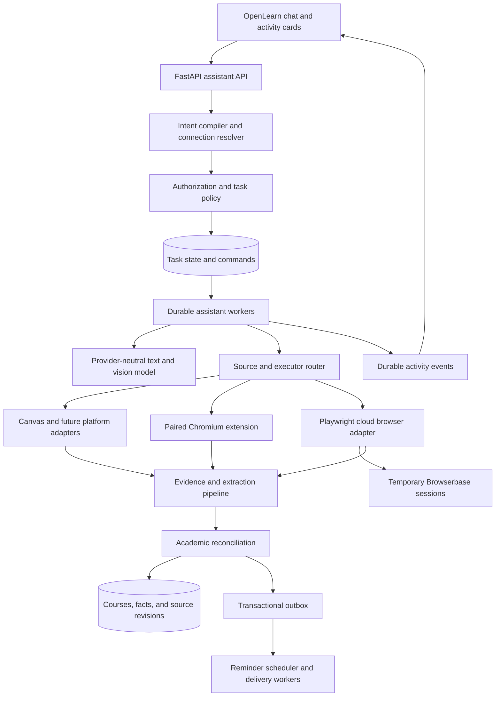

# OpenLearn browser assistant: architecture and implementation brief

Prepared: 3 October 2026. Status: target architecture, partially implemented. Generic task, local-browser, public-fetch, and Browserbase session foundations exist; authenticated cloud profiles and general interactive writes remain gated. See [`GENERAL_PURPOSE_BROWSER_COMPUTER_IMPLEMENTATION_PLAN.md`](GENERAL_PURPOSE_BROWSER_COMPUTER_IMPLEMENTATION_PLAN.md) for the current, agent-ready build sequence and acceptance criteria. This document extends the existing OpenLearn application and its ownership, academic evidence, and durable execution contracts.

## 1. Architecture decision

Build a **durable, provider-neutral assistant in the existing FastAPI backend, with interchangeable local and cloud browser executors**. Use PostgreSQL for hosted task state, academic records, and scheduled work. Use the existing SQLite path for offline desktop operation. Use a Chromium extension for the student's signed-in browser and Python Playwright connected to Browserbase for temporary cloud browser sessions. Keep browser infrastructure behind an adapter so it can later be replaced.

The model interprets intent, selects relevant pages, proposes bounded browser actions, and extracts evidence. Application services authorize and execute actions, validate evidence, reconcile academic records, and schedule reminders. A model answer is never proof that an action succeeded.

Do not allocate an always-running VM to each account. Allocate a browser session only while a task needs one; preserve connection credentials separately where the user has enabled cloud access. A hosted browser provider still consumes isolated compute internally. The saving comes from allocating compute to concurrent work rather than keeping a desktop running for every registered user.

Choose the executor using explicit connection capabilities:

| Task | Default execution |
| --- | --- |
| Read a public URL with straightforward content | Existing bounded public fetch, then cloud browser if rendering or interaction is required |
| Navigate an unfamiliar public website | Temporary cloud browser |
| Read a connected LMS with a supported authenticated API | Platform adapter using the available approved connection |
| Read a private site already signed in on the student's machine | Paired browser companion |
| Check a private site while the student's machine is offline | API connection, or an explicitly configured cloud browser login |
| Answer from previously saved academic facts | Database query; no browser allocation |

Do not silently move a local login into the cloud. Local-only users retain local data and reminders while their app is running. Hosted accounts can opt into cloud academic memory, background checks, and off-device reminders. The current application's local-first promise must remain accurate.

This supports arbitrary **user-selected public web domains**, including authenticated sites once connected. It does not guarantee every website or workflow will be automatable. Restricted browser pages, private-network destinations, CAPTCHA, institutional browser policies, inaccessible controls, and unsupported authentication can require a user handoff or a partial result.

## 2. Target experience and success definition

Example request:

> Go to the university website I study on most, find the classes I'm taking, save all my midterm dates, and summarize what you found.

Expected behavior:

1. Resolve the student's preferred university connection from saved connection metadata. If no connection exists, request a website or connection. If multiple plausible connections exist, ask the student to select one.
2. Recognize four requested outcomes: discover current enrollments, inspect relevant course material, persist exam dates, and summarize. Do not infer permission to submit coursework or create a recurring scan.
3. Start a durable task and show a short activity card with Stop and, when needed, Continue after login.
4. Discover active courses in the selected term. Present enrollments separately from user-created OpenLearn courses and map them without merging courses solely by similar names.
5. Inspect relevant assignments, calendar entries, syllabus sections, announcements, and attached documents. Follow relevant links and scroll or paginate where necessary.
6. Save source-backed exam facts. Preserve ambiguous dates as tentative, date-only, or timezone-unknown rather than inventing a precise instant.
7. Return a sourced summary with courses checked, dates saved, conflicts, and missing coverage. For example: "Saved 3 midterm dates across 4 courses. One syllabus was unavailable; Biology lists a date without a start time."
8. If the user additionally requested reminders or study tasks, create those through existing domain services and the reminder service. Otherwise show optional follow-up actions without executing them.

Success is verified data and a truthful summary, not an agent declaring the task complete. "No midterm found in checked sources" is distinct from "this course has no midterm."

## 3. System layout



This is a modular monolith plus separately scalable workers, not a collection of microservices at launch. Browser processes run outside the API process. Components are service boundaries in code; split deployments only when operational measurements justify it.

Each run has one canonical backend: local SQLite for an offline profile, or hosted PostgreSQL for a signed-in hosted profile. A hosted run can dispatch actions to a local device, but its durable progress and accepted facts remain hosted. Do not independently reconcile the same run into two authoritative databases. Importing a local profile into a hosted account follows the existing explicit identity migration/mapping protocol; general bidirectional database sync is outside this feature.

## 4. Selected technologies and alternatives

| Boundary | Selected approach | Reason |
| --- | --- | --- |
| Application and domain services | Existing FastAPI, Pydantic, SQLAlchemy, Alembic | Preserve identity, courses, material ingestion, and academic planning |
| Durable orchestration | Extend `WorkflowStore`, `learning_jobs`, and `ExecutionOutbox`; introduce assistant run/step records | Matches documented execution ownership and avoids a second workflow authority |
| Hosted persistence | PostgreSQL with indexed due-work queries, atomic leases, and transactional outbox | Durable state independent of API or worker lifetimes |
| Local persistence | Existing SQLite, single local worker configuration | Maintains offline operation; not the hosted scaling mechanism |
| Cloud browser control | Python Playwright over provider-issued CDP connection | Explicit navigation, locators, input, screenshots, frames, and action verification |
| Cloud browser allocation | Browserbase behind `BrowserSessionProvider` | Documented session contexts and user login through live view; replaceable infrastructure |
| Local browser control | Extend `canvas-extension/` into a general companion; packaged DOM readers and scoped CDP commands | Uses existing authenticated browser state without exporting cookies |
| Model integration | New `AssistantModelProvider` over existing provider/key/usage configuration | Tool decisions and image inputs need a contract separate from lesson generation |
| Large evidence objects | Existing immutable object abstraction, local storage or private S3 adapter | Keep screenshots/documents out of ordinary database rows |
| Notification delivery | Durable in-app inbox; desktop delivery locally; Web Push for hosted opt-in subscribers | Reminders do not require an active browser-agent task |

Use a small application-owned tool loop rather than introducing a whole Browser Use or Stagehand agent as the domain orchestrator. Their designs inform this architecture, but authorization, task checkpoints, evidence provenance, and academic reconciliation must stay under OpenLearn control. Do not add eve or migrate providers: this is an established non-eve application.

Do not add Redis, Kubernetes, or Temporal as launch requirements. PostgreSQL is the initial durable queue. If measured queue load later requires a broker, use it to distribute durable command IDs; keep canonical state and replay semantics in the database. A future workflow-engine migration requires a separate decision, not parallel ownership of the same task.

Provider-specific SDK details must be verified against installed versions during implementation. Pin tested browser and SDK versions; this document defines contracts rather than promising compatibility with every future release.

## 5. Intent compilation and connection resolution

### 5.1 Structured intent

Build an intent compiler separate from the teaching/quiz mode classifier. Input is the current user message, relevant conversation context, connection aliases, explicit preferences, and existing task references. Do not expose full browser history to resolve a university.

Output is a strict, versioned `TaskIntent`. The following is illustrative serialized data, not a complete API schema:

```json
{
  "schemaRevision": 1,
  "goal": "Discover current courses and save their midterm dates",
  "sourceSelector": {
    "kind": "preferred_connection",
    "category": "university_lms"
  },
  "operations": [
    "discover_courses",
    "collect_exam_dates",
    "save_academic_facts",
    "summarize"
  ],
  "courseScope": {"kind": "active_enrollments", "term": "current"},
  "dateScope": {"kind": "current_term"},
  "requestedPersistence": "academic_facts",
  "requestedReminderPolicy": null,
  "externalWriteRequests": [],
  "unresolvedFields": []
}
```

Model output proposes intent; code derives effective permissions from the actual user request and connection grants. The model cannot grant itself access, change owner, add an origin, or decide that an external write has been approved. Preserve negation and conditional wording: "don't save", "just summarize", "if there are midterms", and "remind me only about Biology" materially change the task.

Validate known operation IDs. Clear database-only requests can bypass browser planning. On invalid model output, retry a bounded number of times, then request clarification without opening a browser. Confidence scores are not authorization or evidence of correctness.

Define model responses as discriminated Pydantic unions: a typed tool proposal, evidence candidates, a bounded clarification, or a finish proposal. Support validated structured JSON when a provider lacks native tool calling; never parse browser actions from free-form prose. Advertise text/image capabilities explicitly. If the configured model cannot interpret images, retain text-based operation and report unsupported visual evidence rather than pretending OCR succeeded. The current provider module already exposes image/usage types; inspect and reuse them when adding this separate assistant contract.

### 5.2 Connection registry

Persist a connection record with: owner, connection ID, user label, aliases, category, platform hint, canonical origin, approved document origins, authentication mode, executor capability, account fingerprint where available, device association, last successful verification, default term, timezone, and revocation revision.

Resolve a source in this order:

1. Explicit URL or connection selected in the request.
2. Explicitly saved preference such as "my university portal".
3. A unique connected source matching the category and university.
4. A preference inferred from successful OpenLearn tasks on connected sources, presented as a suggestion when ambiguous.
5. A concise selection question if no unique source is established.

Do not assume every Canvas user visits `canvas.instructure.com`; institutions use different origins. Do not invent an institution URL from a university name. A public search may suggest candidate links, but cannot establish a private account connection.

"The site I use most" can mean usage outside OpenLearn. Unless the user has set a preferred site, clarify this when needed; counts of prior assistant tasks are only a limited proxy. Never install passive browsing surveillance to answer that phrase.

Once connected, retain the selection so ordinary repeat requests run without repeated questions. Resolve pronouns such as "that course" from explicit task/course references, with owner and revision checks.

## 6. Browser contracts and execution

### 6.1 Common executor interface

Both executors implement a versioned contract with capability negotiation:

- `open_session(connection, task_scope)` / `close_session(session)`.
- `navigate(session, tab, url)` and `list_task_tabs(session)`.
- `observe(session, tab, scope, cursor)` returning bounded readable text, controls, links, frame references, and document state.
- `find(session, tab, query)` returning references from a fresh observation.
- `click(session, tab, element_ref)` and `fill(session, tab, element_ref, value)`.
- `press_key(session, tab, key)` with an allowlist; no operating-system shortcuts.
- `scroll(session, tab, container_ref, direction, amount)`.
- `capture_screenshot(session, tab, region)`.
- `read_document(session, document_ref)` through bounded material ingestion.
- `read_platform_resource(connection, resource_kind, scope, cursor)` through a registered adapter.

Application services, not browser tools, provide `save_academic_facts`, `create_study_task`, `create_reminder`, and `finish_task`. Extraction uses model output validated by the evidence service, rather than a browser tool permitted to write arbitrary database rows.

No model-accessible arbitrary JavaScript, shell execution, cookie export, arbitrary HTTP request, or raw CDP command tool. Necessary page scripts are packaged, reviewed functions with fixed purposes. Playwright evaluation and CDP are internal implementation mechanisms.

Each browser command includes task ID, command ID, step ID, session ID, connection revision, lease generation, expected document revision, deadline, and typed arguments. Owner identity comes from the authenticated server/device mapping, never a client-supplied owner field. Reject commands for other tasks, revoked grants, stale lease generations, expired deadlines, or tabs outside the session.

Observation records include:

```text
snapshot ID; session/tab/frame IDs; URL and document revision;
captured time; readable text blocks with stable snapshot-local locators;
controls with role, name, state, element reference, and bounding box;
links with resolved destination; scroll containers and positions;
pagination/lazy-loading hints; extracted account identity if available;
truncation/cursor metadata; screenshot object references when requested.
```

Element references expire when their document or relevant DOM state changes. Re-observe rather than clicking a stale reference. Screenshot clicks must include screenshot ID and viewport dimensions, with bounds checks; prefer element references whenever available.

### 6.2 Local companion

Retain the Canvas reader as an adapter inside the companion. Move long-running work out of `popup.js`: closing the popup must not terminate the logical task. Add a service worker, packaged content readers, a companion activity UI, and durable command acknowledgments.

Pair using existing identity/device-grant patterns. A Canvas-only grant stays Canvas-only; new general browsing capabilities require an explicitly upgraded grant. Device credentials are kept outside webpage script context. Page content is untrusted even when delivered by a paired extension.

The user connects a site through an extension UI that requests optional origin permissions under a user gesture. The model cannot request broad access itself. CDP control uses Chrome's debugger permission and user-visible attachment; handle dismissal and institution policy restrictions as capability loss, not an infinite retry. Attach only to task-designated tabs, never enumerate or operate unrelated personal tabs.

Use short authenticated command polls while the companion task is active, with persistent recovery metadata and extension wake/reconnect handling. A socket or in-memory JavaScript object is not the source of task state. Manifest V3 service-worker suspension, browser exit, and network loss must yield `waiting_for_device` and resume safely. User closure of a task tab pauses the task rather than continually reopening it.

Use same-origin Canvas requests from the approved authenticated tab when supported, as the current reader does. Never relay session cookies to OpenLearn or copy local browser profiles to the cloud. A cloud companion can deliver redacted evidence only after the user enables hosted processing; local mode keeps evidence in the local backend apart from the configured model-provider calls.

### 6.3 Cloud executor

The worker creates one temporary provider session per active job and connects with Python Playwright using the provider-issued endpoint. Public tasks use fresh contexts. Private tasks use an owner-and-connection-bound persistent provider context only after the user enables cloud login.

Persistent context is credential-bearing browser storage, not a running VM or the assistant's academic memory. Keep the provider context ID server-side. Restrict reuse to the same owner, connection, and account. Allow one writer/session per persistent context; queue simultaneous tasks and account for the provider's persistence synchronization delay before reuse.

For first login or MFA, stop automation and offer an authorized live-view handoff. Browser access URLs are secrets: issue short-lived access through the authenticated product surface and never put them in chat transcripts or general logs. If a provider's live-view access cannot be adequately scoped, do not ship that route until an authorized proxy/handoff is implemented. Do not automatically transfer a local session into this environment.

On every terminal path, stop the provider session explicitly; closing a CDP client alone is not session cleanup. A reaper stops orphaned sessions using expiry and durable provider/session mappings. Waiting tasks release compute after a short handoff grace period and reconstruct a fresh session later.

Do not assume cookies never expire or that any provider bypasses school SSO. Store a connection's login-required state and request user action. Cross-tenant browser isolation, deletion of contexts, provider recording retention, regional processing, and egress controls are release requirements to validate, not vendor guarantees inferred from the existence of an API.

## 7. Planning, navigation, and visual reasoning

Use one sequential decision loop per browser session. Independent course processing can run in separately scoped jobs under tenant concurrency limits; do not create a swarm of agents sharing one tab.

1. Compile intent and effective scope.
2. Prefer existing facts if the user asks a historical/database question. For a fresh scan, select a platform adapter where available.
3. Obtain a bounded observation. The model chooses an action from the allowlisted tools or produces an evidence candidate.
4. Validate action scope, capability, budget, expected document state, and risk.
5. Persist command intent before dispatch. Execute outside database transactions.
6. Obtain a fresh observation and verify the intended transition. Record result and next checkpoint.
7. Extract candidate facts, validate source references and dates, and persist verified progress.
8. Continue through the tracked frontier until requested coverage is reached or a budget/blocker is encountered.
9. Build the summary from committed records, coverage, and actual tool results.

Maintain a frontier of candidate URLs/controls ranked by task relevance. Track visited resource IDs, content hashes, document revisions, pagination cursors, and per-course coverage. Normalize URLs without stripping query parameters that change course, account, date range, or pagination semantics. Limit calendar date ranges to the relevant term rather than traversing infinite "next month" links.

Read structured page text first. Chunk large pages by headings and locators, retrieve relevant blocks, and preserve source context such as course and term. Use screenshots for visual calendars, inaccessible controls, charts, and image-based schedules. Ground visual date extraction in screenshot/region references; uncertain OCR cannot become a confirmed deadline.

Scrolling must specify the correct document or nested container. Compare observations for newly loaded content. If repeated scrolling produces no new content, stop that branch and record its completeness. Handle pagination, collapsed content, frames, and virtualized lists explicitly. A missing item in a partial observation is not absence.

For PDF/image syllabi, use bounded downloads and the existing material pipeline; preserve page numbers and extraction quality. Request access before following course content onto an unapproved domain. SSO redirects may be handed to the user without permitting automated reading of unrelated identity-provider pages.

Canvas discovery should use current student enrollment and term information from the Courses API, then relevant assignment/calendar data and syllabus/announcement content. Student-specific assignment overrides matter. APIs reduce navigation cost but cannot be assumed to contain every exam date; linked syllabi and announcements remain part of the requested coverage.

A navigation click can cause a side effect even if it looks like a link. Do not equate read-only intent with "GET requests only" or claim that a generic UI reader can prove arbitrary pages are side-effect-free. Block obvious submissions/destructive controls and pause on unknown potentially consequential actions. For academic reading, do not start quizzes or assessment attempts to inspect their contents.

## 8. Evidence, academic memory, and reconciliation

Use three kinds of memory with distinct purposes:

1. **Connection preferences:** university portal aliases, default term, known accounts, and user timezone.
2. **Task memory:** durable progress, visited pages, unresolved branches, and compressed observations needed to resume.
3. **Academic memory:** current facts and immutable source observations used for answers, planning, and reminders.

Every extracted fact includes owner-scoped source revision, locator or PDF page/image region, exact supporting passage where applicable, course and term, observed time, source-updated time if available, student/account context, extraction method, and confirmation status. Model-generated locators must resolve to captured evidence; the model cannot invent citations.

Represent dates using the existing precision vocabulary: `instant`, `date_only`, `timezone_unknown`, or `unknown`. Retain original wording. Use IANA timezones and explicit DST conversion. "Midterm during week 7" is not a precise date; store it as unresolved or an explicit range with uncertainty after a contract extension. Never convert a date-only exam into midnight and describe that as its start time.

Require an explicit exam designation in supporting evidence before classifying an item as a midterm. An assignment title containing "review" or a calendar event next to an exam does not prove the exam date. An updated announcement can contradict a syllabus; preserve both observations and mark a conflict rather than silently selecting the most recently fetched page. Existing user overrides retain their precedence until withdrawn.

Stable identity rules:

- Courses map by owner + connection/account + external course ID + term, with uniqueness constraints.
- Platform items use their stable external IDs scoped to connection and course.
- Unstructured syllabus exams use a persisted reconciliation match based on course, term, exam label, and source lineage; date changes revise the same matched event. Do not use the date as the sole identity.
- Ambiguous duplicate matches require review; embedding similarity alone cannot merge records.

Reuse `AcademicPlanningService` as the authority for assignments/assessments. Extend its contracts for enrollment mappings and class meetings, including starts/ends, recurrence, location, cancellation, and term bounds. Existing calendar imports are coverage records, so this requires a migration and reconciliation path; it is not already a timetable.

The current HTTP observation command has narrow origin/kind/field enums. Add versioned browser provenance deliberately, and keep the public manual-ingestion endpoint from accepting forged authoritative browser evidence. Create a trusted internal ingestion service with server-verified snapshot references. Separate reported page identity from verified platform identity; generic scraped identity may remain uncertain.

Reuse source revisions and material ingestion where appropriate, but do not put credentials or full browser profiles into source memory. Retrieval indexes are optional accelerators, not authoritative records. Answers about upcoming dates use structured queries; explanatory summaries can retrieve eligible source blocks.

No deletion inferred from a failed or incomplete scan. Explicit cancellation, or authoritative removal under a complete adapter-specific reconciliation policy, can retire an event. Disappearance from an unknown website normally marks a fact stale/unverified. Preserve per-course/per-resource completeness in scan records.

Disconnect revokes future reads immediately. Let users keep or delete imported academic facts; deleting a source also invalidates dependent summaries and reminders. Account deletion must cancel work and stop in-flight workers from recreating records.

## 9. Durable task execution and concurrency

Introduce an assistant run aggregate without replacing existing quiz/note/learning IDs. Extend the existing job-kind and queue allowlists for `assistant_intent`, `assistant_step`, `assistant_reconcile`, `assistant_summary`, `connection_refresh`, and `reminder_dispatch` as needed. Long browser workflows are many checkpointed steps, not one HTTP request or a transaction held open around an LLM call.

States:

```text
queued → resolving → running → reconciling → summarizing → completed
                         ↘ waiting_for_user / waiting_for_login / waiting_for_device
                         ↘ paused / cancelled / failed
                         ↘ completed_partial
```

Waiting/paused states release worker leases and do not consume retry attempts as failures. Resume is an authenticated command with expected task revision; it revalidates connection access, account identity, current source revisions, and remaining budget.

Claim jobs atomically with a lease token and fencing generation. Heartbeat without reviving expired leases. Dispatch local commands with the same generation so an old worker cannot keep controlling the device after losing ownership. One active browser command stream per session; one active connection refresh per owner/connection. Use database-backed locks/leases rather than process-local mutexes in hosted mode.

Persist command state as `prepared`, `dispatched`, `succeeded`, `failed`, or `outcome_unknown`, with unique command IDs and hashes. Duplicate delivery returns a persisted result where valid. A crash after a click but before recording its result creates an unknown outcome: observe/reconcile before retrying. There is no exactly-once guarantee for arbitrary browser side effects.

Internal fact persistence is idempotent and transactional. Refactor ingestion to accept an existing transaction where needed: the present `AcademicPlanningService.ingest` owns its transaction, so an outer caller cannot currently guarantee an atomic fact + reminder-outbox commit by simply wrapping it.

For external writes in later phases, persist a prepared operation, concrete target, approval revision, result verification, and unknown-outcome recovery. Never automatically replay an uncertain submission, purchase, message, or deletion.

Use indexed PostgreSQL ready/due queries and `FOR UPDATE SKIP LOCKED` or validated conditional claims for hosted dispatch. Existing learning-job claims are a reusable starting point, not an already benchmarked high-throughput assistant scheduler. Load-test this extension. SQLite uses its existing single-writer-compatible paths locally.

Reconnect UI events using durable per-task sequence numbers and `Last-Event-ID`. Transient progress delivery is not the task's source of truth. Cancellation blocks new commands and late fact commits, stops the owned cloud session, and detaches local browser control. Keep already committed requested facts visible with an accurate partial-work status.

## 10. Reminders and subsequent tasks

Reminder creation requires a user request or an enabled saved policy. "Save my midterms" authorizes internal fact storage, not automatic daily website checks or push subscriptions. Existing permissions and policies carry forward; do not ask again for routine authorized work.

Each reminder binds to owner, event identity, event revision, reminder policy revision, channel, and scheduled instant. In the same transaction that changes a fact, invalidate obsolete pending reminders and append an outbox command to calculate replacements. Do not perform notification provider calls inside that transaction.

A periodic scheduler claims due rows and enqueues deliveries. The delivery worker rechecks cancellation, event/policy revisions, owner status, quiet hours, and subscription state immediately before sending. Use a deduplication key such as `(owner, event, event_revision, policy_revision, offset, channel)`. Provider acknowledgments are not proof that the student saw the notification. Represent `sent_unconfirmed` and unknown outcomes honestly; use provider idempotency when available and stable client notification IDs to reduce duplicates.

For date-only events, require a user policy specifying the reminder's local time; do not invent an event start. For timezone-unknown events, do not schedule a precise reminder until resolved. Quiet-hour deferral must not silently move an urgent notification past its usefulness; define a user-visible policy and mark reminders skipped when necessary. Add configurable expiry and catch-up rules for disconnected desktop devices.

Hosted delivery: durable in-app inbox plus Web Push where the student subscribes and platform/browser support is verified. Integrate push registration in the actual web build/service-worker setup; do not assume it already exists. Local delivery: extend Electron notifications and due-reminder reads while the desktop service is running. A local-only app cannot promise alerts while the machine is off.

Refreshing sources is a separate scheduled job. Deduplicate refreshes, spread them with jitter, respect per-origin limits, and stop repeated login-required attempts. Show the last successful check. Reminders use the stored event revision even when new reads are unavailable, with a freshness indication where relevant.

Subsequent instructions reuse the same task framework and domain tools. Launch with summaries, saved facts, notes, reminders, and study planning. External website writes belong in a later capability tier with concrete previews and narrowly scoped approvals. Unsupported writes return a clear handoff rather than pretending to succeed.

## 11. Security and authority boundaries

These requirements belong in executable policy and tests, not only in prompts:

- Authenticate every task, snapshot, event stream, object download, command acknowledgment, connection, and reminder. Derive owner from the principal; do not trust task IDs as authorization.
- Treat page text, screenshots, PDFs, and tool outputs as untrusted evidence. They cannot amend system instructions, request secrets, authorize cross-site navigation, or approve actions.
- Allow HTTPS web origins by default. Reject embedded URL credentials, unsupported schemes, nonstandard ports unless separately configured, loopback/private/link-local addresses, and cloud metadata endpoints. The trusted local OpenLearn transport is a separate narrow exception, never a browsable destination.
- Validate redirects, popup navigation, frames, document downloads, and browser-initiated requests. Browser-level egress isolation must enforce private-network blocks, including DNS rebinding and IPv6 cases; a URL check before `goto` alone is insufficient. Verify the provider's enforceable egress controls before shipping arbitrary cloud browsing. If unavailable, use a compatible controlled proxy/isolated executor or withhold that capability.
- Distinguish allowed page-navigation origins from bounded third-party asset origins. Assets may load under egress policy without granting the model permission to inspect or navigate arbitrary third-party accounts. Sensitive new navigation destinations require a user connection/grant.
- In local mode, the companion must also enforce the origin policy on its own commands and observe permission changes. Browser-generated request isolation differs from cloud egress; do not claim equivalent sandbox protection without validation.
- Keep local pairing tokens in extension-private storage. Cloud API/OAuth credentials use managed secret storage and short-lived access; model prompts, logs, SSE, and evidence cannot contain them.
- Redact sensitive URL query values and exclude password/payment inputs and unrelated page regions from observations. Screenshots can still contain private information; capture only task-relevant regions and explain configured model-provider processing.
- Disable or minimize cloud session recordings by default where supported. Recordings/live views can expose login secrets. Validate provider controls and retention before accepting authenticated accounts.
- Revocation cancels commands, closes sessions, deletes provider contexts when requested, invalidates credentials, and stops future refreshes. Backup restore and deletion markers must not resurrect deleted access.
- Audit action type, authorization decision, source/record IDs, and safe error codes. Do not log private passages, tokens, raw screenshots, live-view URLs, or browser connection endpoints.

Read-only means task intent and policy enforcement, not a guarantee that an arbitrary website has no incidental session activity. First release must fail closed on consequential or uncertain controls.

## 12. Proposed records and API contracts

Use explicit tables for new query-heavy assistant data; reuse academic and source tables as the canonical authorities. Names below are proposed and must be reconciled with current migrations before creation.

| Record | Required content and indexes |
| --- | --- |
| `site_connections` | Owner, canonical origin, aliases, auth/executor type, account binding, grant revision, status; unique owner/connection |
| `external_course_links` | Owner, connection, external ID, term, internal course ID; unique external mapping |
| `assistant_runs` | Owner, chat reference, intent, effective scope, state, revision, budget, coverage, result, cancellation; owner/status index |
| `assistant_steps` | Run, sequence, command ID/hash, lease generation, snapshot basis, outcome, retries, checkpoint; unique run/sequence and command |
| `assistant_events` | Owner, run, sequence, safe event payload; unique run/sequence for SSE replay |
| `browser_session_leases` | Owner, run, connection, provider/device mapping, generation, expiry, cleanup state; due-expiry index |
| `browser_snapshots` | Owner, run, source identity, hashes, observation metadata, object refs, retention expiry; no credentials |
| `academic_scan_coverage` | Owner, run, course, resource category, scope, completeness, blockers, observed time |
| `connection_refresh_schedules` | Owner, connection, requested scope, next due, policy revision, status; indexed next-due query |
| `reminder_policies` | Owner, event/course scope, offsets, channels, timezone/date-only/quiet-hour policy, revision |
| `reminders` | Owner, event/policy revisions, due time, status, dedup key; unique dedup and indexed due status |
| `notification_deliveries` | Reminder, channel, attempt, idempotency ID, provider outcome, acknowledgment metadata |

Assistant-created snapshots reference existing source/material records where eligible. Avoid a second canonical exam table; extend academic entity projections for efficient upcoming-event queries and enforce uniqueness at their authoritative boundary.

Proposed endpoints, all owner-authenticated:

```text
POST   /v1/assistant/tasks                    create run; Idempotency-Key
GET    /v1/assistant/tasks/{id}               committed state and partial results
GET    /v1/assistant/tasks/{id}/events        SSE with sequence replay
POST   /v1/assistant/tasks/{id}/commands      cancel/pause/resume/resolve; expectedRevision

GET    /v1/site-connections
POST   /v1/site-connections                  begin pairing or cloud login
PATCH  /v1/site-connections/{id}             aliases/preferences; expectedRevision
DELETE /v1/site-connections/{id}             revoke; optional imported-data deletion
POST   /v1/site-connections/{id}/refresh     bounded manual refresh

POST   /v1/browser-devices/pair              scoped, short-lived pairing flow
GET    /v1/browser-devices/commands          device-scoped bounded polling
POST   /v1/browser-devices/commands/{id}/result

GET    /v1/academic/upcoming                 current structured events and freshness
GET    /v1/reminders
POST   /v1/reminder-policies
PATCH  /v1/reminder-policies/{id}            expectedRevision
POST   /v1/notification-subscriptions       explicit channel subscription
```

Reconcile new pairing endpoints with the existing identity/device APIs; do not build a second identity mechanism. Legacy Canvas pairing/sync endpoints remain supported during migration or have an explicit versioned migration path. Enrollment discovery removes the present requirement to manually enter all course IDs.

API handlers return durable task IDs quickly. Model calls and browsing occur in workers. Duplicate creation with identical input returns the existing run; an idempotency key reused with different input returns a conflict.

Errors use structured codes such as `connection_required`, `ambiguous_source`, `login_required`, `account_changed`, `device_offline`, `capability_unavailable`, `origin_not_approved`, `layout_unsupported`, `budget_exhausted`, `source_conflict`, and `outcome_unknown`. Private provider exceptions never flow directly into the UI.

## 13. Existing code integration map

| Existing location | Implementation direction |
| --- | --- |
| `backend/app/mode_transition_service.py` | Keep tutor/quiz transitions; introduce a separate assistant intent service and integrate its routing at the chat boundary |
| `backend/app/model_provider.py` and provider/key/usage services | Add assistant decision/image capability adapter, retain provider configuration, deadlines, cancellation, and usage reporting |
| `backend/app/workflow_store.py`, `execution_worker.py`, `execution_outbox.py` | Extend job kinds/queues and checkpoint lifecycle; preserve existing lease/transaction ownership |
| `backend/app/identity.py`, `identity_routes.py`, `identity_middleware.py` | Reuse account and device grants; expand narrowly scoped companion capabilities |
| `backend/app/canvas_reader.py` | Retain supported imports; extract platform adapter, add enrollment discovery and precise calendar/exam mapping |
| `backend/app/academic_planning.py`, `academic_routes.py`, `course_service.py` | Canonical fact reconciliation, course mapping, conflict/override behavior, transaction-aware ingestion |
| `backend/app/source_memory.py`, material services, context compiler | Store eligible evidence revisions and retrieve them with purpose/owner restrictions |
| `backend/app/web_evidence/` and `url_ingestion.py` | Reuse public research patterns, quotas, redaction, and URL checks where valid; public search is not a private-browser executor |
| `backend/app/object_storage.py` / `object_store.py` | Select the existing maintained storage boundary for new evidence; inspect both abstractions rather than duplicating them |
| `canvas-extension/manifest.json`, `popup.js` | Migrate into a general companion with recovery and adapter modules; preserve current Canvas flow |
| `web/components/learn-chat.tsx`, `compact-tutor-chat.tsx`, `canvas-connection.tsx` | Find the actual chat submission/event integration points; add connection selection, activity, coverage, and review cards |
| `desktop/src/main.cjs` and notification settings | Add academic reminder delivery without conflating it with spaced-repetition review notifications |

Suggested new backend package: `backend/app/browser_assistant/` with `contracts`, `intent`, `connections`, `policy`, `orchestrator`, `evidence`, `reconciliation`, `routes`, `workers`, `reminders`, and `executors/{local,cloud}`. Add `adapters/{base,canvas,generic_web}`. Split modules by ownership, not by arbitrary file-size targets.

Before edits, read repository instructions and the foundation/identity contracts. Current documentation contains planned sections alongside partial implementations; verify code and tests rather than assuming a "planned" label proves absence or a file proves completeness.

## 14. Scale, cost controls, and operations

Scale API instances independently from assistant workers and browser allocation. With A active users, task-start rate r per second per active user, browser fraction p, and mean browser-holding duration T seconds, expected average concurrent browser sessions is approximately `A × r × p × T`. Provision for measured peak traffic and bounded queues, not this mean alone. Registered account count is not the browser capacity requirement.

Separate browser/assistant, existing teaching, batch material, and notification worker capacity so a long syllabus scan does not delay chat lessons or reminders. Apply per-owner, per-connection, and per-origin admission limits. Serialize tasks using the same local tab or persistent cloud context. Set tenant fairness and queue aging rules; one large university scan cannot consume all slots.

Starting configurable guardrails, to tune through evaluation:

- One browser session per run; one active session per private connection.
- At most two active browser runs per hosted owner, on different connections.
- Initial task budget: 80 browser actions, 40 relevant pages/documents, 10 minutes wall time; course-scale tasks can use checkpointed batches with explicit larger budgets.
- At most three recovery attempts per failing read; no automatic retry for permissions, login expiry, invalid input, or revoked access.
- Model rounds and image calls have separate token/cost ceilings. Record actual usage per intent, extraction, and summary stage. Monetary caps require configured pricing or provider cost data, not invented estimates.
- Close waiting/idle cloud sessions after a short configured grace period. Retain checkpoints, not unused browser compute.
- Begin with at most 24-hour retention of redacted raw task observations/screenshots after completion; retain only the necessary cited academic evidence until the user deletes it or policy expires. Login captures and credentials are never evidence. Retention values are product defaults to validate before release, not legal claims.

Use API adapters and changed-resource checks to reduce browser/model work. Cache only within correctly scoped owner/connection/source revisions. Never share private page caches or academic embeddings across users. Deduplicate simultaneous scheduled/manual refreshes.

Metrics: queue delay, time to first progress, task completion/partial rate, per-site blockers, citation validity, date extraction errors, conflicts requiring review, browser minutes, token/image cost, worker lease loss, orphan-session cleanup, notification lateness, and deduplication failures. Collect safe dimensions rather than private URLs or page text.

Release gates include PostgreSQL concurrent-worker tests, browser-provider credential lifecycle and isolation checks, controlled live Canvas verification, retention/deletion verification, and an end-to-end reminder run. No throughput or accuracy claim is justified until benchmarked.

## 15. Implementation phases and acceptance tests

### Phase 1: durable assistant and general browsing foundation

Implement strict contracts, intent routing, connection registry, task/events/steps, policy, budget enforcement, and the common executor protocol. Deliver local companion navigation/observation/click/scroll plus an ephemeral public cloud executor. Use deterministic fake executors/providers for recovery tests and real controlled fixture sites for browser integration.

Acceptance: a chat request opens a user-selected public site, follows relevant links on an unfamiliar layout, scrolls a lazy-loaded container, extracts sourced information, and returns a truthful summary. Stop, popup closure, worker crash, expired leases, stale element references, duplicate delivery, and reconnect recover without crossed ownership or invented results. Both executors pass the same semantic contract suite.

### Phase 2: complete Canvas academic workflow

Implement current-enrollment discovery, course mappings, term and account verification, relevant API reads, syllabus/PDF/announcement navigation, evidence extraction, exam/date reconciliation, and sourced summaries. Preserve legacy Canvas imports and existing user course history.

Acceptance: "Use my university portal, find my classes, and save my midterms" resolves a saved connection, discovers courses, captures exams from several source types, and saves idempotent facts. Changed dates revise the same event; account switching and login expiry stop the affected scan. A partial course read cannot erase facts or claim complete coverage.

### Phase 3: reminders and opted-in background operation

Implement fact-to-reminder transactional scheduling, due dispatcher, durable inbox, desktop delivery, hosted push subscriptions, refresh schedules, private cloud login/live-view handoff, persistent context deletion, and orphan session cleanup. Keep local/offline semantics explicit.

Acceptance: a deadline change replaces pending reminders; crashes and retries do not create duplicate inbox items; stale/revoked policies cannot send; quiet hours, DST, date-only events, offline devices, and account deletion behave as specified. Demonstrate a hosted reminder arriving when the desktop app is closed. Demonstrate local-only messaging that does not promise that behavior.

### Phase 4: expand domains and controlled subsequent actions

Evaluate the generic reader on a second LMS and independently designed academic sites. Add adapters only when accuracy or efficiency requires them. Add approved external-write actions individually with target previews and unknown-outcome recovery; generic unrestricted submissions are not a launch capability.

Acceptance: unseen-domain fixtures work without a hardcoded site allowlist beyond runtime permission grants. Unsupported layouts return actionable partial results. Prompt injection cannot export data or broaden scope. Consequential writes cannot run on a read-only task or be replayed blindly after an uncertain result.

Cross-phase evaluation set must include:

- Intent negation, ambiguity, follow-up pronouns, multiple institutions, explicit preference, and unknown university URLs.
- Courses with no exam found, archived courses, duplicate titles, student-specific overrides, changed exam dates, ambiguous years, conflicting announcements, date-only entries, timezone uncertainty, recurring meetings, and cancellations.
- Infinite calendars, pagination, nested/virtual scrolling, cross-origin frames, popups, denied document origins, image schedules, PDFs, stale references, and incomplete reads.
- Prompt injection in text/images/PDFs, forged citations, private-network redirects/subresources, revoked devices, cross-owner IDs, account switches, credential redaction, and context isolation.
- API/worker/extension restarts, command result loss, duplicate outbox delivery, lease fencing, terminal cleanup, deleted-owner resurrection attempts, and SSE replay.

Measure unsupported-case reporting separately from successful task accuracy. A careful partial answer is preferable to a falsely complete scan. Deterministic/fake tests do not establish that live SSO, cloud session persistence, push delivery, or arbitrary sites work.

## 16. Handoff instructions for the implementation agent

Implement phases in order, delivering an integrated user flow at each phase. Do not mark all phases complete after scaffolding endpoints or passing mocked tests. Avoid changing unrelated teaching/quiz policies or migrating provider credentials.

Before implementation:

1. Read applicable repository instructions and the foundation, identity, academic, and Canvas source files cited above.
2. Inventory current job leases, migrations, chat routes, source eligibility, and device capabilities. Reconcile proposed contracts with existing versioned contracts.
3. Establish controlled browser fixture sites and a task contract suite. Do not use real student accounts for automated development tests.
4. Implement Phase 1 with feature flags and compatibility preserved; then continue through the academic workflow and reminders.
5. Keep production cloud/private browsing disabled until credentials, provider isolation, egress, recording retention, and deletion have been verified. Continue local/public work when a hosted dependency is unavailable and report the exact unverified boundary.

The implementation report must state what users can actually do, migration effects, tested environments, unresolved live dependencies, and how to enable the delivered flow. Use actual evidence to distinguish implemented, mocked, live-verified, and deferred behavior.

## 17. References and evidence boundaries

The architecture decisions above are recommendations for OpenLearn. These primary sources support the browser capabilities and constraints, not a guarantee of end-to-end product reliability:

- [Playwright Python Page API](https://playwright.dev/python/docs/api/class-page): navigation, screenshots, page interactions, and event handling.
- [Playwright locators](https://playwright.dev/python/docs/locators): semantic element targeting and locator behavior.
- [Chrome extension capabilities](https://developer.chrome.com/docs/extensions/develop): tab control, packaged content scripts, and page interaction.
- [Chrome debugger API](https://developer.chrome.com/docs/extensions/reference/api/debugger): CDP transport, permissions, available domains, and managed-browser restrictions.
- [Optional website permissions](https://developer.chrome.com/docs/extensions/develop/concepts/declare-permissions): user-controlled origin access.
- [Extension service-worker lifecycle](https://developer.chrome.com/docs/extensions/develop/concepts/service-workers/lifecycle): lifecycle constraints that require persistent recovery state.
- [Browserbase persistent contexts](https://docs.browserbase.com/platform/browser/core-features/contexts): login-state reuse, context persistence, synchronization, and deletion. A context is not the academic database.
- [Browserbase live view](https://docs.browserbase.com/platform/browser/observability/session-live-view): browser-session visibility and handoff mechanism; product access control still needs validation.
- [Canvas Courses API](https://developerdocs.instructure.com/services/canvas/resources/courses): course and enrollment discovery.
- [Canvas Calendar Events API](https://developerdocs.instructure.com/services/canvas/resources/calendar_events): structured calendar data.
- [Canvas OAuth overview](https://developerdocs.instructure.com/services/canvas/oauth2/file.oauth): institution-specific authentication requirements.
- [Stagehand](https://docs.stagehand.dev/v4/first-steps/introduction): separation of action, observation, extraction, and direct browser control.
- [Browser Use](https://docs.browser-use.com/cloud/quickstart): separate agent and browser-infrastructure offerings.
- [Anthropic tool-use loop](https://platform.claude.com/docs/en/agents-and-tools/tool-use/how-tool-use-works): application execution of model-proposed tools.

Repository authority to read alongside this brief: [foundation decisions](OPENLEARN_2_FOUNDATION_DECISIONS.md), [application foundation](APPLICATION_FOUNDATION.md), [identity and sync](../Open%20Learn%202.0/03_identity_and_device_sync.md), [academic model](../Open%20Learn%202.0/16_academic_model.md), and [Canvas requirements](../Open%20Learn%202.0/17_canvas_reader.md).
