# Shared flashcard agent: architecture and rendering

Proposal — 4 October 2026. Based on inspection of the current checkout. No flashcard implementation, migration, provider provisioning, or UI changes are delivered by this document. Conversation and In-Class remain product directions in the redesign brief, not assumed existing runtime modes.

Follow the [behavior and recovery contract](BUDDY_BEHAVIOR_AND_RECOVERY_CONTRACT.md) for memory retrieval, proactive draft creation, duplicate commands, offline ratings, and interrupted work. Buddy is companion identity; Conversation is the default mode.

## Decision

Personalized companions follow [the Buddy/course integration specification](BUDDY_HOME_COURSES_AND_CHATS.md). Record requesting Buddy, conversation, course, and class-session references for attribution and navigation. Deck ownership and scheduling stay with the student account. Any authorized companion can open the same deck; changing companions or course assignments does not duplicate cards, reset review progress, or create another scheduler. Internal flashcard workers are shared across all Buddy profiles.

Implement flashcards as a shared typed capability under the existing Python agent execution system. A versioned skill defines how to select concepts and write good cards; a bounded worker executes generation and validation. All modes call the same capability. Deck storage, editing, review sessions, scheduling, and notifications are platform services rather than responsibilities delegated to a model.

Do not create a second assistant, independent conversation history, or a new agent framework. Ordinary card generation does not require a sandbox. Reuse authorized source extraction first; call the sandbox adapter only when a supported material-processing task needs isolated execution.

## Current integration boundaries

| Existing code | Proposed extension |
| --- | --- |
| `backend/app/agent_execution/contracts.py`, `coordinator.py`, `worker.py`, `repository.py` | Add explicit `flashcards` capability and typed input; extend admission, dispatch, revision fencing, durable activity, and result references |
| `backend/app/workflow_store.py`, `execution_outbox.py` | Reuse the agent runtime's job/outbox path for bounded generation and retries; do not schedule the same task through two worker owners |
| `backend/app/context_compiler.py`, `workspace_note_context.py`, material and lecture services | Resolve owner-authorized sources and freeze their versions for generation |
| `backend/app/model_provider.py` | Structured model generation through the existing provider boundary |
| `backend/app/review/{scheduler,scheduling_authority,session_service,evaluation_service}.py` | Reuse review entry points and align scheduling policy; introduce separate card-level state through a deliberate adapter |
| `backend/app/identity.py`, `identity_data.py`, `identity_import.py` | Ownership, account export/delete/import, and device authorization |
| `web/lib/assistant-client.ts`, `web/components/assistant/execution-panel.tsx` | Shared generation status, commands, reconnect and replay; add deck result references |
| `web/lib/workspace-events.ts`, `workspace-split.tsx`, `workspace-panel.tsx` | Typed deck-open event and Flashcards canvas tab |
| `web/components/review-workspace.tsx` | Deck library and due-card entry under Review, alongside current concept review |

The agent message contract currently enumerates lab analysis, research, and sandbox lab; it is not an unrestricted plugin registry. Flashcards require a real contract/dispatch extension. The canvas currently accepts notes, quiz, and sources tabs, including a layout validator; adding a label alone will not render a new tab. Current review is concept-oriented and must not be silently repurposed as card scheduling.

## End-to-end flow

```mermaid
flowchart LR
  Modes[Conversation / Ask / Learn / Quiz / In-Class] --> Admission[Shared capability admission]
  Admission --> Sources[Authorized versioned source resolver]
  Sources --> Task[Durable flashcard task]
  Task --> Generate[Concept selection and structured generation]
  Generate --> Validate[Grounding, quality, and duplicate checks]
  Validate --> Draft[Persistent draft deck]
  Draft --> Chat[Conversation result card]
  Draft --> Canvas[Canvas preview and editor]
  Canvas --> Publish[Publish selected cards]
  Publish --> Review[Card review and deterministic scheduling]
  Review --> Reminders[Existing reminder and notification boundaries]
```



1. A mode or explicit UI action submits a typed request with a stable command identity. The server determines the owner from the verified principal.
2. Resolve selected sources against that owner, conversation, and course. Snapshot note revisions, material versions, lesson delivery versions, quiz attempt references, or lecture segment revisions. Course-wide scope needs a bounded coverage manifest.
3. Admit a durable task and return its identity immediately. The task remains independent of whether the canvas is open or the device remains connected.
4. Select covered concepts, generate cards in bounded batches, validate them, and persist a draft. Provider calls happen outside long database transactions.
5. Publish one result reference and final activity item idempotently. The conversation shows a compact deck card; opening it fetches the authoritative deck.
6. The student edits and publishes selected cards into review. Draft saving happens automatically; publication is a separate user action unless a future explicit preference permits automatic publication.
7. Review attempts and next-due state are committed by the review service, not generated by the agent.

## Shared invocation contract

Proposed input shape, not an existing endpoint:

```ts
type FlashcardRequest = {
  sessionId: string;
  courseId?: string;
  origin: 'conversation' | 'ask' | 'learn' | 'quiz' | 'in_class' | 'review';
  sourceRefs: SourceRef[]; // Discriminated kinds with IDs and revisions.
  objective?: string;
  requestedCount?: number; // Server applies limits; this is not a coverage promise.
  cardTypes: ('qa' | 'cloze')[];
  targetDeckId?: string;
  expectedDeckRevision?: number;
  clientCommandId: string;
};
```

SourceRef variants include note revision plus selected offsets, material version plus source span, lesson delivery, committed quiz feedback, and lecture segment revision/timestamps. The source resolver checks relationships rather than trusting these references. Do not send an entire textbook from the browser or let the model choose another account's files. If source content is unavailable, request it or return partial coverage instead of inventing support.

First support explicit button/menu actions in existing Ask/Learn/Quiz. Later, conversational routing identifies requests such as “Make cards from that explanation” and submits the same contract. If “that” has several possible sources, ask which one. Origin controls delivery context, not ownership or permission. A global create action can work from any surface, but activity should attach to an existing or explicitly created conversation/task context.

## Skill and agent responsibilities

Proposed module: `backend/app/flashcards/` containing contracts, source resolution, service/repository, generation, validation, routes, and review adapter. Put versioned generation instructions alongside this module, with a skill manifest declaring supported inputs, output schema, limits, and permitted tools. Record skill, prompt, validator, and provider/model versions on each generation run. These are application runtime instructions, not a personal Codex skill installed on a developer's computer.

The skill specifies: one retrievable idea per card; precise prompts; concise correct answers; no answer leakage; clear cloze deletions; preserved mathematical notation; and citations to the supporting passage. It favors recall over copied paragraphs and does not equate a requested card count with complete coverage.

The worker performs concept selection, generation, validation, and deduplication. Start with one bounded pipeline, not several agents for every deck. Larger inputs can use bounded parallel batches with a final consolidation step under the existing runtime once that coordination is implemented. Quality checks include schema and length constraints, source existence/ownership, supported answer grounding, empty/ambiguous cards, contradictory cards, exact duplicates, and semantic duplicate candidates. Model-based checks are fallible; expose uncertain candidates rather than presenting them as certified facts.

## Data model and lifecycle

| Proposed entity | Essential fields and purpose |
| --- | --- |
| `flashcard_decks` | Owner, course, title, status, revision, generation task, origin session, timestamps |
| `flashcards` | Stable card ID, deck, type, concept links, ordering, active/suspended/deleted state |
| `flashcard_versions` | Immutable prompt, answer, explanation, cloze payload, source refs, creator kind, content hash |
| `flashcard_generation_candidates` | Batch/source lineage and candidate status, enabling edits without worker overwrites |
| `flashcard_review_sessions` | Owner, selected card/version snapshot, cursor, state, revision |
| `flashcard_review_attempts` | Immutable card-version attempt, reveal state, response, self-rating, optional evaluated result, stable command ID |
| `flashcard_schedule_state` | Owner/card, next due, interval/history inputs, scheduler version, revision |

Deck lifecycle: draft → published → archived, with explicit delete behavior. Individual cards can be selected for publication or suspended. A published deck may acquire new draft candidates without withdrawing existing reviewable cards. Generation status belongs to the task; an interrupted task does not make already saved cards disappear.

Edits create new content versions. Attempts reference the version actually reviewed. A major answer/concept change should offer a review-state reset; typo fixes can preserve scheduling. Source corrections mark affected cards for revalidation and create suggested revisions, preserving user edits and prior versions. Deck IDs and references stay stable across devices.

## Proposed API responsibilities

- Agent admission: extend the existing message/task surface with typed flashcard input rather than building a second generation queue.
- `GET /v1/flashcard-decks`: owner-scoped course/status pagination.
- `GET /v1/flashcard-decks/{id}`: deck metadata and paginated cards/candidates.
- `PATCH /v1/flashcard-decks/{id}` and card mutation routes: expected revisions and idempotent commands.
- `POST /v1/flashcard-decks/{id}/publish`: publish the selected card versions atomically.
- `POST /v1/flashcard-review-sessions`: snapshot a due or practice selection.
- Session reveal/answer/rating commands: persist review state and apply one scheduling outcome per attempt.
- Due-summary endpoint: lightweight count and course grouping for Review/Buddy.

Exact route naming should be reconciled with existing review contracts during implementation. Never fetch hidden answers in the initial review prompt payload if preventing early exposure is a product requirement; reveal is a separate server command. Flashcards are a study tool, not a secure examination system.

## Frontend rendering

Proposed components: `FlashcardTaskCard`, `FlashcardWorkspace`, `DeckEditor`, `FlashcardReviewSession`, `FlashcardFace`, and `FlashcardSourceLinks`, with a typed `web/lib/flashcards-client.ts` using the current authenticated API path.

The chat task card renders server-authoritative preparation states: selecting sources → drafting → checking → draft ready, plus needs-input, partial, failed, and cancelled states. Show source scope, ready count, and allowed task commands. On completion show “12 cards prepared from today's biology notes” with Preview deck and, after publication, Review. Retry links to saved task/output context; it must not create duplicate decks. Do not insert all cards as assistant message bubbles.

Extend WorkspaceTab, tab names, persisted-layout validation, WorkspaceSplit state/events, and panel rendering together. Add a typed `openWorkspaceFlashcards({deckId, view})` event for local navigation. This event opens the panel and selects the deck; it never starts generation or serves as the only storage for its state. Reload and reconnect resolve content by deck/session IDs. Add restorable URL/view state where appropriate. Existing persisted layouts continue to load.

Canvas views:

- **Preview/editor:** title, course, source coverage, draft/published badge, question/answer rows, select/remove/edit controls, source inspection, and Publish selected. Debounce edits with revision checks and show conflict handling.
- **Review:** one prompt, optional typed response, Show answer, then Again/Hard/Good/Easy. Reveal before rating; offer Skip separately. Show progress, save status, and a visible link to explain the concept in Learn. Self-rating represents perceived recall, not verified correctness.
- **Deck library:** course filters, due counts, draft decks, and completed review sessions under Review. Use the same canvas renderer when opened from any mode.

Reuse RichContent/math rendering for card content. Sanitize generated content through existing rendering rules. For source links, reuse openWorkspaceSource for supported material spans; add deliberate adapters for note selections and lecture timestamps. Keyboard controls should work without trapping editor input; prompts, answer reveal, and controls need accessible labels and predictable focus. Respect reduced motion rather than requiring a flip animation.

On mobile, the same deck/editor/review becomes an expanded sheet or full-screen view, with return-to-chat, safe-area spacing, and persisted progress. A mode switch or panel close does not stop the background task or submit a review rating.

## In-Class generation and proactive use

Consume settled transcript segments with stable session/segment/revision keys. Accumulate meaningful topic changes and generate bounded batches, not a deck every few seconds. Append candidates to one draft deck for the class; user-edited or published cards are never replaced by a later batch. Transcript corrections mark dependent candidates stale. Quiz mistakes create linked candidate cards without silently adding duplicates to review.

At class end, consolidate covered concepts, references, and duplicates, then deliver the draft alongside summary notes, revision quiz, and active recall. Flashcards provide reusable scheduled recall; the revision quiz remains a separate practice workflow. If an assessment is imminent, Buddy can prepare a draft deck under proactive preferences. Draft creation does not silently enroll the student in notifications or publish the cards.

## Scheduling, learning evidence, and sync

Use one deterministic versioned scheduling authority for card review. Adapt the existing scheduler where its outcome assumptions fit; keep card-level state separate from concept memory. Define rating/outcome mapping and review-day/timezone handling explicitly. Do not introduce FSRS or another algorithm without a deliberate scheduling decision and migration plan.

Creating cards, viewing answers, and self-rating do not independently establish mastery. Evaluate typed recall through existing review evaluation only where supported, and commit qualified learner evidence through the existing authority with one attempt identity. Never award learning credit for work done by the agent or count the same attempt as both quiz and flashcard evidence.

Store metadata and review state in the existing SQLAlchemy/migration layer, targeting Supabase PostgreSQL later. Use private object storage for future image assets; text cards do not need individual object files. Supabase Realtime can invalidate cached views, but durable server records/change cursors govern recovery. Scheduling stays server-authoritative.

Extend pending-command support deliberately: the current queue is limited to note/quiz writes and does not automatically cover cards. Preserve owner-scoped edits, pinned review versions, and stable attempt IDs offline; show pending status until acknowledged. Serialize concurrent schedule updates and reject stale rating commands rather than allowing two devices to advance one review attempt twice. Rebase or flag conflicting offline edits, and explicitly reconcile review sessions opened independently on two devices. Keep deletion tombstones, account erasure, exports, and imports consistent; imported decks must not restart generation jobs.

## Delivery sequence and verification

1. Source-grounded QA/cloze draft generation from notes or lessons, with durable task/result, editing, publication, and canvas rendering from explicit actions.
2. Review library, reveal/self-rating flow, versioned scheduling, due counts, account portability, and reconnect/cross-device reconciliation.
3. Conversational invocation across modes, source-linked cards from quiz mistakes and bounded In-Class batches, then proactive preparation/reminders.
4. Image-label/occlusion cards only after asset handling, accessible rendering, and source rights/coverage are designed.

Acceptance includes owner isolation, unsupported-source handling, citation correctness, malformed generation rejection, deduplication, edited-card preservation, exactly-once task publication under retry/lease loss, cancel fencing, reconnect without duplicate messages, revision conflicts, hidden-answer rendering, no scheduling on panel close, ratings applied once across devices, no automatic mastery for self-ratings, and export/delete cleanup. Test actual user flows from each supported origin; include mobile keyboard and long math/content layouts. Production PostgreSQL concurrency and hosted notification delivery require separate acceptance from local SQLite/UI tests.
