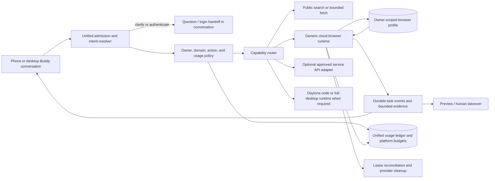

# Buddy's general-purpose browser computer: implementation handoff

Status: partial production release as of 9 October 2026. Temporary, read-only public cloud browsing is enabled on the Render backend. A bounded live Browserbase smoke test verified public navigation, private-network request blocking, session shutdown, and usage settlement. This is not completion of the general computer-use feature: saved sign-in remains gated, browser writes are unsupported, and the full authenticated learner journey and domain-quality matrix still need acceptance.
Last updated: 9 October 2026.

This plan builds on [`BROWSER_ASSISTANT_ARCHITECTURE.md`](BROWSER_ASSISTANT_ARCHITECTURE.md), [`BROWSER_ASSISTANT_IMPLEMENTATION.md`](BROWSER_ASSISTANT_IMPLEMENTATION.md), and the agent execution platform. It defines the generic browser-computer capability Buddy needs for phone and desktop conversations. It does not make Canvas, Gmail, or any other named website a prerequisite.

## 1. Product decision

Build a general-purpose, user-visible browser computer that Buddy can use on a learner's behalf. The learner describes the outcome in the ordinary chat composer. Buddy resolves the website from the request and the learner's saved preferences, asks a natural follow-up when it cannot resolve the site or task, then opens a private browser session, explains what it is doing, and returns evidence and results in the same conversation.

The default execution path is a cloud Chromium browser through the existing Browserbase adapter. Use a persistent, owner-scoped browser profile only when the learner explicitly opts to remember a sign-in. Allocate the actual browser session on demand per task and close it after the bounded task. Keep Daytona behind the same future computer-runtime boundary for tasks that need a full desktop, local code execution, or installed software; do not route ordinary web visits through the CSV-analysis sandbox.

Service APIs and site-specific adapters may be used internally when they provide a safer, more reliable operation. They are optional optimizations. The generic browser remains the fallback, and the student should not have to select “Canvas integration,” install an extension, or learn an implementation detail to ask Buddy to use a website.

The product promise is “work with ordinary websites through a browser, with the learner in control,” not literal automation of every site or action. MFA, CAPTCHAs, anti-automation controls, inaccessible controls, account restrictions, and unsupported sites can pause work for a learner handoff or produce a partial result.

## 2. Current Open Learn baseline and exact gaps

Reuse the existing identity, agent execution, workflow, usage, object storage, and browser-assistant services. Do not create a second agent scheduler or a second account-ownership model.

Existing browser-assistant foundations include generic website connections and origins, intent parsing, durable task events, a browser worker, public fetch, a Browserbase/Playwright executor, usage reservations, owner-scoped preview/takeover routes, and revocation/cleanup records. The main implementation locations are:

- `backend/app/browser_assistant/connections.py`, `routes.py`, `service.py`, `workers.py`, and `control.py`
- `backend/app/browser_assistant/executors/cloud.py` and `executors/public.py`
- `backend/app/agent_execution/` for the shared admission, durable execution, and usage contracts
- `web/components/browser-task-card.tsx`, `web/components/browser-task-dock.tsx`, `web/components/browser-control-panel.tsx`, `web/lib/browser-assistant.ts`, `web/lib/conversation-admission.ts`, and the ordinary chat composers
- `docs/AGENT_PLATFORM_REMAINING_WORK.md` for the remaining agent-platform convergence work

### Actual request path inspected on 9 October 2026

The standard web composers already use the shared message admission endpoint; do not create a parallel browser-only admission API:

```text
web/components/learn-chat.tsx or compact-tutor-chat.tsx
  -> useBrowserAssistant.tryStart()
  -> web/lib/browser-assistant.ts
  -> web/lib/conversation-admission.ts / admitConversation()
  -> POST /v1/assistant/messages
  -> backend/app/agent_execution/routes.py
  -> Coordinator.admit()
  -> Browser intent: AssistantService.create() in the same transaction
  -> assistant_runs with runtime_owner=browser_legacy
  -> browser_assistant.workers -> public_fetch or Browserbase/local executor
  -> task/events/evidence returned to the existing browser task UI
```

`admitConversation()` also carries uploaded material references and a retry-stable idempotency key. If admission returns `handled: false`, the composer continues to the normal tutor flow. `Coordinator.admit()` recognizes browser intent, but creates the task in `AssistantService` and marks it `browser_legacy`; it does not move browser task execution into `agent_v2`. Browser task routes dispatch commands to the runtime owner recorded on the task. Keep that ownership explicit and never enqueue one request in both runtimes.

The browser UI currently refreshes task lists on a 2.5-second timer even though `/v1/assistant/tasks/{id}/events` supports replay and SSE. The task card can answer a browser question through an explicit `resolve` command. Free-form chat follow-up currently associates a prior task partly through text-pattern heuristics and is not accepted as a reliable answer-to-question contract. The next integration work should use an explicit task/request reference and revision when the learner answers in the chat composer.

The remaining code and release gates are:

1. **Public cloud browsing is live, with a deliberately narrow scope.** Render has `OPENLEARN_CLOUD_BROWSER_ENABLED=true`, the server-side Browserbase key, an approved/versioned `$0.002` per-minute app tariff, `$1/day` and `$10/month` platform limits, and a `$0.02` maximum initial session reservation. The bounded real-provider smoke test loaded `https://example.com`, blocked two private-network subresource requests, closed the Browserbase session, and settled `$0.002`. This proves that smoke path, not broad website compatibility or the complete authenticated chat journey.
2. **Private sign-in is implemented but gated.** Owner-scoped Browserbase contexts, explicit opt-in, no-store Live View handoff, 30-day inactivity expiry, and retryable deletion exist. `OPENLEARN_BROWSER_PRIVATE_VERIFIED=false` must stay false until two-account isolation, handoff authorization/expiry, profile reuse, shutdown, revocation, and provider deletion pass live acceptance.
3. **Cloud browser remains read-only.** Non-GET/HEAD/OPTIONS requests are blocked. There is no supported browser-write approval loop yet; do not infer approval from chat intent, page text, or an earlier approval.
4. **Browser execution is still owned by the legacy assistant runtime.** The shared coordinator is the admission route for the listed composers, but browser tasks are stored/executed with `runtime_owner=browser_legacy`; agent-v2 owns its own bounded research, lab, and other tasks. Do not migrate schemas or dispatch owners implicitly.
5. **Conversational continuity is incomplete.** Current tasks can pause for user input and the task card can resolve them. Make same-chat clarification replies explicit and revision-bound; do not guess which task a plain answer belongs to when multiple tasks are open.
6. **Physical-device and broad production acceptance remain open.** Test mobile takeover/reconnect, extension-to-hosted API, PostgreSQL concurrency and crash recovery, profile privacy, and representative unrelated websites with disposable accounts. A successful provider smoke test or green readiness flag is not a substitute.

Before implementation, inspect the exact current schemas, event names, task ownership, and frontend hooks. This plan controls the target behavior; existing tested ownership and usage contracts remain the implementation source of truth where names differ.

## 3. Target architecture



The browser provider is replaceable behind an application-owned `BrowserRuntimeProvider`. Browserbase is the first provider. Browserbase API credentials and provider context identifiers stay on the backend. The model receives bounded page observations and may propose typed browser actions; it never receives cookies, passwords, raw CDP endpoints, or provider API keys.

The model is not the authority. Application code derives the allowed owner, profile, domains, operations, spend reservation, and approvals from authenticated state and the user's request. Page contents are untrusted evidence, never new system instructions.

## 4. Learner journeys

### 4.1 Open an arbitrary site

Learner: “Open my university portal and find the next biology assignment.”

1. The composer submits the request through unified admission with its conversation and account context.
2. Buddy resolves a previously used site only if the saved origin is unambiguous. Otherwise it asks “Which site should I open?” in the chat, with a URL field or safe public-search suggestions. A suggestion is not treated as an authenticated connection.
3. The user sees a compact activity card such as “Opening your course site.” The task persists while browser execution runs.
4. A private session starts within the task's usage reservation. Buddy navigates only to the user-selected HTTPS origin and approved redirects.
5. If login is needed, Buddy pauses the agent and presents a live browser view with “Sign in” and “Return to Buddy.” The user enters credentials and MFA directly into the remote browser. Credentials are never typed into chat or submitted to the model.
6. After the user returns control, Buddy re-observes the page and continues. Remembered sign-in is an explicit, off-by-default choice shown before opening the private login browser, because the provider profile must exist before authentication. If not selected, use a temporary session and discard its authentication state.
7. Buddy returns a concise answer with source links and the pages it checked. Save information to Open Learn only if the learner asked for it or accepted a clear save proposal.

### 4.2 Take an action

Learner: “Upload this draft to my assignment.”

1. Buddy identifies the exact site, target course, assignment, and file. It asks for any missing information conversationally.
2. It navigates and fills a draft upload flow, then stops at a review card showing the target, filename, and intended external effect.
3. It submits only after an explicit approval tied to that exact task step, destination, and payload. Approval expires and cannot be reused for a changed form.
4. It verifies the resulting page/state before saying the submission succeeded. If the result is uncertain, it does not blindly retry a non-idempotent action; it reports uncertainty and offers a user takeover.

Apply the same generic policy to sending messages, publishing, purchases, deleting, submitting, changing account settings, and transmitting learner files. Classify by effect, not by website name. Read-only navigation and inspection do not need per-click approval after the task has been admitted.

### 4.3 Conversational pause and resume

If Buddy needs a website, account, course, file, or decision, persist a typed `needs_input` or `needs_approval` state and ask in the same chat. Keep the original request and draft intact. An answer resumes the same task with a revision check; it does not create a duplicate task. A task event stream reports real actions only, such as “Opening the site,” “Waiting for sign-in,” “Reading the assignment list,” or “Ready for your approval.” Do not rotate generic “working” messages that imply actions that did not occur.

## 5. Provider-neutral contracts

Define or extend these application-owned contracts. Reuse existing equivalents and migrate rather than duplicating them.

### 5.1 Browser profile

Owner-scoped `BrowserProfile` fields:

- Stable profile ID, owner ID, provider ID, provider context ID, and profile revision.
- User-visible label; do not require a website/vendor type.
- State: `not_created`, `active`, `reauth_required`, `deleting`, `deleted`, or `error`.
- Explicit remembered-login consent timestamp, policy version, retention expiry, last used, and last successful verification.
- Optional per-origin allow/deny preferences and user-selected default site. Task authorization still limits the current task; a remembered profile is not blanket permission to browse every site.
- No plaintext password, access token, cookie value, or raw provider secret in application logs or model context.

Only create a persistent provider context after explicit “remember sign-in” consent. If the user declines, keep the current task session temporary. Show saved profiles in a general **Connected websites** or **Buddy's browser** settings view with last-used time, “Forget sign-in,” and “Delete all browser data.” Deleting/revoking a profile prevents new sessions immediately and queues provider deletion until confirmed.

Initial policy defaults: temporary sessions expire after the existing ten-minute hard TTL; enforce the shorter application usage reservation where policy requires it. A remembered profile expires after 30 days without successful use unless the learner renews it. Make the inactivity window and retention boundary centrally configurable; do not rely on provider defaults. User deletion is immediate in Open Learn state and durable/retryable at the provider. No always-on browser is required for a profile to persist.

### 5.2 Browser session lease

One session lease is tied to one owner, task, profile (optional), provider session, allowed-origin set, usage reservation, lifecycle generation, start/expiry time, and cleanup state. Enforce one live browser session per task, one agent or human controller at a time, owner concurrency limits, and provider-reconciliation before retrying allocation.

Use the existing lease/usage tables and atomic database transactions where possible. A session is not considered closed until the provider confirms terminal state. On API/worker crashes, keep the funded reservation and lease until a reconciler confirms termination or safely settles the maximum exposure.

### 5.3 Typed browser actions

Expose only application-defined commands:

- `navigate`, `observe`, `find`, `click`, `fill`, `select`, `press_key`, `scroll`, `capture_screenshot`, `download`, and `upload`.
- Use DOM/accessibility observations and stable snapshot-local element references first. Use screenshots and computer-use actions when semantic controls are unavailable.
- Commands carry task ID, owner-derived authorization, connection/profile revision, session ID, lease generation, step ID, observation revision, deadline, and idempotency key.
- Do not expose arbitrary JavaScript, arbitrary shell, raw CDP, unrestricted HTTP requests, cookie export, or operating-system shortcuts to the model.
- The provider adapter may use Playwright/CDP internally. It must re-observe and verify after actions and reject stale, cross-owner, expired, or wrong-origin commands.

### 5.4 Conversational task events

Persist event sequence numbers and replay cursors using the existing durable task event model. Support at least:

`task.started`, `task.progress`, `task.needs_input`, `browser.session_started`, `browser.page_observed`, `browser.login_required`, `browser.human_takeover_ready`, `browser.control_returned`, `task.needs_approval`, `task.action_verified`, `task.artifact_created`, `task.completed`, `task.partial`, `task.cancelled`, and `task.failed`.

Events contain user-safe labels and minimal evidence references, never secrets or full unrestricted page dumps. A reconnect loads the authoritative task snapshot and replays later events without duplicating questions, actions, or results.

## 6. Generic site and action policy

1. Accept any user-selected, publicly routable HTTPS origin by default, subject to safety checks. Reject loopback, private, link-local, metadata, unsupported schemes, credential-bearing URLs, and unsafe DNS resolutions. Recheck redirects, subresources, downloads, and DNS changes at the executor/network boundary.
2. Keep active-task navigation to the chosen origin and explicitly approved redirects. When a task needs to cross to another login or document origin, ask in chat instead of silently expanding scope. Do not use a hardcoded Canvas-only allowlist.
3. Use a provider egress allowlist matching the approved origins. Application URL validation alone is insufficient. Verify the actual Browserbase egress/isolation behavior before attesting the gate.
4. Treat DOM text, screenshots, documents, links, and downloaded content as hostile input. The agent may extract facts from them but may not obey instructions embedded in page content that attempt to override Open Learn policy, exfiltrate data, or expand permissions.
5. Downloads and uploads require MIME/size limits, malware-safe handling, owner-scoped object access, and clear display of files being moved. Ask before transmitting private course or learner data to a website.
6. Separate user-owned data from provider session metadata. Enforce owner scope on every read, write, preview, event, profile, lease, artifact, and cleanup operation. Account erasure must revoke and queue deletion of provider contexts and active sessions.
7. Preserve privacy settings: disable session recording, provider logging, and CAPTCHA solving unless an explicitly reviewed policy changes them. Verify actual provider settings and retention; a config request is not proof the provider honored it.
8. Support user stop, account revocation, connection revocation, and human takeover. These revoke further agent commands before exposing control. Returning control requires fresh observation and a new generation token.

## 7. Implementation milestones

### Milestone 0 — Baseline and contract audit

- Map current `assistant_runs`, `agent_execution` ownership, event streams, leases, usage ledger, identity/device grants, cleanup workers, and browser UI.
- Reconcile `BROWSER_ASSISTANT_ARCHITECTURE.md`, `BROWSER_ASSISTANT_IMPLEMENTATION.md`, and `AGENT_PLATFORM_REMAINING_WORK.md`; mark current and blocked capabilities truthfully.
- Create provider contract fixtures and document Browserbase account/project settings, data handling, live-view expiry, session/context termination, and costs.
- Decide the canonical execution owner for new browser tasks. Do not build the generic computer flow on a parallel scheduler.

Exit: a reviewed architecture diagram, typed contracts, data-flow/threat model, and a test plan. Preserve the already-live temporary public read-only tier; do not widen production flags as part of the audit. Keep remembered sign-in and browser writes gated.

### Milestone 1 — Unified conversational admission

- Preserve `POST /v1/assistant/messages` as the shared admission path. The Learn and compact tutor composers already call it through `browserAssistant.tryStart()` -> `admitConversation()`; inventory all other web, mobile, voice, and desktop entry points before changing routing.
- Keep deterministic/model classification as an intent suggestion only. The authenticated server, policy, readiness checks, and task owner decide whether a capability is allowed. If admission returns unhandled, retain the existing tutor route.
- Keep the browser task owner explicit. Today `Coordinator.admit()` sends browser work to `AssistantService.create()` and `runtime_owner=browser_legacy`; preserve that single owner while integrating the experience. Do not also create an `agent_v2` task or perform a parallel dispatch. Any later migration needs a separate schema/event/command migration plan and a dual-run prohibition.
- Replace heuristic same-task follow-up detection with explicit reply context. When Buddy asks a browser question, the conversation should identify the `taskId` and current revision; an answer should call the existing task `resolve` command (or a versioned equivalent) on that task, not start another browser task. If several tasks need input, show which question is being answered and let the learner switch targets.
- Preserve `clientMessageId` and idempotency semantics across network retries. Keep uploaded material IDs and ownership checks in the admission body; never silently drop attachments when routing. Persist the original question and its answer with the owning task so reconnect can reconstruct the conversation.
- Support clarification, account/site selection, file/course selection, correction, cancel, continue, and ordinary tutoring in the same conversation. Do not make capability selectors a prerequisite.

Exit: tests prove that both existing composers preserve tutoring fallback and route eligible requests once; a plain answer resumes the exact waiting task after reload/reconnect; duplicate message/answer delivery creates no duplicate task, browser session, or question; and attachment ownership is preserved. Add coverage for every additional production composer before enabling it.

### Milestone 2 — Safe temporary Browserbase runtime and metering

- The first bounded public-page Browserbase path is already enabled in Render and has passed a live smoke run. Treat this milestone as partially delivered; keep the public read-only path in service and close the remaining acceptance gaps below.
- Preserve the provider-neutral session interface and Browserbase adapter for temporary unauthenticated sessions.
- Validate HTTPS origin, public address, redirect and subresource egress. Keep Browserbase session record/log/CAPTCHA settings disabled and assert returned session fields and TTL.
- Use the unified usage ledger. Reserve worst-case provider liability before creating a session, cap action count and active duration, and settle only after provider termination is verified. Maintain a durable reconciler for uncertain create/stop/settlement outcomes.
- Make `OPENLEARN_BROWSERBASE_USD_PER_MINUTE` mandatory and rate-versioned whenever the route is enabled. Enforce existing per-user and platform budgets; fail closed on missing policy, provider limits, or uncertain session state.
- Preserve source attribution and bounded snapshots through the current evidence/object-store abstraction.

Exit: a dated acceptance record proves the full deployed API-to-provider path for create/navigate/observe/stop, private-network denial, recording/logging settings, actual TTL/terminal state, failure reconciliation, usage reservation and settlement. The existing smoke result is necessary but does not alone satisfy the end-to-end mobile/desktop or arbitrary-site release gates.

### Milestone 3 — Remembered sign-in and profile lifecycle

- Implemented in this workspace: owner-scoped Browserbase context create/attach, explicit off-by-default “Remember sign-in” consent, short-lived no-store Live View handoff, ten-minute login session, read-only saved-profile reuse, 30-day inactivity expiry, forget/disconnect cleanup, and provider cleanup retries. Browserbase project resolution uses only `BROWSERBASE_API_KEY`.
- The backend remains gated by `OPENLEARN_BROWSER_PRIVATE_VERIFIED=false`. That setting may only change after two-account isolation, live-view expiry/authorization, saved-state persistence, shutdown, forget/delete, and account-erasure acceptance pass against the provider.
- Regression tests cover project-ID-free session creation, expiry handling, usage/lifecycle readiness, and waiting for session shutdown before profile deletion. Mocked tests do not replace provider acceptance.

Exit: live acceptance proves one user cannot attach/read/delete another's context; sign-in and MFA happen only in the remote view; login context resumes across separate task sessions; “Forget sign-in” and account deletion remove it at Browserbase after retries if needed.

### Milestone 4 — Generic browser observe/read agent loop

- Reuse the existing bounded reasoning loop in `browser_assistant/intent.py` (`AssistantModelProvider.decide`), `browser_assistant/workers.py`, the cloud/local/public executors, and evidence validation. This is a hardening and acceptance milestone, not a blank-slate browser agent.
- Use DOM/accessibility observations as the preferred interface, screenshot/visual fallback where needed, and application-owned typed actions. Keep site-specific adapters optional fast paths; generic website reading must not depend on Canvas selectors.
- Reuse the existing model provider and structured-response contract; send bounded user request, safe profile summary, current observation, and allowed actions. Do not send cookies or secrets.
- Implement action-level origin checks, post-action verification, safe link following, pagination/scrolling, page-load wait, and source evidence with URLs/timestamps.
- Surface exact progress and truthful partial-result states. Distinguish no result from a source the agent could not inspect.

Exit: fixture and controlled live tests cover unfamiliar layouts, JavaScript-rendered content, pagination, links, frames, timeout, prompt injection, malformed model calls, and source citations without named-site selectors.

### Milestone 5 — Human takeover and mobile/desktop experience

- Reuse `BrowserTaskCard`, `BrowserTaskDock`, `BrowserControlPanel`, and `useBrowserAssistant`. Today the task hook refreshes task lists every 2.5 seconds while an authenticated replay/SSE endpoint exists; prefer cursor-based event replay/SSE with bounded polling fallback, and verify correct state after reconnect.
- Integrate progress into the existing chat timeline. Keep composer usable for explicit follow-ups and questions while a task is active; do not infer the target task from whichever task happens to be most recent.
- Mobile: show a compact task card in the conversation; open the remote browser in an in-app full-screen or bottom-sheet takeover view with large controls and a clear “Return to Buddy” action. Hide the browser view until useful or requested.
- Desktop: show a collapsible preview beside chat and an expanded takeover view. Do not force students to watch every action.
- Provide status, preview, and takeover levels analogous to the published Grok Bot design; never show a dead/stale browser link as live.
- Restore tasks from database snapshot plus event cursor after app restart or device change. Deduplicate questions and actions.

Exit: real iOS/Android phone acceptance covers login, MFA, takeover, keyboard, rotation/full-screen behavior, return, reconnect, stop, and session-expired states; desktop acceptance covers split-pane, keyboard accessibility, and resizing.

### Milestone 6 — Carefully gated interactive writes

- The cloud path is currently read-only and blocks non-GET/HEAD/OPTIONS requests. Preserve that default. Add a new server-side write capability flag with a default of false only when this milestone begins; do not assume a browser write feature flag already exists.
- Add generic effect classification for site actions: observation, reversible draft, data transmission, and external side effect.
- For high-impact actions (submit, post, send, purchase, delete, account/security changes, transmit file), show exact target, effect, and payload/filename, then require explicit approval tied to an immutable action fingerprint, destination origin, task revision, and short expiry.
- Only after approval, dispatch the one reviewed step; do not treat prior user intent as blanket approval for a changed form or later action.
- Verify result page/state; an uncertain write must pause for user review and must not be blindly retried. Preserve idempotency where the site/API permits.
- Maintain a kill switch and provider policy that can return the system to read-only mode.

Exit: adversarial tests show page prompt-injection cannot approve actions, stale approvals cannot be reused, changed recipients/files block dispatch, and uncertain external writes require human reconciliation.

### Milestone 7 — Optional fast-path adapters and Daytona boundary

- Add service API connectors as optional implementations behind capability contracts. The task planner chooses a safe API when available and falls back to the generic browser when not. Do not add product-specific “connect Canvas” prompts as the only route.
- Keep the present Daytona CSV/data-analysis capability in its own task class. Add a Daytona computer-use executor only if acceptance shows a real need for a full GUI/OS or local code/files in the same task. It must implement the same owner/task/action/usage/stop/evidence contracts; it cannot bypass browser approval rules.
- Prefer browser sessions for normal websites; use a full VM only when desktop applications, file tools, or installed packages are needed.

Exit: adapter contract tests prove API/browser choice does not alter learner consent, evidence, permissions, or task result semantics. Daytona must retain resource caps and exact/estimated usage settlement before general end-user code or computer use is enabled.

### Milestone 8 — Production acceptance and staged rollout

- Browserbase credentials are already configured server-side for the bounded Render path. Keep them off the frontend, use the existing API-key project resolution (no project ID), and verify rotation/revocation procedures before broadening to profiles or more providers.
- Run two-account/two-profile isolation and deletion tests against the real provider. Inspect actual provider settings for recording/logging, session TTL, context lifetime, link expiration, and data deletion.
- Exercise PostgreSQL concurrent workers, browser lease fences, duplicate delivery, API restart, provider outage, account deletion, spend cap, and cleanup retry.
- The initial temporary public read-only tier is live with conservative app-level spend limits. Keep private profiles and writes as separately gated capabilities; expand only by observed task success, safety/support rate, latency, and settled spend. Maintain an immediate server-side kill switch.
- Do not set any `*_VERIFIED=true` readiness field until its matching dated acceptance record exists. Readiness is evidence-based, not a way to bypass tests.

Exit: each advertised capability has its own dated evidence record. Public temporary browsing, remembered sign-in, and interactive writes have separate release decisions; do not describe the full general computer agent as live merely because the public Browserbase smoke test passes.

## 8. Configuration and secrets

The backend reads `BROWSERBASE_API_KEY`; Browserbase infers the project from that key, so Open Learn does not need a project ID. For local development, put the key in the ignored `backend/.env` file; `backend/.env.example` lists the expected variable. Restart the backend after changing that file. For hosted deployment, set it as a secret environment variable on the Render backend service. Never put it in `web/.env.local`, a `NEXT_PUBLIC_*` variable, frontend bundle, chat transcript, or committed file.

Credentials alone are not an enable switch. The Render deployment currently enables temporary read-only cloud tasks with an approved, versioned tariff, enforced usage policy, and verified egress/lifecycle settings. Local templates keep cloud enablement and verification flags false. Remembered sign-in additionally requires `OPENLEARN_BROWSER_PRIVATE_VERIFIED=true`; keep it false until its own dated acceptance checks pass. Browser writes are unsupported; keep them disabled by policy and introduce an explicit default-off server flag only as part of Milestone 6. Never use a guessed rate or flip a verification flag to make readiness green.

## 9. Required verification suite

Every milestone adds tests at the level that proves its contract:

- Unit tests: intent clarification, owner/profile resolution, permissions, action schema, effect classification, approvals, redirect policy, egress and URL validation, event sequencing, budget reservation, TTL calculation, settlement, cleanup retry.
- Database tests: migration from supported SQLite/PostgreSQL revisions, concurrent task leases, same-owner duplicate starts, cross-owner/profile isolation, deletion queue durability, event replay, stale revision rejection.
- Browser fixture tests: public unauthenticated sites, authenticated fixture site, sign-in handoff, arbitrary unfamiliar layouts, modal and lazy content, safe downloads/uploads, prompt injection, cross-origin redirects, private IP/metadata and malformed URL denial.
- Provider contract tests: Browserbase create/context attach/session termination/context deletion and actual live-view expiry; distinguish mocked adapter tests from live-provider proof.
- UI tests: clarification continuation, login-required, approval, progress truthfulness, pause/resume, stop, takeover/return, offline/reconnect, expired session, mobile keyboard and accessibility.
- Live acceptance: two real test accounts, two separate profiles, one supported institution portal and one unrelated website. No student production credentials in fixtures. Verify network limits, provider privacy configuration, total cost, and cleanup.

## 10. Definition of complete

The feature is complete only when an ordinary Buddy chat request can resolve or clarify an arbitrary user-selected website, sign in through a user-controlled cloud browser handoff, carry out an allowed task using generic browser controls, ask approval for consequential effects, recover from disconnect/restart, return verified sources/artifacts to chat, honor per-user and platform budgets, and delete/revoke browser state at both Open Learn and the provider. A Canvas-specific test alone, a mocked Browserbase session, or a green configuration flag is not sufficient acceptance.

## 11. Next coding-agent work packet: finish the conversational read-only slice

The next implementation agent should complete one user-visible vertical slice before broadening providers or permissions: **a student asks Buddy in the ordinary chat to inspect a public website, can answer Buddy's clarification in the same conversation, sees truthful progress, receives a sourced result, and can reconnect or stop without duplicate work or an orphan browser session.** This work builds on the current live temporary Browserbase tier; it is not a second browser product.

### 11.1 Read these files before editing

1. Read this plan, `BROWSER_ASSISTANT_ARCHITECTURE.md`, `BROWSER_ASSISTANT_IMPLEMENTATION.md`, and the browser-specific findings in `AGENT_PLATFORM_REMAINING_WORK.md`.
2. Trace the deployed paths in `web/components/learn-chat.tsx`, `web/components/compact-tutor-chat.tsx`, `web/lib/browser-assistant.ts`, and `web/lib/conversation-admission.ts`.
3. Trace backend admission in `backend/app/agent_execution/routes.py`, `coordinator.py`, `admission.py`, and task execution in `backend/app/browser_assistant/{routes.py,service.py,workers.py,intent.py,store.py}`.
4. Trace cloud session controls in `backend/app/browser_assistant/executors/cloud.py`, `connections.py`, and `control.py`; read `web/components/browser-task-card.tsx`, `browser-task-dock.tsx`, and `browser-control-panel.tsx` before changing the UI.
5. Read `backend/tests/test_agent_execution.py`, `test_browser_assistant.py`, `test_browser_assistant_browser.py`, `web/tests/conversation-admission.test.tsx`, and browser-assistant UI tests. Preserve existing ownership, idempotency, expiry, and usage invariants.

### 11.2 Implement in this order

1. **Protect one admission and execution owner.** Use `/v1/assistant/messages` for ordinary chat admission. Keep `Coordinator.admit()` as the admission decision and the existing `browser_legacy` owner as the sole browser executor for this milestone. Verify unhandled messages still continue to tutoring. Do not start a second browser run in `agent_v2`, and do not change the task schema owner without a migration design.
2. **Make replies explicitly target a waiting question.** When a browser task asks for a site, course, file, or decision, retain its task ID and revision in the conversation UI. Show a small “Replying to Buddy's question” target with a way to switch or dismiss it. Send the answer to that task's existing `resolve` command with the expected revision; clear the target only after the server acknowledges it. If the revision is stale, refresh the task and ask the student to review the current question. Do not infer ownership from the last task or a regex over the answer. If multiple tasks await input, require an explicit target. A corrected destination or materially changed goal should create a clearly linked follow-up, not silently mutate an in-flight task.
3. **Use durable task events for visible progress.** Consume the existing task event cursor/SSE endpoint and replay missed events on reconnect; retain bounded polling as a fallback. Map only persisted events/action outcomes to labels (“Opening the page”, “Reading the results”, “Waiting for your answer”, “Browser closed”). Never invent a current action from a spinner timer. Deduplicate by task ID and event sequence. Keep the normal composer available for a new request while making the active reply target clear.
4. **Complete the public read loop and its evidence.** Resolve a user-provided HTTPS origin or ask which site is intended; do not fabricate an institution URL. Use public fetch when it suffices and the cloud Chromium executor when JavaScript or interaction is needed. Prefer accessible DOM evidence and use screenshot reasoning only when needed. Keep every step read-only, within the selected/approved origins, with per-request private-network checks. Return claims with source URL and supporting quote/locator; mark incomplete, blocked, or unverified results as partial.
5. **Preserve bounded execution and cleanup.** Reserve the configured maximum cost before provider allocation. Enforce task/session time, page/action, and owner/platform limits. Stop and confirm the provider session is terminal before settling actual usage; if state is uncertain, retain the lease/reservation and let the reconciler resolve it. Cancellation, lost connection, worker restart, and duplicate delivery must not create a second live session.
6. **Keep later permissions out of this slice.** Do not enable saved sign-in, browser form submission, arbitrary shell, full desktop control, or new site-specific API integrations. Preserve `OPENLEARN_BROWSER_PRIVATE_VERIFIED=false`; keep non-read network methods blocked. Those changes need the separate milestones below and their own acceptance records.

### 11.3 Acceptance matrix for this work packet

| Scenario | Required result |
| --- | --- |
| Ordinary lesson question | Tutor handles it; no browser task/session is created. |
| Public URL request in both existing chat composers | Exactly one `browser_legacy` task is admitted; the agent reads the page and returns source-backed findings. |
| Missing or ambiguous destination | Buddy asks a concrete question before allocating a browser; answer resumes the same task ID after reload. |
| Two tasks waiting for input | The learner explicitly selects which task to answer; no cross-task answer or duplicate task is created. |
| Lost admission response / repeated send | Same client message and idempotency key return the original admission result; no second task/session appears. |
| Reconnect during progress | Snapshot plus event cursor restores current state and does not replay a question/result as a new action. |
| Loopback, private, link-local, metadata, redirect, or subresource target | Request is denied at policy/executor boundary; no private response body reaches the model or evidence store. |
| Cancel, worker crash, provider timeout | Agent commands stop; no blind replay; lease remains funded until provider termination/reconciliation; final usage settles once. |
| Browser status, cost, and task result | UI reflects actual task/event state; readiness and usage remain truthful; no credentials or private URLs enter logs. |

Use deterministic fixtures for normal CI. Run the existing bounded Browserbase acceptance runner only against the configured test account and public test domain, preserve its cost ceiling, and record provider session cleanup. Separately verify the deployed authenticated user journey from mobile and desktop. A passing unit/fixture suite is not a live-provider pass; a provider smoke session is not an end-to-end product pass.

### 11.4 Follow-on gates, in dependency order

1. **Read-only reliability:** complete the work packet above, then test representative unrelated domains, prompt-injection handling, citations, pagination, slow pages, and partial-result behavior.
2. **Remembered sign-in:** run two-account/two-profile provider acceptance, test no-store human-link authorization and expiry, sign-in/MFA only in the remote view, profile reuse, revocation, 30-day expiry, deletion retries, and account erasure. Only then consider `OPENLEARN_BROWSER_PRIVATE_VERIFIED=true`.
3. **Takeover and device continuity:** prove the agent stops before human control, generation ownership changes atomically, fresh observation occurs on return, and mobile/desktop reconnect, keyboard, rotation, stop, and expiry work on physical devices.
4. **Interactive writes:** introduce a default-off write gate and effect classifier. Preview exact destination and payload; bind approval to task revision, action fingerprint, origin, and short expiry; re-observe immediately before dispatch; verify the postcondition. Uncertain effects pause for reconciliation and are never blindly replayed.
5. **Operational rollout:** test PostgreSQL races, worker/provider restart, orphan cleanup, account deletion, usage settlement, budget exhaustion, metrics/alerts, and kill-switch behavior. Roll out each capability independently with acceptance evidence.

## 12. Reference material

- [Grok Bot design: status, preview, and takeover](https://x.ai/news/designing-grok-bot)
- [Browserbase cloud browser sessions and live view](https://docs.browserbase.com/integrations/vercel/quickstart)
- [Browserbase session creation and API-key project resolution](https://docs.browserbase.com/reference/api/create-a-session)
- [Browserbase saved browser contexts](https://docs.browserbase.com/platform/browser/core-features/contexts)
- [Browserbase plans and session billing](https://docs.browserbase.com/account/billing/plans)
- [Browserbase browser/session/context overview](https://www.browserbase.com/blog/what-is-a-browserbase-browser)
- [Daytona Computer Use](https://www.daytona.io/docs/en/computer-use/)
- [Canvas OAuth2](https://developerdocs.instructure.com/services/canvas/oauth2/file.oauth) as an example of an optional fast-path adapter, not a user-facing prerequisite
