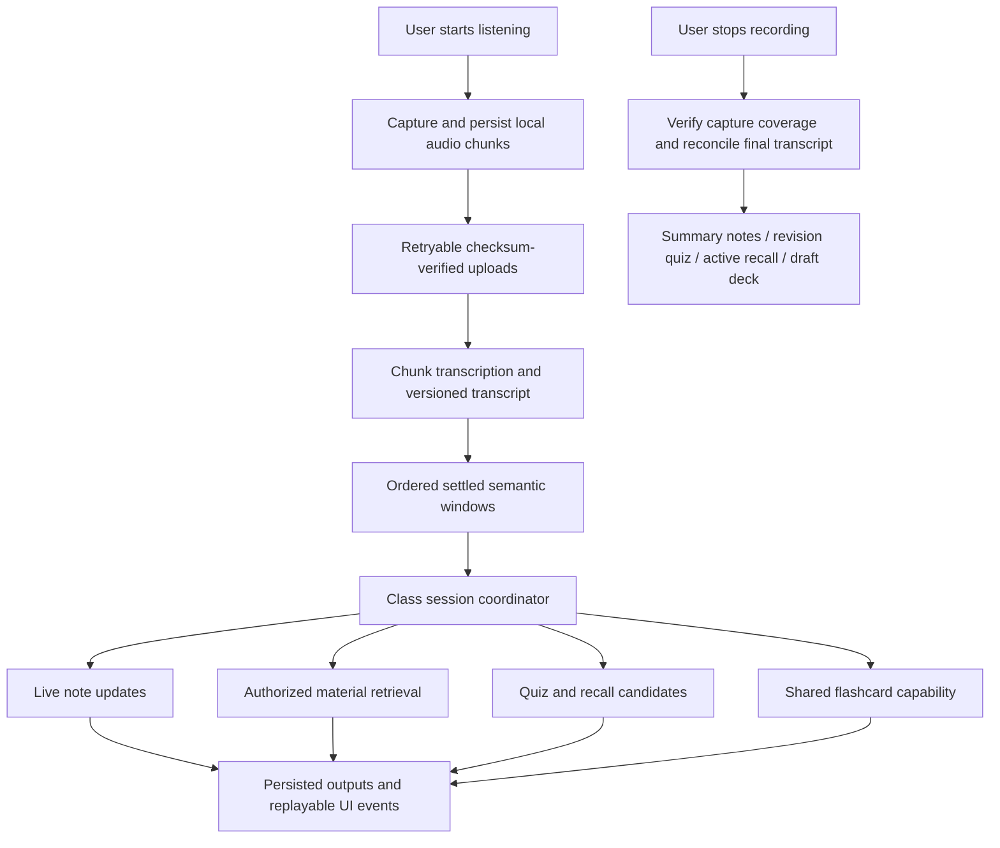

# In-Class mode: activation and live processing

Design specification — 4 October 2026. The web/backend implementation and explicit remaining acceptance requirements are tracked in [IN_CLASS_IMPLEMENTATION.md](IN_CLASS_IMPLEMENTATION.md) and [the build checklist](IN_CLASS_IMPLEMENTATION_TASKS.md). Complements the Complete UI Redesign and shared flashcard architecture briefs.

## Existing foundation and missing work

The current checkout has chunked microphone capture (`web/lib/lecture-capture.ts`), durable local manifests/chunks (`lecture-local-store.ts`), an upload/recovery queue (`lecture-upload-queue.ts`), and controls in `class-recorder.tsx`. Backend lecture routes accept idempotent chunks, finalize recordings, expose transcripts/representations, and support transcript corrections. `lecture_service.py` and `lecture_pipeline.py` enqueue transcription and downstream processing using WorkflowStore. Generated lecture blocks are separate from student-authored notes.

Current capture also polls transcript updates. This is not yet the proposed coordinated In-Class workspace: semantic processing is gated by finalized capture and transcription completion, and live quiz/material/flashcard coordination needs new work. Preserve legacy recording compatibility. Do not treat historical architecture documentation or local code presence as production/mobile acceptance.

The existing durable agent runtime provides task admission, revisions, commands, activity replay, and background execution for implemented capabilities. Reuse those boundaries, extending supported capabilities explicitly; there is no unrestricted specialist-agent registry today.

## Activation

Course and companion selection follows [the Buddy/course integration specification](BUDDY_HOME_COURSES_AND_CHATS.md). Resolve the companion from an explicit session override, then the course preference, then the account default. Persist its ID with the class session and linked chat. Later course reassignment does not change an ongoing session or historical chat. Display the resolved avatar/name in setup and the session header; internal specialist workers remain shared capabilities across all companions.

Offer **In-Class** in the mode selector and **Start class session** from a course. A conversational request such as “Start taking notes for this class” opens the same setup. Selecting a mode, opening a course, or reaching a scheduled class time must never start microphone capture automatically. Buddy can suggest starting when class approaches.

Setup shows course, class/session title, available source materials, microphone selector where supported, and output preferences: live notes, supporting materials, practice questions, and draft flashcards. Default to quiet preparation, not distracting prompts. Explain capture and recording status in plain language. Existing course context can prefill setup; ask only for missing essentials. Recording consent requirements must be addressed in the product's classroom flow.

The user presses **Start listening**. In that user-gesture handler, request microphone permission and initialize capture; avoid waiting on a long server call before requesting device access. Create a stable local session/recording identity, save the local manifest, and sync the server session with an idempotency key. If microphone permission fails, show an actionable retry and do not label the session recording. If the API is temporarily unavailable after local capture is safely initialized, visibly distinguish local recording from connected live processing. Account/source readiness should be checked before offering cloud assistance.

Opening an existing live session on another device joins its views; it does not start a second recorder. Recording starts on one explicitly chosen device. Switching capture devices requires an explicit handoff and a new capture epoch; surface any gap. First implementation can disallow mid-session handoff rather than silently risking duplicate audio.

## Session lifecycle and state

Apply the detailed [behavior and recovery contract](BUDDY_BEHAVIOR_AND_RECOVERY_CONTRACT.md), including interruption, storage failure, account changes, missing coverage, and cancellation races. The default chat mode is Conversation. Capture lifecycle remains independent of response mode; switching companions/views preserves the active session's original identity and visible recording controls.

Model independent dimensions instead of one overloaded status:

- Capture: initializing, recording, paused, stopped, interrupted.
- Upload: local-only, syncing, synced, missing-chunks, failed.
- Processing: waiting-for-audio, live, catching-up, finalizing, completed, completed-partial, failed.
- Outputs: separate readiness/revision/error for notes, materials, quiz, flashcards, summary, and active recall.

Pause halts capture but can let already captured audio finish processing. Stop closes the microphone immediately, persists final local metadata, and begins upload/finalization; it does not cancel the revision package. Closing the canvas or changing chat mode leaves capture governed by the explicit recording controls. Show a persistent recording indicator and Stop access outside the canvas. Navigating away or terminating a browser may still interrupt web capture, so persist recovery metadata and never promise browser background reliability. Native lock-screen capture requires separate device testing.

Cancel processing is separate from Stop recording. Deletion is another explicit operation affecting saved data. Restore a stopped/interrupted session honestly on restart; do not restart the microphone automatically.

## Audio-to-output pipeline

Reuse current capture formats and upload contracts until device validation justifies changing them. Audio chunks must be independently processable as expected by the transcription adapter; MediaRecorder data events are not automatically independent audio files. Persist bytes, sequence, timing, MIME and checksum before upload; delete local bytes only under the retention/acknowledgement policy.

Commit transcript segments with source revision and timings. Emit durable transcript-ready obligations in the same database transaction. A contiguous processing watermark prevents later uploaded chunks from being treated as earlier lecture content. Show gaps if sequence coverage is incomplete; after an explicit partial-coverage decision, retain gap markers rather than pretending the transcript is continuous.

Group settled transcript into semantic windows with small bounded overlap and topic metadata. Audio chunk boundaries are not lesson boundaries. Trigger downstream work on meaningful new coverage/topic changes, with batching, debounce, and max-in-flight limits. Proposed live latency should be measured in device/provider tests before a target is promised; supporting materials may arrive later than notes. Immediate audio level/recording feedback is independent of cloud output latency.

## Coordinated specialist work

Use one ClassSessionCoordinator as the authoritative planner. Its shared context contains owner, course, conversation, recording ID, capture epoch, transcript watermark/revisions, covered topics, authorized material versions, student preferences, and output references. Each specialist receives only its bounded required context. Modes do not determine ownership.

| Worker responsibility | Input | Persisted output |
| --- | --- | --- |
| Notes | Settled transcript window and prior section context | Versioned generated note blocks with lecture evidence |
| Materials | Covered topics and authorized course material index | Relevant source links/passages, labelled supplementary |
| Practice | Covered concepts and grounded lecture/source excerpts | Draft live quiz questions and recall prompts |
| Flashcards | Covered concepts and source references | Candidates in one class deck through the shared capability |
| Final synthesis | Final transcript/coverage and accepted outputs | Summary notes and class revision package manifest |

Parallel work is bounded background execution, not always-running LLMs or a sandbox per specialist. Course material lookup reuses existing source/context retrieval. Sandbox execution is optional for supported processing that requires isolation; it is not required to read every passage. Existing QuizService remains the owner of quiz generation/attempt rules; add a source-grounded lecture continuation adapter rather than building a second assessment engine. Shared flashcard services own decks/review. Lecture coverage does not itself award learner mastery.

Introduce a deliberate live semantic-analysis path instead of disabling finalization checks in the existing lecture pipeline. A live path creates provisional section/output versions; final processing reconciles them using complete capture metadata. Each job has a stable key derived from session, specialist, window, input revision, and policy version. Worker lease/input revision fencing prevents obsolete work from publishing. Transcript corrections invalidate dependent generated content; preserve student edits and existing attempts, and propose corrected versions.

Choose one queue/outbox owner per obligation. Lecture ingestion/transcription retains its current owner; the class coordinator consumes explicit durable handoff events and creates downstream specialist jobs through the agent execution path. Do not enqueue duplicate copies through lecture recovery, API BackgroundTasks, and agent workers. Provider/model calls execute outside short database transactions. Persist outputs before notifying viewers; job recovery must publish each result once.

## Frontend rendering

Add an InClassWorkspace using the existing split canvas: Live notes, Materials, and Practice views, with draft flashcards accessible through the shared deck renderer. Buddy chat remains usable. Keep recording controls/status in the workspace shell so they remain accessible when the user reads another view.

Use a snapshot plus cursor-based event feed, with polling fallback, scoped to the verified class session. Proposed events: capture.status, transcript.committed, notes.updated, materials.ready, practice.ready, deck.updated, output.failed, and package.updated. Extend current agent activity contracts deliberately; browser-local events only navigate and do not store authoritative progress. Ignore duplicate event IDs and older output revisions, detect gaps, and reload a snapshot on reconnect. Do not steal focus or scroll when the user is editing or reading earlier notes.

Live notes should arrive in stable sections with “Updating” and uncertainty indicators. Keep authored edits in their established separate storage. Practice questions display a quiet availability badge; answering is optional during the lecture. Source links navigate to supported material passages or lecture timestamps. On mobile render a full-screen class view with Notes/Materials/Practice navigation and persistent recording status, retaining an obvious way back to Buddy. Native audio capture uses a separate platform adapter to the same session/upload APIs.

## Proposed data and API extensions

Add a class-session envelope linked to the existing lecture recording, course, and conversation rather than duplicating audio tables. Proposed records: class_sessions, class_input_windows, class_worker_runs or task references, class_output_versions, and class_package_items. Store capture-device/epoch identity and explicit output policies; reuse agent task/activity and existing output entities instead of copying full task state. Include export/delete/import handling and ownership indexes.

Proposed endpoints: idempotent class-session creation/setup; session snapshot and cursor events; revision-checked session policy/processing commands; and final revision-package retrieval. Exact names should be chosen with the existing lecture and agent routes. Continue using existing chunk PUT, transcript correction, recording status, retry, and finalize endpoints. Session creation should resolve an existing recording or map the client recording ID once; successful retries must not create another note or class session.

Audio remains local/owner-private object storage through current adapters, with Supabase private storage planned later. SQLAlchemy metadata targets local SQLite and hosted PostgreSQL. Signed-in devices consume the same class-session state once hosted sync is configured; raw live audio need not be replicated to every device.

## End-of-class finalization

Stop records expected chunk count, duration, interruption information, and capture epoch. Wait for acknowledged chunks and transcription coverage before marking the full package complete. Expose missing coverage and an explicit partial-package path if recovery is impossible. Do not bypass existing recording finalization integrity checks just to show a completed UI.

Reconcile topic sections, deduplicate provisional content, and produce summary notes, a revision quiz, active-recall prompts, and the draft flashcard deck. The package references durable artifacts and their source revisions. Show each item as preparing, ready, partial, or failed independently; ready notes remain accessible when quiz generation needs retry. Final work continues after the viewer disconnects. Completion notifications use the shared notification/preferences boundary, not a worker's direct device message.

## Implementation sequence and acceptance

1. Class-session activation/setup, recording identity linkage, persistent controls, and existing transcript rendering—reuse capture/upload first.
2. Incremental source-backed live notes with durable transcript handoff, revision fencing, reconnect, and corrections.
3. Bounded materials/practice/flashcard specialist tasks and shared canvas rendering.
4. Final revision package, notification integration, hosted/device sync, and native capture acceptance.

Test microphone denial, unavailable API, interruption and recovery, duplicate/reordered/missing chunks, transcript corrections, stale worker publication, repeated Stop/finalize, permission/owner isolation, source access loss, offline devices, tab close, student edits, in-progress answers, and independent output failures. Validate SQL locking/leases with hosted PostgreSQL and test long real recordings on target web/native devices. No arbitrary automatic microphone activation or unverified background-capture promise.
