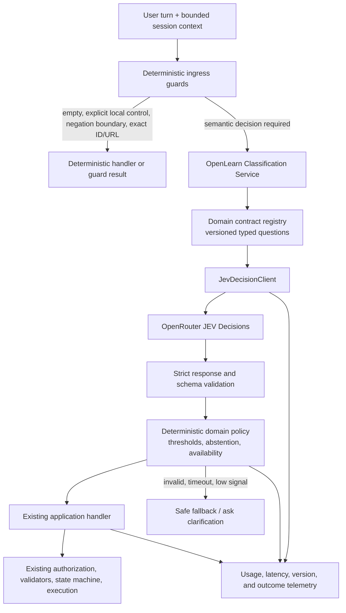

# JEV classification architecture plan

**Status:** implemented in the backend behind per-contract rollout controls. Production activation remains gated on labeled evaluation and operator configuration.

## Implementation status

The backend now has a shared typed JEV Decisions client, versioned contracts for mode intent, turn routing, teaching intent, browser tasks, reminder actions, evidence outcomes, and concept candidates, plus adapters at the existing decision points. Deterministic permissions, validators, acceptance flows, and action execution remain authoritative. JEV shadow decisions are sampled and cannot change user-visible behavior; active behavior is independently configurable by contract.

The example environment starts globally in shadow mode and samples 10% of eligible turns. The runtime's built-in sample rate is zero unless configured. A JEV call also requires an OpenRouter key, enforced usage accounting, a pinned provider-rate version, and an operator-configured per-request ceiling. No production environment has been changed. Before enabling active mode, owners still need to run the labeled benchmark, set domain-specific thresholds and latency/cost limits, and review the resulting shadow metrics.

## Goal

Use JEV as Open Learn's common semantic decision model wherever the application must infer meaning from a learner's words, conversation context, or evidence. Replace independent keyword-driven guesses and scattered model classifiers with versioned, typed decision contracts and one shared JEV integration.

“All classification” means all *semantic* classification. Exact parsing, validation, arithmetic, identity checks, permissions, and state transitions remain deterministic. JEV labels a request; it does not authorize an action, perform an action, generate a lesson, or establish that an answer or source is correct.

JEV Decisions accepts typed questions such as a choice or a yes/no decision over supplied state. Its returned scores should be treated as model signals, not calibrated real-world accuracy; operating thresholds need to be selected against Open Learn's labeled examples. See [OpenRouter's JEV Decisions guide](https://openrouter.ai/blog/tutorials/how-to-use-jev/).

## Current architecture and why it is inconsistent

The repository already has a JEV adapter inside `ModeTransitionService`, but JEV is only used in a narrow ambiguous-quiz path when `AI_TUTOR_MODE_CLASSIFICATION=jev`. Clear phrase rules can return earlier, so JEV does not currently own every mode decision. That adapter calls OpenRouter's `/api/alpha/decisions`, sends a bounded mode context, asks three typed questions, validates the answers, applies hard-coded score cutoffs, and falls back to `stay` on failure. JEV usage is metered as a per-request estimate.

Elsewhere, meaning is inferred separately:

| Current decision point | Current approach | Planned JEV responsibility |
| --- | --- | --- |
| `backend/app/mode_transition_service.py` | Rules first; configured lesson provider for general hybrid classification; JEV only for an ambiguous subset | Classify immediate workflow and explicit vs. implicit mode intent for every eligible Ask/Learn turn, with conversation context. |
| `backend/app/agent_execution/admission.py` | Regex routing to direct answer, browser, research, analysis, flashcards, reminder, control, connected action, memory, or responsibility | Classify the user's primary task when natural-language meaning determines the route. |
| `backend/app/browser_assistant/intent.py` | Heuristic candidate/fallback plus a generative provider compiling `TaskIntent` | Decide whether the request belongs to the browser/academic assistant and select a bounded task class. Keep arbitrary goal/entity extraction in the existing structured compiler. |
| `backend/app/reminder_intent.py` | A generative provider compiles a reminder into a validated `ReminderCreate` | Classify reminder operation and whether the user intends a routine, one-time reminder, list, cancel, snooze, quiz, or flashcard action. Keep schedule/date/action argument extraction and validation separate. |
| `backend/app/learning_kernel.py` | Token lists select teaching sub-intents such as simplify, example, why, visualize, or check understanding | Select a teaching sub-intent when the learner's meaning implies a presentation choice. |
| `backend/app/web_evidence/lifecycle.py` | Excerpt count, polarity tokens, and age hints estimate evidence outcome | Classify semantic support/conflict among bounded evidence excerpts. Keep evidence count, age limits, and lifecycle transitions deterministic. |
| `backend/app/stable_concept_service.py` | A generative provider proposes candidate concept IDs | Select or abstain among a bounded list of candidate concepts when semantic similarity is needed. Keep IDs, identity validation, persistence, and merges deterministic or human-approved. |

The table is an implementation inventory, not an instruction to send every input through every row. At runtime, invoke only the domain contract needed by the user's turn. Related decisions should be batched into one JEV request.

## Target architecture



### 1. Shared transport: `JevDecisionClient`

Extract the direct HTTP, usage accounting, and response-envelope parsing now embedded in `ModeTransitionService` into a backend-wide client. The client should own:

- OpenRouter auth, model selection, fixed endpoint, bounded timeout, and request ID.
- Versioned state/question payload construction only through registered contracts; set conservative body and state size limits.
- Strict JSON/answer parsing, expected question names, answer types, score ranges, and provider error normalization.
- Central usage accounting. Reserve against an operator-verified per-request ceiling before dispatch. Settle using OpenRouter's raw `usage.cost` receipt and response ID when valid; if a response or receipt is unavailable, conservatively retain the ceiling and mark it estimated. Meter every dispatched attempt, including retries and failed responses.
- One bounded retry only for transient connection/server errors if the remaining deadline permits; do not retry malformed results or decisions. Never leave background provider work running after the request has fallen back.
- Privacy-safe structured telemetry. Record request/contract/model versions, outcome labels and scores, latency, estimated cost, and error class. Do not log raw learner prompts, lesson text, browser pages, or evidence by default.

The transport returns typed answers and metadata. It does not apply domain thresholds or decide what Open Learn should do.

### 2. Domain contracts: small, typed, and versioned

Add a classification service above the transport, with separate contracts rather than one giant prompt or an unconstrained `TaskIntent` response. Initial interfaces should be along these lines:

- `classify_turn_route`: primary route from `direct_answer`, `learn`, `quiz`, `browser_academic`, `research`, `data_analysis`, `flashcards`, `reminder`, `memory`, `responsibility`, or `none`.
- `classify_mode_intent`: requested mode (`ask`, `learn`, `quiz`, `none`), request type (`explicit`, `implicit`, `none`), and whether the intent is immediate versus future/quoted/negated. Ask all related questions in one JEV request.
- `classify_teaching_intent`: a bounded sub-intent such as `simplify`, `example`, `why`, `visualize`, `check_understanding`, `resume`, or `teach`.
- `classify_browser_task`: whether a request should open/use a connected browser and the broad task class. It must not invent a URL, connection, course, due date, or page element.
- `classify_reminder_action`: create/list/cancel/snooze plus routine-vs-one-time and study activity class. Keep extraction of exact times, recurrence, timezone, scope IDs, and action arguments in existing parsers/structured generation and validators.
- `classify_evidence_outcome`: semantic support/conflict/limitation labels over a supplied set of excerpts. It must not declare factual truth or mastery.
- `classify_concept_candidate`: choose from candidate IDs or `none`; never mint a concept ID.

Each contract defines its own schema version, allowed labels, concise criteria, minimum context, maximum context, and output validation. Preserve the user's text as untrusted data. When top-level task routing and mode intent are both needed for the same turn, ask both in a single JEV call so JEV can share the state and the app avoids serial model round trips. Do not include irrelevant data just to make one universal payload.

### 3. Deterministic domain policy remains the authority

After validation, a pure policy function maps a JEV answer into the existing domain models (`AdmissionPlan`, `TaskIntent`, `TeachingIntent`, `EvidenceOutcome`, or a mode transition result). It owns:

- Confidence / score thresholds selected per label and per consequence using evaluation data, plus a clear `abstain` interval.
- Available destination checks, current mode comparison, cooldowns, dismissal history, and the existing requirement that mode changes are user accepted.
- Explicit negative, quoted-instruction, future-intent, and exact control safeguards. Semantic classification can add context, but cannot erase an explicit refusal or preference.
- Final authorization, connection scope, external-action approval, schema validation, evidence/source requirements, schedule calculations, and all writes.
- Failure behavior. A mode suggestion may safely abstain and keep the current mode; a browser/reminder/connected action should route to clarification or existing safe fallback instead of guessing.

JEV never receives credentials, secrets, unrestricted page controls, or authority to approve its own proposed action. Browser and source content are untrusted input. A decision such as `browser_academic` only selects the existing browser workflow; the workflow's allowlists, confirmation rules, and state machine still decide what may run.

## How a chat turn will work

1. The server receives the message and loads only the bounded session context required by the active workflow.
2. Deterministic guards handle empty input, pending suggestion accept/dismiss, explicit local controls, exact IDs/URLs, hard refusals, and other cases that do not require a semantic judgment.
3. If semantic classification is required, the ingress coordinator requests the applicable domain decision(s). For Ask/Learn turns, mode intent is evaluated on every non-empty eligible turn rather than only when a keyword list matches. Top-level route and mode questions can share one JEV call.
4. The domain policy validates the selected class, score signal, current state, and availability. It either emits the existing typed plan, abstains, or requests clarification.
5. The existing handler executes. Its validators and authorization checks remain in charge. Mode changes remain opt-in in the UI.
6. Store safe telemetry and interaction outcomes so accepted, dismissed, corrected, and failed decisions can improve the evaluation set and thresholds.

JEV is a decision model, not the content-generation provider. If the selected route needs a lesson, arbitrary website plan, reminder schedule extraction, or a natural-language answer, the current purpose-built handler/provider continues to do that work after routing.

## What stays deterministic or with the existing generator

| Responsibility | Owner after migration |
| --- | --- |
| Parse/normalize URLs, exact dates, recurrence arithmetic, counts, IDs, and schemas | Existing code and validators |
| Consent, authentication, permissions, browser origin checks, external-write approval | Existing policy and authorization code |
| User accepting or dismissing a mode suggestion | Existing UI/API interaction flow |
| Tool lifecycle and action state transitions | Existing state machine |
| Exact source-domain mapping | Existing deterministic lookup |
| Generate lesson text, browser task details, reminder arguments, answers, or explanations | Existing task-specific model/provider |
| Claim that an answer is correct, a source is true, or a learner has mastered a concept | Existing evidence/rubric policy; JEV may label text but cannot certify it |
| Stable IDs, database writes, merges, final action execution | Existing services, with validation/approval |

## Latency, cost, and fallback design

Moving from occasional classification to full semantic coverage can add a model round trip to the hot path. Reduce the impact by:

- Batch co-required labels into one decision request; avoid separate sequential requests for route, mode, and sub-intent when they use the same user turn and context.
- Invoke domain-specific detail classifiers only after their route is selected. Do not run browser, reminder, evidence, and teaching classifiers in parallel for every message.
- Keep payloads compact and bounded. Include recent turns only when needed to resolve a follow-up or implicit intent.
- Set and measure an end-to-end classification deadline, p50/p95 latency, timeout rate, and estimated cost per user turn. Pick the timeout and per-user budget from actual product SLOs before broad rollout.
- Use a safe per-domain fallback. Do not silently substitute a different classifier and report that JEV made the decision. If fallback is deterministic, label its provenance separately in telemetry.
- Keep a configuration kill switch for JEV and per-contract shadow/active state. A rollback should restore the prior route without a data migration.

The existing mode adapter's 2.5 second timeout and `.80/.20/.75/.82` score gates are implementation details, not rollout targets. Re-evaluate these values per contract; do not copy them across unrelated decisions.

## Evaluation and rollout

Build a labeled benchmark before changing production behavior. Include paraphrases, slang, multilingual messages, multi-intent prompts, ordinary questions, conversational follow-ups, future plans, quotes, negation, refusals, and ambiguous requests. For domain-specific sets, include browser-vs-tutor examples, reminder edits and recurrence edge cases, evidence with disagreement, and near-neighbor concept candidates.

Evaluate each label separately. For mode recommendations, emphasize explicit-intent recall and unsolicited-suggestion precision separately; false interruptions should carry a larger penalty than an abstention. Track confusion matrices, abstention rate, calibration/reliability by score band, latency, failure rate, and cost. User acceptance/dismissal/correction is useful feedback but is not automatically a ground-truth label.

| Phase | Work | Promotion condition |
| --- | --- | --- |
| 0. Baseline | Inventory all semantic decisions; define contracts and labeled sets; measure current route outcomes and latency. | Each contract has a clear label definition, negative cases, and owner. |
| 1. Shared client | Extract the current mode JEV request into `JevDecisionClient`; centralize validation, usage, timeout, and telemetry. Keep existing behavior active. | Contract tests cover malformed, missing, out-of-range, timeout, and usage-accounting cases. |
| 2. Shadow decisions | Run JEV beside current behavior for sampled eligible requests; never let shadow answers change user-visible behavior. Compare per-domain decisions on the labeled set and opt-in production sample. | Precision/recall and latency/cost meet agreed thresholds; no privacy or authorization regression. |
| 3. Mode rollout | Make JEV mode intent the semantic path for every eligible Ask/Learn turn; preserve explicit safeguards, accept/dismiss flow, and deterministic fallback behind a feature flag. | Mode false-suggestion rate and end-to-end latency meet product targets; rollback verified. |
| 4. Task routing | Migrate admission and teaching sub-intent, then browser and reminder route labels. Keep their structured extraction, authorization, and execution layers. | Each domain contract passes its own benchmark and operational budget. |
| 5. Evidence/concepts | Add evidence outcome and candidate concept labels only after their own domain evals demonstrate value. | No unsupported increase in factual claims, concept mislinks, or mastery decisions. |
| 6. Default-on | Enable all approved semantic contracts by default; retain per-contract kill switch and model/schema version tracking. | Stable production quality, cost, and latency over the agreed observation window. |

## Configuration and ownership proposal

Replace the overloaded mode-only setting with a central JEV configuration and per-contract rollout controls. Names are proposals; settle them during implementation:

```text
OPENLEARN_CLASSIFICATION_PROVIDER=jev
AI_TUTOR_JEV_MODEL=typesafe/jev-1.13
AI_TUTOR_JEV_TIMEOUT_SECONDS=<approved SLO>
OPENLEARN_JEV_USD_PER_REQUEST=<operator-verified rate>
OPENLEARN_CLASSIFICATION_MODE=shadow|active
OPENLEARN_CLASSIFIER_<CONTRACT>_MODE=off|shadow|active
```

The shared client owns request-level accounting and version tags. Each domain owns its schema, decision policy, examples, and quality target. Product/learning policy owns user-facing interruption thresholds; backend/platform ownership covers budgets, telemetry retention, and the global kill switch.

## Decision summary

Adopt JEV as the single semantic classification service, introduced first by extracting and broadening the existing mode adapter. Use one shared transport and several small domain contracts, batch related questions per turn, and pass every result through deterministic policy. Migrate in shadow mode and promote each domain independently. Keep exact parsing, authorization, action execution, content generation, and truth/mastery decisions with their current owners.
