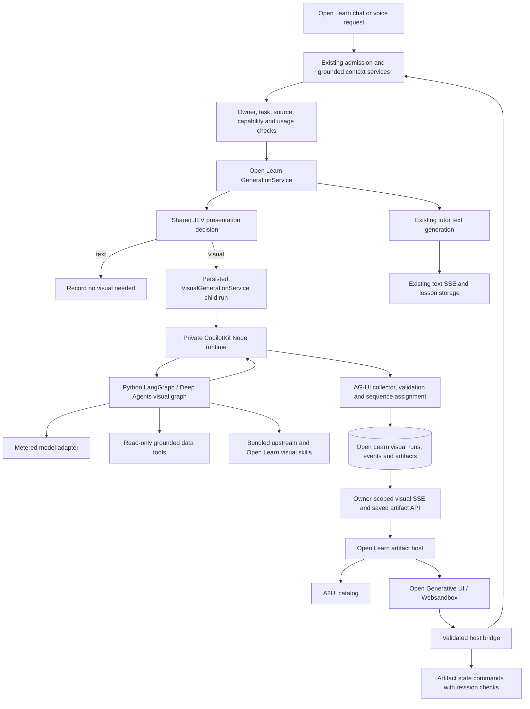

# OpenIntelligentUI visual stack replacement plan

Prepared: 9 October 2026. Status: proposed architecture and implementation plan. This document does not claim that the integration, provider access, security checks, or deployment have been completed.

## 1. Decision and intended result

Replace Open Learn's generation of new visuals with the complete OpenIntelligentUI visual pipeline: JEV presentation selection, a LangGraph/Deep Agents visual agent, CopilotKit runtime and AG-UI transport, A2UI rendering, streaming Open Generative UI, Websandbox, shared design guidance, and visual skills. Include its optional MCP capabilities as a later interface to the same artifact services.

The goal is that a learner can ask for an explanation and receive a purpose-built interactive answer: an electrical circuit, a 3D mechanism, a calculator, a comparison, an animated process, or a geographic display. Generated layouts and behavior must not be limited to the fixed visual types and six simulation models currently built into Open Learn.

Open Learn remains the authority for the learner, conversation, grounded teaching context, lessons, sources, tasks, usage, and saved artifacts. The imported graph is the visual production subsystem inside that architecture. It is not a second owner of the student's conversation or browser tasks.

This requires a new artifact contract. Converting arbitrary generated interfaces back into the existing `VisualizationSpec` would preserve the restriction we are trying to remove. Keep the old schema only for historical artifacts during compatibility support.

### Scope of "entire stack"

Adopt the full production path used to generate and display visuals, including its model tools and skills. Adapt integration boundaries rather than merely copying its visual styling. The upstream demo chat, visitor API-key form, sample CSV database, sample login form, and demo todo state do not become Open Learn product features. Replace their data access with real Open Learn services.

The working import is pinned to upstream commit `f6e4388b26a64b9a0714943b08a1ce622b924eec`. A read-only source copy was inspected at `work/research/openintelligentui-20261009`; this research directory is ignored and is not a production dependency.

Sources: [upstream architecture](https://github.com/CopilotKit/OpenIntelligentUI/blob/f6e4388b26a64b9a0714943b08a1ce622b924eec/docs/architecture.md), [routing](https://github.com/CopilotKit/OpenIntelligentUI/blob/f6e4388b26a64b9a0714943b08a1ce622b924eec/docs/visualization-routing.md), [runtime options](https://github.com/CopilotKit/OpenIntelligentUI/blob/f6e4388b26a64b9a0714943b08a1ce622b924eec/apps/app/src/lib/copilotkit-runtime-options.ts).

## 2. What exists today and what changes

| Current Open Learn boundary | Inspected behavior | Migration decision |
| --- | --- | --- |
| `backend/app/visualization_planner.py` | Visual eligibility uses cues; the provider returns a small validated specification bundle. | Replace new-output planning with the JEV presentation contract and visual graph. Remove the cue gate after cutover. |
| `backend/app/visualization_models.py` | Bounded types, mathematical expressions, provenance, and approved simulations; model-supplied code/layout is prohibited. | Retain as legacy input validation. Introduce a distinct generated-artifact envelope with isolated code payloads. |
| `backend/app/generation_service.py` | Runs a visual planner beside tutor text generation; emits `visualization.planning/ready/skipped`; commits visuals through the journey service. | Admit a persisted visual child run, stream its activities, and attach artifact references to the lesson. |
| `backend/app/journey_service.py` and `session_models.py` | Lessons embed visual specifications and text/visual parts. | Add stable artifact references and placement records; avoid copying generated code into every journey representation. |
| `backend/app/visualization_service.py` | Revision-checked changes to a simulation parameter, annotation, or domain. | Keep historical behavior; create state and revision commands for generated artifacts. |
| `web/components/visualization*.tsx` | Native renderers chosen by a fixed registry. | New outputs use A2UI or the imported sandbox renderer; legacy registry remains read-only for existing records. |
| `web/lib/generation-stream.ts` | Reconnecting, sequence-filtered Open Learn SSE observer. | Keep for tutor text; add an equivalent visual-run observer and AG-UI activity reducer. |
| `backend/app/classification/` | Metered JEV decisions through OpenRouter, with per-contract rollout policies. | Add presentation selection to the shared service, with a TypeSafe transport adapter for upstream parity. |
| `backend/app/voice/teaching.py`, `voice/tools.py`, `web/lib/voice/client.ts` | Visual creation uses the old planner; updates target a focused bounded numeric parameter. | Route creation to the new subsystem; use an optional typed interaction manifest for verified voice control. |

Inspect exact current code before editing: this is an active working tree, and older architecture documents contain historical status descriptions. Relevant boundaries include [current architecture](CURRENT_ARCHITECTURE.md), [application foundation](APPLICATION_FOUNDATION.md), [JEV classification](JEV_CLASSIFICATION_ARCHITECTURE_PLAN.md), and [browser/computer plan](GENERAL_PURPOSE_BROWSER_COMPUTER_IMPLEMENTATION_PLAN.md).

## 3. Upstream components to bring across

| Component | Upstream source | Open Learn role and required adaptation |
| --- | --- | --- |
| Deep Agent and LangGraph | `apps/agent/main.py` | A bounded visual graph initialized with a server-built visual brief. |
| Model middleware | `apps/agent/src/model.py` | Tool-capable generation through Open Learn's provider configuration and accounting. |
| JEV routing middleware | `apps/agent/src/visualization_router.py` | Preserve presentation vocabulary and rendering-tool filtering; use the shared classification result exactly once. |
| Prompt and visual skills | `apps/agent/src/prompt.py`, `skills/` | Preserve detailed design/streaming guidance; add teaching goals, verified data, and accessibility requirements. |
| Skill backend | `apps/agent/src/skill_backend.py` | Immutable bundled skill snapshots and isolated per-run scratch state. |
| CopilotKit runtime | `apps/app/src/app/api/copilotkit/route.ts`, runtime options | Inject A2UI and `generateSandboxedUi` tools; transform tool streams into activities. |
| Open Generative UI renderer | `apps/app/src/components/generative-ui/open-generative-ui/` | Progressive visual previews and final interactive sandbox in an Open Learn message/artifact panel. |
| A2UI catalog | `table-catalog.tsx` | Structured semantic tables; expand only through reviewed catalogs. |
| Websandbox and host bridge | `apps/app/src/lib/sandbox/` | Isolated execution with an Open Learn bridge rather than a second chat submission path. |
| Design system | `packages/design-system/` | Map upstream tokens, SVG classes, forms, and import maps to Open Learn theme tokens. |
| Export functionality | `export-utils.ts`, `export-overlay.tsx` | Safe static export first; executable export gets an explicit separate policy. |
| Optional MCP | `apps/mcp/` | Expose the same trusted skills and assembler after the primary application path works. |

Preserve MIT notices for imported source and audit the licenses of transitive packages and assets. Vendor only the needed source in a clearly identified integration package, with the upstream commit and a documented patch list. Do not use a moving Git branch as an install-time dependency.

## 4. Target architecture



### Ownership rules

1. The API derives owner, session, generation, sources, and permissions. Browser-supplied agent state cannot override these fields.
2. `VisualGenerationService` owns the visual run and its terminal state. LangGraph owns internal generation steps only.
3. CopilotKit owns rendering-tool injection and protocol translation. It does not authorize learner data access or settle application usage.
4. The event collector is the single writer of a visual run's client-visible event sequence. Workers use leases/fencing so two collectors cannot commit the same run concurrently.
5. The artifact service owns completed payloads and saved interaction state. LangGraph checkpoints and local iframe variables are not the canonical lesson record.
6. Browser execution continues through the existing assistant coordinator and executor services. Generated visual code cannot open authenticated browser connections or execute browser actions directly.

### Process placement

Default to a private Node runtime process because tool injection is part of the actual upstream stack and Open Learn's current Vinext wrapper needs compatibility verification. A standalone official CopilotKit server adapter must be verified against the pinned package; do not invent an adapter API.

Package the Python visual graph under the existing backend codebase. Mount its internal endpoint in the existing FastAPI app if dependency resolution, event-loop behavior, and load checks pass. Execute visual jobs through the existing supervised worker boundaries. If dependency or resource isolation requires a dedicated Python visual process, it uses the same backend package and authoritative database, with authenticated internal access; it is not a second learning application.

An optional simplification is to host the runtime in a web route after Vinext/production runtime tests pass. That is a placement change, not a change in authority or protocol. Avoid making the first migration dependent on replacing Open Learn's frontend framework.

## 5. Request and response lifecycle

### A normal explanation with a visual

1. Existing admission handles task routing and permissions. A request to inspect a website still goes to the browser workflow first.
2. Existing tutor preparation compiles a bounded, grounded context: the learner's question, goal, depth, selected sources, course context, relevant recent conversation, and accessible previous artifacts.
3. Presentation selection decides text, A2UI table, or sandbox output. Cache the decision by owner, user message ID, brief revision, and contract version; repeating the same text in a new message is a new decision.
4. For a non-text decision, create a visual child run and reserve its bounded provider liability before dispatch. Publish its ID and placement anchor immediately so the UI has a stable location.
5. Tutor text and the visual graph can proceed independently after the shared context is ready. The visual graph receives the same evidence and learning purpose, not a fresh general-agent conversation that reinterprets the student's entire task.
6. The private runtime injects the upstream rendering tool contracts. The Python graph creates useful content and invokes only the rendering path selected by the validated presentation decision.
7. The collector preserves activity ordering, validates limits, persists replayable events, and forwards bounded updates to the artifact host. The frontend uses the imported renderer to show progressive previews.
8. On completion, finalize an immutable payload and attach a stable reference to the lesson/turn in a transaction. A crash between object storage and DB commit is reconciled using content hashes and staged-object cleanup.
9. The frontend reports ready only after the final sandbox mounts and initialization succeeds. Server generation success and browser rendering success are distinct signals.

### Text completion does not wait for a slow visual

Keep the tutor's existing generation lifecycle and create a separate visual-run lifecycle. `generation.completed` returns the text/lesson result plus any visual-run IDs. A `VisualRunStream` continues observing those runs after `GenerationStream` reaches its terminal event.

These are two observers of different owned records, not two competing runtimes for the same request. A later session-level multiplexed observer can simplify transport without changing ownership.

The pending artifact is anchored by message/block ID and slot, not transient paragraph indices alone. Late completion fills that slot without jumping the learner's reading position or duplicating the response. Use revision-checked attachment commands so concurrent messages cannot overwrite journey history. Updating the lesson reference must not regenerate its text.

### Follow-up and changes

- Ordinary sliders and filters act locally and do not send messages or spend model credits.
- An explicit "Ask Buddy about this" action submits a new Open Learn message with the artifact ID, revision, and validated selected values.
- The server resolves the artifact and values, then passes a concise scenario description into normal admission/context compilation. Never trust an iframe-supplied owner or free-form context as authority.
- A request for a substantial design/formula change creates a new artifact revision using the visual graph and records `supersedesArtifactId`. Preserve earlier snapshots and show which version is current.
- Do not implement arbitrary cross-call DOM patching: the inspected upstream implementation does not provide that contract. Minor state changes use the typed interaction interface described below.

## 6. New artifact and protocol contracts

Introduce a versioned envelope instead of expanding `VisualizationSpec` with arbitrary code fields. Proposed names below are implementation proposals, not existing APIs.

```json
{
  "id": "visual_...",
  "schemaVersion": 2,
  "kind": "sandbox_ui",
  "sessionId": "session_...",
  "generationId": "generation_...",
  "visualRunId": "visual_run_...",
  "lessonId": "lesson_...",
  "revision": 1,
  "status": "ready",
  "placement": {"turnId": "turn_...", "blockId": "block_...", "slot": 0},
  "title": "Explore a circuit",
  "textAlternative": "Explanation of the circuit and its formula",
  "payload": {"objectId": "owned_object_...", "sha256": "..."},
  "provenance": {"kind": "illustrative", "sourceIds": [], "assumptions": []},
  "runtimeVersion": "openlearn-ogui-v1",
  "assetManifestVersion": "visual-assets-v1",
  "interactionManifestId": "manifest_..."
}
```

`kind` initially permits `a2ui`, `sandbox_ui`, and `legacy_visualization`. The authenticated server stores owner and effective policy separately; omission from this client example does not weaken ownership enforcement. Source IDs and lesson links must reference accessible records. Payload references are identifiers resolved through an authenticated resource service, not arbitrary fetch URLs supplied by the model.

The A2UI payload preserves the upstream catalog/protocol version, surface ID, and validated component tree. The sandbox payload preserves the final ordered activity fields (`css`, HTML chunks, `jsFunctions`, JavaScript expression chunks) plus manifest and runtime versions. Do not flatten them into a single executable string and lose the upstream streaming contract.

Suggested durable records:

| Record | Purpose |
| --- | --- |
| `visual_runs` | Owner, message/parent generation, input revision, decision, attempt, status, lease/fence, budget, cancellation, timestamps and safe error. |
| `visual_events` | Owner/run/attempt sequence, upstream event identity/type and bounded payload; replay with retention. |
| `visual_artifacts` | Immutable revision metadata, payload hash/object reference, provenance, summary, versions and supersession. |
| `lesson_visual_refs` | Turn/block placement, artifact identity/revision and attachment revision. |
| `visual_interaction_states` | Explicit saved scenario values, manifest version and optimistic revision. |
| LangGraph checkpoint tables | Internal graph continuation; owner-scoped keys and separate lifecycle from saved artifacts. |

Use SQLite-compatible migrations locally and PostgreSQL-compatible migrations when hosted. Local graph checkpoints require a supported SQLite implementation; hosted checkpoints use a verified PostgreSQL implementation. Do not ship `BoundedMemorySaver` as the recovery mechanism.

Suggested authenticated application APIs:

```text
GET  /v1/visual-capabilities
GET  /v1/visual-runs/{id}
GET  /v1/visual-runs/{id}/events?after={sequence}
POST /v1/visual-runs/{id}/cancel
POST /v1/visual-runs/{id}/retry
GET  /v1/visual-artifacts/{id}?revision={revision}
POST /v1/visual-artifacts/{id}/interactions
POST /v1/visual-artifacts/{id}/revisions
```

Initial visual admission is an internal call from existing generation/admission, not another public chat composer endpoint. Each mutation has owner checks, an idempotency key, and the appropriate expected revision. Event-stream reconnect never starts a model run. Provider-stream replay after a crash is not token-level resumption: recover verified checkpoints when possible, otherwise mark interrupted and offer a separately accounted retry.

Preserve the upstream AG-UI activity representation behind an adapter. Validate the actual SDK event schema and reducer against the pinned runtime; do not invent patch semantics. Assign Open Learn sequences before delivery, deduplicate events within an attempt, preserve tool-call/activity IDs, and isolate superseded attempts so replay cannot execute JavaScript twice.

## 7. JEV, model integration, tools, and skills

### Presentation selection

Upstream uses TypeSafe's direct System One transport, while Open Learn's existing JEV service uses OpenRouter Decisions. They are distinct configurations; an OpenRouter key must not be assumed to authenticate TypeSafe.

Add a `visual_presentation` contract to the shared classification service. Preserve the upstream label set and derive the renderer deterministically. Use OpenRouter Decisions for presentation selection, with `typesafe/jev-1.13`, wrapped in Open Learn's metering, bounded context, deadline, and telemetry interfaces. The local adapter preserves upstream criteria and uses the same structured answer envelope. Other semantic contracts retain their currently configured transport. Avoid invoking both routers for the same visual turn.

The OpenRouter presentation transport is implemented locally and a live smoke decision has passed. Broader labeled-case evaluation is still required. Record the transport/model/contract in each decision. Do not claim parity because both providers use the JEV name. Existing global shadow settings for semantic task routing must not silently determine production visual routing; give this contract an explicit rollout setting.

JEV sees concise recent text and format intent, not credentials, raw generated code, or the full learner database. It chooses a presentation, not factual truth or access permissions.

### Visual model

The existing text-provider `stream_text` interface is insufficient for the upstream graph's tool-call streaming. Add a tool-capable LangChain adapter that reads Open Learn's backend-owned model configuration. Support the existing OpenRouter provider where the chosen model passes schema, streamed tool arguments, long-output, cancellation, and usage-receipt checks. Use direct OpenAI/Anthropic only when explicitly configured and verified.

Every graph model invocation, including tool continuations and repair attempts, must pass through the usage boundary. Reserve before dispatch and settle from provider receipts when reliable; retain a conservative bound for uncertain dispatched calls. The graph must not construct an unmetered fallback client.

Upstream's Anthropic path permits 64,000 output tokens because large widgets can truncate. Do not copy that default into ordinary tutor output or assume the current model supports it. Benchmark separate visual output limits and retry budgets. A truncated JavaScript channel is a failed/incomplete artifact, not a ready calculator.

### Grounded data tools

Replace the demo sample-data tool with narrow reads of the server-built brief and explicitly selected data. Useful initial tools are `read_visual_brief`, `read_selected_source`, `read_selected_dataset`, and `read_prior_artifact_summary`. Implement actual registered names during the compatibility phase.

Use existing services to resolve material/source/analysis output IDs with owner checks. External research and authenticated browser reads remain separate tasks; the visual graph consumes their verified results. The graph cannot fabricate a connection or grant itself broader retrieval.

Facts, illustrative assumptions, and computed outputs remain distinguishable in the artifact. Require visible provenance for quantitative results and a text explanation of formulas/assumptions. A correct-looking visual cannot certify learning mastery or serve as evidence that a website task succeeded.

### Skills and graph bounds

Import the upstream master playbook, SVG, and advanced-visualization skills as immutable bundled source. Add Open Learn guidance for depth, teaching goals, accessible mathematics, valid source references, and purposeful interaction. Preserve creative freedom in layout and animation; do not recreate the old six-simulation restriction in the prompt.

Allow only reviewed data and rendering tools, read-only bundled skills, and per-run state-backed scratch files. Deep Agents' automatically available tools and delegation behavior must be inspected for the installed version. Disable general filesystem, shell, unbounded subagents, and unsupported external actions for this visual graph. Bound tool iterations, output bytes, wall time, concurrency, and charged retries.

## 8. Frontend, progressive rendering, and design

Create an integration package for the upstream renderer and design system. Mount a narrow CopilotKit context where required by `useSandboxFunctions`; do not replace the existing composer with CopilotChat or let the upstream prompt bridge submit an independent agent run. The adapter feeds persisted Open Learn activity content into the upstream renderer and registers only approved host functions.

Preserve the real streaming behavior: CSS completion gates the styled preview, progressive HTML updates are throttled, and final initialization executes the ordered function/expression channels. Upstream's renderer and schema omit some tool-level fields such as placeholder messages, so verify actual runtime activities rather than assuming every tool argument appears in the activity schema.

Apply Open Learn colors, typography, spacing, focus states, theme choice and reduced-motion preference through the shared token package. Theme must follow the app's explicit selection, not merely the OS media query. Generated interfaces use those tokens and readable units/labels while retaining rich animation and 3D where useful.

Each artifact host has compact truthful progress, a final error/retry state, expand/collapse, and a stable placement. Avoid rotating decorative loading statements that imply actions not actually performed. Keep user-selected zoom/pan and reading position stable across streaming updates. Lazy-load 3D/chart libraries, suspend animations outside the viewport, and limit simultaneously mounted active sandboxes.

A2UI tables continue to render cell values as text with semantic headers and provenance. Add new catalogs only when their user interaction is backed by a real service; native quiz, note, and dashboard components keep their domain contracts.

## 9. Sandbox, assets, and the host bridge

Imported isolation is a useful starting point, not a completed security acceptance result. Upstream's final document adds CSP and CDN allowlists; its preview shell is minimal. Audit the library's behavior and apply an equivalent enforced policy to preview, final, saved replay and export paths.

- Execute generated HTML/JS only inside the isolated artifact frame. Never inject it into the application DOM or evaluate it in the host window.
- Keep the frame opaque to parent cookies/storage and deny access to app APIs, device grants, microphone, camera, clipboard and learner credentials.
- Package reviewed versions of Three.js, GSAP, D3, Chart.js and required helpers into a versioned static asset manifest. Replace unrestricted CDN imports with manifest-resolved assets from a dedicated credential-free asset origin. Preserve license/attribution and dependency integrity metadata.
- Default to no arbitrary outbound connections. Maps/photos use reviewed provider assets or cached proxy results with narrowly allowed destinations and visible source attribution. The proxy accepts asset identifiers, not arbitrary model-controlled URLs.
- Upstream runtime may need inline scripts or evaluation internally. Any necessary allowance stays within the isolated artifact frame and is justified by compatibility tests; it never becomes the application's CSP policy.
- Check sender/frame identity, run/artifact revision, payload size and message type for host messages. Prefer per-frame registered bridge capabilities rather than a shared ambient command bus.
- A schema-valid `sendPrompt` call does not prove a human clicked it. The host presents an action/confirmation affordance or uses a verified host-issued action mechanism before admitting a generated follow-up. Test unsolicited calls on load, input changes and timers; reject them.
- `openLink` passes through Open Learn's safe navigation UX. It does not acquire authenticated browser authority. Data-bearing or external-write operations return to existing task admission and approval rules.

Browser iframe isolation is not a compute quota. An infinite loop or excessive WebGL allocation can still freeze a renderer. Bound payloads and mounted instances, require constrained computation patterns, exercise runaway-code tests, and provide cleanup/remount. Do not promise that a JavaScript watchdog can always preempt a blocked browser thread.

Do not automatically export raw executable HTML as a trusted file. Initial export supports accessible static summaries/images and structured data. An optional interactive HTML export explains that it contains generated code, removes authenticated host capabilities, preserves provenance, and has its own asset/network policy. Saving to Notes is an explicit user action, consistent with the removal of automatic save-to-note UI.

## 10. Saved interaction state and Talking Mode

Arbitrary sandbox DOM state is not a dependable API. Add an optional `InteractionManifest` with reviewed control IDs, types, labels, units, bounds, defaults, and allowed actions. It supports values such as number, enum and boolean, plus operations such as reset/play/pause where meaningful. The graph generates the manifest and an adapter; the backend validates it before exposing it to host/voice tools.

Example: a circuit artifact advertises `voltage` and `resistance`. "Set voltage to 12 volts" resolves the focused artifact, checks the manifest and revision, submits a typed command, and waits for an acknowledgement of applied values before saying it changed. The reported result is not automatically trusted as scientific validation.

Persist explicit scenario saves and accepted host/voice changes. High-frequency slider movement stays local and may be debounced for optional state reporting. A saved state never overrides the immutable underlying code/formula payload; it is a separate revisioned value record.

If no verified manifest exists, Buddy can explain a submitted scenario or generate a revised artifact, but cannot claim to control an arbitrary slider. Update `visual_create`, `visual_update`, focus validation, and the frontend voice refresh path. Preserve historical parameter updates for legacy artifacts during migration.

Dictation continues to enter normal messages and therefore uses the same visual admission path. Spoken response generation uses the artifact's text alternative and confirmed state, not raw HTML or JavaScript.

## 11. Fit within the rest of Open Learn

| Open Learn workflow | Relationship to the new subsystem |
| --- | --- |
| Buddy Ask/Learn | Primary entry; prepared teaching context drives presentation and artifact generation. |
| Browser/Canvas/website tasks | Existing executor gathers evidence; visuals can present verified results afterward. No browser task tools are granted to generated code. |
| Research and data analysis | Existing tasks produce sources/datasets; selected owned outputs become visual inputs. Computation requiring trusted results uses the existing analysis service. |
| Quizzes and flashcards | Visuals can illustrate questions or concepts; domain services remain responsible for question validity, answers, grading and scheduling. |
| Notes and study canvas | Store artifact references or static representations through explicit actions. Editing a note does not execute imported code in the note editor. |
| Calendar/dashboard | Presentation can explain an existing plan; scheduling/writes continue through domain commands. Do not generate an unofficial second calendar state. |
| Lecture/in-class | Generate explainers from selected transcript evidence; annotate uncertainty and keep synthesis identity/source links. |
| Learner intelligence | Record explicit actions/answers as observations only through established evidence contracts. Slider play is not proof of mastery. |
| Desktop/mobile | Web clients use the same authenticated artifact APIs; native WebViews require separate sandbox acceptance before interactive support is advertised. |
| Local/offline | Replay saved artifacts with packaged assets without provider calls. New AI generation still needs configured provider access; live maps/photos can be unavailable. |

## 12. Deployment and configuration

For localhost, run the existing UI on 3000 and API on 8000, with the private CopilotKit runtime on an internal port such as 8130. The graph's internal endpoint is hosted by the backend or a supervised process according to compatibility results. Update the local launcher to start required services, detect collisions, reuse healthy matching configurations, and report model/router/sandbox readiness separately.

For hosted operation, retain the existing frontend/API/database/storage topology and add the private Node runtime. The API/worker reaches it over an authenticated internal channel. The runtime reaches only the approved graph endpoint; redirect forwarding of internal credentials is forbidden. Bind job admission to a short-lived owner/run/attempt/capability ticket or equivalent service authentication, and revalidate mutable run state before dispatch and commit. No internal endpoint trusts owner identifiers from a browser request.

Reuse PostgreSQL, object storage and the existing allowance ledger. Introduce shared graph checkpoints and durable artifact events before multiple replicas or worker scaling. Deploy schema changes first, compatible readers second, then generation changes.

Proposed operator settings:

```text
OPENLEARN_VISUAL_ENGINE=legacy|openintelligentui
OPENLEARN_VISUAL_ROLLOUT=off|internal|cohort|active
OPENLEARN_VISUAL_RUNTIME_ORIGIN=<private runtime origin>
OPENLEARN_VISUAL_MODEL_PROVIDER=<configured supported provider>
OPENLEARN_VISUAL_MODEL=<verified model ID>
OPENLEARN_VISUAL_ROUTER_PROVIDER=typesafe|openrouter
OPENLEARN_VISUAL_ROUTER_MODEL=<verified model ID>
OPENLEARN_VISUAL_MAX_OUTPUT_TOKENS=<benchmarked budget>
OPENLEARN_VISUAL_MAX_SECONDS=<benchmarked deadline>
OPENLEARN_VISUAL_MAX_TOOL_STEPS=<bounded count>
OPENLEARN_VISUAL_MAX_ARTIFACT_BYTES=<bounded size>
OPENLEARN_VISUAL_ASSET_MANIFEST=<version>
```

Reuse existing provider secrets server-side; configure a separate TypeSafe key if the direct transport is selected. Add verified tariffs for every selected provider path. Names above are proposals and must be reconciled with the existing env conventions during implementation.

Visual generation can consume substantially more output than fixed JSON specs. Measure router, graph, tool continuation, asset, and storage costs separately. Show a maximum allowance before unusually expensive generation where existing product policy requires it. Timeouts, repair retries and interrupted calls still incur metered liability; do not release dispatched work as if it were free.

## 13. Implementation phases and exit gates

Phases are sequential where they depend on contracts; frontend renderer work and backend adapter work can proceed independently once those contracts are fixed. This plan does not authorize production activation or provisioning paid infrastructure without the applicable deployment workflow.

### Phase 0 — Pin, benchmark, and prove compatibility

Tasks:

1. Record source/license/version inventory and copy only reviewed integration modules into a vendor package.
2. Resolve Node and Python dependencies with reproducible lockfiles. Upstream uses CopilotKit `1.55.2-next.1`, Websandbox `1.2.1`, LangGraph `1.0.7`, and broad Python dependency ranges; compatibility with our current FastAPI/Pydantic/React/Vinext must be tested, not inferred.
3. Run the upstream example in a separate local harness using synthetic data and approved provider access. This is a comparison harness, not an alternate deployed Open Learn.
4. Exercise the real CopilotKit runtime-to-graph tool injection and record representative AG-UI events, A2UI output, ordered sandbox channels and errors.
5. Compare current Open Learn and upstream on the same prompt/evidence/model conditions where possible; record any model differences rather than attributing all gains to the framework.

Exit: working tool-call streaming, supported provider access, a compatible renderer in our web environment, dependency locks, protocol fixtures, and measured quality/cost/latency baseline. If a critical prerequisite fails, resolve it before rewriting production code.

### Phase 1 — Durable visual contracts and storage

Implement envelope, run/attempt records, placement references, immutable payload publication, replay events, checkpoints, ownership, cancellation and retry commands. Add additive migrations and legacy readers. Define API contracts shared by Python and TypeScript.

Exit: a seeded synthetic artifact survives reload/restart, respects account isolation, appears once in its lesson, and can be cancelled/retried without duplicate state or unaccounted provider work.

### Phase 2 — CopilotKit runtime and metered visual graph

Create the private runtime, internal authentication, actual upstream tool injection, Python graph, immutable skills, grounded reads, shared JEV presentation adapter, model/provider adapter, usage integration and event collector. Restrict graph capabilities and add safe failure codes.

Exit: real text/table/diagram/calculator requests stream through the full stack and persist finalized artifacts. Tool continuation is metered, router results are not repeated, and worker restart cannot commit a stale attempt.

### Phase 3 — Production-quality renderer in the existing chat

Import progressive renderer/A2UI catalog, map theme tokens, build versioned asset delivery, enforce preview/final sandbox policy, add host bridge, mount artifact references in both standard and compact chat, and implement stable loading/error/reconnect behavior.

Exit: the same saved artifact renders on desktop and narrow web layouts; interactions, reset, reduced motion, keyboard navigation and explicit follow-ups work. No generated JavaScript executes in the app context, no unsolicited follow-up is admitted, and ordinary input changes incur no provider calls.

### Phase 4 — Teaching, interaction, voice and workspace integration

Connect lesson finalization and late attachment, source/provenance display, prior-artifact scenario context, interaction manifests, saved state, voice creation/update/refresh, explicit note/canvas references, and validated analysis/research inputs. Add static export.

Exit: "explain this circuit", "set voltage to 12", "ask about this scenario", reload, and re-open lesson form one coherent verified journey. Grading, source access and browser-task permissions stay under the relevant services.

### Phase 5 — Full-stack parity and optional MCP interface

Verify chart, SVG, animated, 3D and geographic capabilities with pinned libraries and truthful data. Adapt upstream MCP resources/prompts/assembler to the same artifact envelope and isolated rendering policy. Internal tool registration can use the existing tool registry; a separately exposed MCP server requires owner-scoped authentication, usage and cancellation. Do not enable all MCP servers or external tools globally.

Exit: MCP assembly and web generation share source/version provenance and output policy; consuming hosts explicitly render artifacts. Assembling HTML is not treated as displaying, saving or deploying it. Non-US map cases communicate the inspected source provider's coverage limits or use a separately verified provider.

### Phase 6 — Evaluate, cut over, and retire new legacy generation

Run the complete acceptance matrix below locally and in a deployment preview. Activate internal/cohort rollout with one chosen engine per request. Compare outcomes and costs, verify rollback, then make OpenIntelligentUI the sole producer of new visuals.

Remove active calls to the old planner from text and voice generation. Keep historical artifact rendering and old saved parameter updates for the documented compatibility period. Do not regenerate old visuals silently, discard source links, or remove old readers while data still references them.

Exit: new visual requests no longer invoke the fixed-spec planner; saved historical lessons still open; production activation has verified provider, persistence, sandbox, accounting and platform acceptance evidence.

## 14. Acceptance matrix

| Area | Required checks |
| --- | --- |
| Visual quality | Same prompts across systems: graph/function, circuit, projectile, gradient descent, concept relationships, timeline, table, comparison calculator, 3D mechanism, map and unfamiliar subject. Assess relevance, labels, formulas, working controls, useful animation and visual polish. |
| Grounding | Missing numeric data, conflicting sources, illustrative values, unit conversion, unfamiliar material and adversarial source instructions. No invented factual values or unverified task-completion claims. |
| Rendering | Partial CSS/HTML, empty channel, malformed payload, initialization error, truncated JS, delayed library, WebGL unavailable, map image failure and theme changes. Clear failure is preferable to a broken "ready" artifact. |
| Interaction | Empty/nonfinite/out-of-range/zero-divisor inputs, reset, selected scenario follow-up, rapid double click, busy run, stale revision, superseded artifact and forged bridge messages. |
| Streaming/recovery | Reconnect at each channel boundary, duplicate/out-of-order events, API and worker restart, expired lease, cancel before/after dispatch, browser unmount, object publication failure and concurrent lesson messages. |
| Privacy/isolation | Two learners, two tabs/sessions, owner mismatch, revoked access, checkpoint export/deletion, generated host/API access, data-bearing navigation, preview vs final isolation and unsolicited timer follow-ups. |
| Cost | One router result per message, each model/tool continuation reserved, max-step/deadline cancellation, truncated retries, provider receipt failure and platform/user budget exhaustion. |
| Platforms | Chrome/web, desktop Electron, Safari/iOS web, Android web, reduced motion, keyboard/screen reader, narrow split panels, packaged offline replay; test native WebViews separately. |
| Voice | Focus, manifest checks, applied-value acknowledgement, stale focus, disconnect/reconnect, legacy compatibility and spoken text alternative. |
| Export/MCP | No authentication bridge in exported content, required attribution, consuming-host isolation, owner-scoped tool execution, and correct distinction between assembled and rendered output. |

Suggested initial promotion targets, to validate against Phase 0 measurements: at least 95% successful final rendering on the fixed acceptance corpus; all reference numerical cases correct; no cross-account access or unsolicited action admitted; demonstrable user-visible quality improvement over the baseline. Set p95 latency and per-artifact cost ceilings after measurement rather than adopting the upstream 64k allowance or the old planner's timeout as product targets.

Track presentation decision latency, time to first styled preview, final-ready latency, artifact initialization failures, source/assumption coverage, follow-up success, voice command application, interruption recovery, bytes/assets and total provider cost. Record safe IDs and counts by default, not raw student content or generated payloads in operational logs.

## 15. Work packages and proposed file map

| Work package | Proposed changes |
| --- | --- |
| Upstream packaging | `vendor/openintelligentui/` with license, source manifest and patch log; scoped shared design/renderer package and locked asset manifest. |
| Node runtime | `services/visual-runtime/` with pinned runtime options, official server adapter, internal authentication and health/capability checks. |
| Python visual subsystem | `backend/app/visuals/{contracts,service,store,routes,agent,model_adapter,activity_collector,interaction,assets}.py`; optional requirements/lock for the graph. |
| Classification | Add visual presentation contract and TypeSafe transport adapter under `backend/app/classification/`; reconcile config and metering. |
| Persistence | New Alembic migration, object-store publication, owner-scoped graph checkpoints and deletion/export support. |
| Tutor integration | Update `generation_service.py`, `generation_models.py`, `journey_service.py`, `session_models.py`, and request contracts to admit/link visual runs. |
| Frontend | `web/components/generated-visual/` and `web/lib/visual-artifacts.ts`, `visual-run-stream.ts`, `ag-ui-activity-adapter.ts`; integrate with standard/compact chat and artifact panels. |
| Voice | Update `backend/app/voice/teaching.py`, `tools.py`, focus validation and `web/lib/voice/client.ts` to support generated artifact references/manifests. |
| Platform/deployment | Local launcher, backend/frontend env examples, runtime service build/start configuration, asset packaging and release runbook. |
| Verification | Backend owner/replay/accounting/recovery tests; renderer/bridge tests; full browser journeys and provider smoke cases with documented costs. |

The file map is a planning proposal. During Phase 0, adjust to actual package exports and current service conventions instead of maintaining duplicate abstractions just to match these names.

## 16. Rollout, rollback and completion definition

Use additive schemas and explicit per-run engine/runtime versions. First deploy readers capable of both legacy and generated artifacts. Roll out new generation by cohort while keeping one engine authoritative for each admitted run. Shadow generation is paid provider work and must be separately admitted/metered; prefer offline benchmark comparisons initially.

Rollback switches the engine used for new requests and cancels/fences affected unfinished attempts. Completed new artifacts retain a compatible reader and asset manifest. Older clients show their text alternative instead of trying to parse new code as `VisualizationSpec`. Do not roll back by dropping new artifact/checkpoint tables or rewriting lesson history.

Historical rendering may need longer support than the migration itself. Remove old generation paths after text/voice cutover is verified; remove legacy rendering only after an explicit data lifecycle decision and migration of any required historical records.

The migration is complete when the entire imported visual generation/runtime/renderer path produces new Open Learn visuals, saved artifacts work across supported clients and restarts, follow-ups and voice actions preserve context, sources and costs are accounted for, and the old fixed-spec generator is no longer invoked for new visuals. The optional MCP interface must meet its own acceptance before it is exposed as available.

Remaining decisions are implementation measurements rather than reasons to delay the plan: exact pinned model and supported output budget; CopilotKit standalone adapter compatibility; hosted graph checkpoint package; asset-host placement; model/TypeSafe tariffs; and mobile WebView support. Keep them as Phase 0/acceptance tasks and record verified choices in an implementation tracker.
