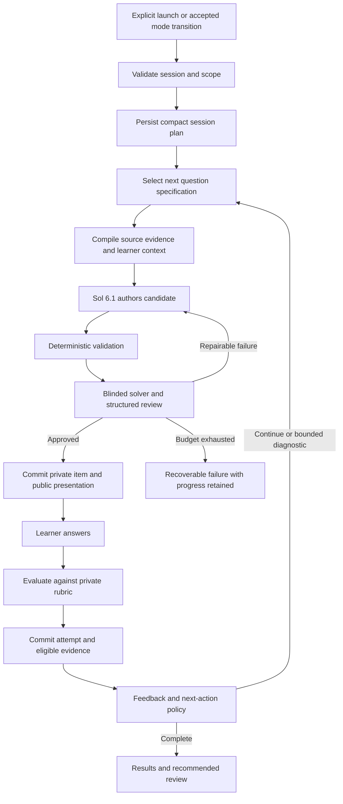

# Open Learn: quiz quality and experience implementation plan

Prepared: 2026-10-09

Status: Implementation handoff; this document does not claim the features below are implemented or deployed.

## 1. Objective and agreed direction

Improve the quiz experience around two customer complaints:

1. Questions are too weak: they should test conceptual understanding, meaningful reasoning, and appropriate challenge.
2. The question interface and generation experience need clearer structure and better usability, especially on mobile.

The user prefers a stronger question-authoring model, specifically Sol 6.1 through OpenRouter. Verify the exact available OpenRouter model identifier and supported request parameters before configuring it. Do not assume a display name is a valid API identifier, and do not silently substitute an unrelated or free model.

Deliver a complete integrated improvement: dedicated assessment model configuration, a compact quiz plan, richer question specifications, corrected quality checks, bounded diagnostic follow-ups, useful answer-specific feedback, a redesigned question interface, and reliable delivery. Establish a small quality benchmark alongside implementation.

Retain the existing workflow engine, ownership checks, stable concept mappings, evidence ledger, assistance tracking, and challenge mechanisms. Extend existing services rather than introducing a separate autonomous-agent framework.

## 2. Instructions for the implementing coding agent

- Inspect applicable AGENTS.md instructions and the current working tree before editing. Paths in this document describe the inspected repository; reconcile them with the latest code.
- Other agents have been working in this repository, including on dictation, chat, classification, and general agent execution. Preserve all unrelated changes. Do not reset, overwrite, or commit someone else's work as part of this feature.
- Prefer changes inside assessment services and quiz components. If shared chat, dictation, provider, usage, or workspace files must change, keep edits narrowly scoped and review the existing diff first.
- Use the implementation order and acceptance criteria below. Implement the backend, interface, compatibility, and recovery behavior together; adding fields or endpoints alone is not completion.
- Treat proposed module and field names as design suggestions. Reuse equivalent existing abstractions where possible and document final names.
- Verify live model availability and capabilities through official provider documentation or an authenticated model catalog. Never expose credentials in logs, reports, or commits.
- Distinguish offline tests, live provider checks, educator review, browser validation, and production deployment in the final report. Do not claim educational improvement based solely on mocked model tests.
- Do not block implementation on unavailable educator ratings: deliver the benchmark tooling and label pending human validation clearly. Do not manufacture reviews or measurements.
- Configure model integration and rollout according to existing project authorization and deployment practices. Report production status explicitly; a local feature flag or passing build does not establish deployment.

## 3. Current architecture to preserve and extend

The current quiz is an orchestrated assessment workflow. It creates a quiz record, prepares one question on demand, authors and checks that question, presents it, evaluates an answer, and commits evidence. JEV handles classification where enabled; it does not replace the generative author or written-answer evaluator.

| Existing area | Files to inspect | Role in this implementation |
| --- | --- | --- |
| Quiz session | `backend/app/quiz_service.py` | Creation, scope, question preparation, grading commits, pause/resume, history |
| Request and item schemas | `backend/app/assessment_models.py` | Public commands and private question contracts |
| Question planner | `backend/app/adaptive_question_planner.py` | Coverage and next assessment objective |
| Context budgeting | `backend/app/assessment_context_planner.py`, `backend/app/json_context_prompt.py` | Source/context selection and bounded model requests |
| Authoring and grading | `backend/app/assessment_generation.py` | Candidate author, quality checks, verifier, answer evaluation |
| Shared assessment lifecycle | `backend/app/assessment_lifecycle.py`, `backend/app/assessment_assistance.py`, `backend/app/assessment_adjudication.py` | Approval, presentation, private solutions, assistance, attempts, challenges |
| Durable commands | `backend/app/learning_routes.py`, `backend/app/workflow_store.py`, `backend/app/execution_worker.py` | Jobs, idempotency, leases, revisions, transactional commits |
| Provider transport | `backend/app/model_provider.py`, `backend/app/main.py` | Shared provider configuration and JSON requests |
| Usage controls | `backend/app/usage/`, `backend/app/usage_service.py` | Paid-model accounting, allowances, reservations, enforcement |
| Learner state | `backend/app/unified_learner_state.py`, `backend/app/learner_state_service.py` | Evidence projection; inspect actual admission path before extending |
| Control and hypotheses | `backend/app/learning_control_plane.py`, `backend/app/hypothesis_service.py` | Shared scope constraints and existing diagnostic hypotheses |
| Other entry points | `backend/app/review/`, `backend/app/in_class_service.py`, `backend/app/reminder_actions.py`, `backend/app/agent_execution/learning.py`, `backend/app/voice/` | Consumers of shared quiz/assessment behavior |
| Quiz interface | `web/components/quiz-workspace.tsx`, `web/components/assessment-card.tsx`, `web/components/quiz.module.css` | Setup, question states, answers, feedback, history |
| Frontend contracts | `web/lib/learning-workflows.ts` | API types, workflow execution, recovery |

Read the existing design documents before expanding learner modeling: `Open Learn 2.0/11_adaptive_quiz_planning.md`, its linked learner-state and misconception documents, `docs/EVIDENCE_LEDGER.md`, `docs/MISCONCEPTION_HYPOTHESES.md`, and `docs/UNIFIED_LEARNER_STATE.md`. Do not create competing sources of truth for these concerns.

### Confirmed limitations from the inspected implementation

- Quiz generation shares the app's lesson provider. The OpenAI transport hardcodes low reasoning effort; model configuration is not assessment-role-specific.
- Candidate JSON schemas are supplied in prompts, while the transport does not consistently enforce provider-level strict schema output.
- The planner mostly balances concept coverage and a small set of objectives. Adaptive difficulty resolves to standard or stretch, not a calibrated difficulty estimate.
- Author and checker use the same supplied provider. A separate call is useful, but their errors may remain correlated.
- The current answer-leakage heuristic compares choice text with the private solution. A correct solution naturally repeating an option is not evidence of a student-visible giveaway.
- Broad rejection of repeated reasoning families can prevent worthwhile repeated practice of a skill.
- Single- and multiple-choice scoring is exact-match. Written grading uses weighted rubric criteria and exact supporting response spans.
- Questions are prepared on demand, so model work can cause delays between questions.
- Timed quizzes use a deadline; the revised timing policy must explicitly address server preparation/grading time.
- The question UI exposes some internal objective vocabulary and largely shares a generic layout across formats.
- Generated study-context fallback is marked unverified and excluded from canonical performance evidence. Audit all legacy evidence paths as well; preserve that distinction consistently.

## 4. Scope and non-goals

### Required for this release

1. Assessment-specific model roles with Sol 6.1 as the requested authoring candidate.
2. Evaluation fixtures and tooling for a blind comparison against the existing baseline.
3. Versioned session plans and question specifications with coverage, reasoning targets, source requirements, and challenge preferences.
4. Improved authoring, independent solving, bounded repair, and corrected deterministic checks.
5. Structured answer-specific feedback and bounded diagnostic follow-ups.
6. A responsive question and feedback interface using the existing answer formats.
7. Consistent recovery, source freshness, assistance, evidence, and timer behavior.
8. A bounded background preparation path and feature-flagged rollout after correctness is established.

### Defer until data supports the investment

- A large reusable question bank or cross-user item marketplace.
- Fine-tuning models.
- Item-response theory or statistically calibrated mastery/difficulty claims.
- A committee of several model agents voting on every question.
- New question formats such as drawing, arbitrary simulations, or drag-and-drop unless separately scoped.
- Unbounded quizzes that repeatedly diagnose one weakness.
- New infrastructure providers or framework migrations solely for this feature.

Version and retain approved questions for audit now; this is not authorization to share private course content across users or reuse items indiscriminately.

## 5. Target flow



The server owns approval, scope, scoring policy, timing, evidence admission, and transitions. Model outputs are proposals validated by code. JEV remains in the existing classification layer; do not introduce a second generic intent classifier inside the quiz author.

## 6. Data contracts and persistence

Use explicit versioned schemas. Maintain existing public field names and serialization conventions unless a migration is required. Store new data through the existing assessment/workflow persistence where appropriate; avoid a new database subsystem.

### 6.1 Assessment model profile

Represent each role with `provider`, exact `model_id`, optional supported `reasoning_effort`, input/output budgets, timeout, retry budget, schema capability, and `profile_version`.

Required roles:

- `quiz_author`: requested stronger model through OpenRouter.
- `assessment_verifier`: separately configurable; begin with a measured capable configuration, without claiming that a different model guarantees independence.
- `written_answer_evaluator`: separately configurable and validated against grading examples.

Suggested configuration names are `AI_TUTOR_QUIZ_AUTHOR_MODEL`, `AI_TUTOR_ASSESSMENT_VERIFIER_MODEL`, and `AI_TUTOR_ASSESSMENT_EVALUATOR_MODEL`, with corresponding provider/effort/budget settings. Final names should follow existing configuration conventions.

Resolve an immutable configuration snapshot for each job. Record role and configuration per model call and accepted item. A worker restart or setting change must not silently alter the provenance of already prepared content.

### 6.2 Quiz session plan

Suggested fields:

| Field | Purpose |
| --- | --- |
| `schemaVersion`, `policyVersion` | Compatibility and decision trace |
| `conceptIds`, `canonicalConceptIds`, graph revision | Agreed, ownership-validated scope |
| `sourceRevisionRefs` | Material versions and any explicitly selected spans |
| `challengePreference` | `build_confidence`, `balanced`, or `challenge_me` |
| `feedbackPolicy` | `practice_immediate` or `exam_deferred` |
| `count`, `coverageTargets` | Fixed question budget and concept/capability coverage |
| `diagnosticBudget` | Follow-up allowance within the fixed question count |
| `requestedDurationSeconds`, `timingPolicy` | Optional server-owned answering allowance |
| `modelProfileVersion` | Authoring configuration lineage |

Separate challenge preference, feedback policy, and timed/untimed behavior. Do not overload the existing `topic_drill` / `timed_short_quiz` enum with three unrelated decisions. Define compatibility mappings for old difficulty fields and retain their interpretation for existing sessions.

Persist selected specs and decisions as the quiz progresses. Do not author a rigid full quiz at creation; reserve coverage and choose the next eligible specification from the latest accepted evidence.

### 6.3 Question specification

Extend `QuestionPlan` with:

- Stable identity, schema/policy version, parent quiz, and parent attempt for a follow-up.
- Target concept and capability, student level, prerequisite assumptions, and explicit scope constraints.
- Reasoning task, such as explain, predict, apply, diagnose an error, compare explanations, or transfer.
- Observable success criteria: what the answer must demonstrate.
- Intended challenge dimensions, such as number of conceptual steps and unfamiliarity of context. Store these as requested design properties, not empirical difficulty.
- Required source claims or passages and their immutable references.
- Allowed response format: existing single, multiple, or short; optional brief rationale for choice questions.
- Possible misconception to distinguish, alternative explanations, and expected distinguishing evidence. These remain private hypotheses.
- Public objective text that explains the task without disclosing its answer.
- Time estimate used for planning only, allowed assistance, and scoring policy.
- Previous-item exclusions and quality acceptance requirements.

Validate that a spec remains in scope and fits remaining coverage before sending it to the author. Do not silently expand into another course or prerequisite topic.

### 6.4 Authored item and verification result

Retain the existing candidate fields: stem, format, options, key, solution, weighted rubric, hints, sources, and family metadata. Add spec reference, explicit assumptions, private distractor rationale, and structured explanation elements where needed.

Verifier output should include a separately derived answer/solution, correctness findings, ambiguity findings, source support, skill alignment, visible answer cues, rubric adequacy, and actionable rejection reasons. Use explicit `pass`, `fail`, or `uncertain` outcomes for essential checks. A high average score must never override a known incorrect answer.

Private keys, distractor diagnoses, hidden hypotheses, rubrics, and verifier reasoning must not leak through presentation, prefetch, job status, or source endpoints. Use explicit public serializers instead of relying on increasingly long exclusion lists.

### 6.5 Answer evaluation and feedback

Preserve immutable learner response, selected choices, first-attempt/retry relationships, assistance lineage, source basis, and grading version.

Add structured feedback fields for demonstrated criteria, missed criteria, exact supporting spans, uncertainty reason, concise explanation, and recommended next action. Generate a safe legacy feedback string from these fields where old clients require it.

A suspected misconception is a proposed link to the existing hypothesis system. A selected distractor alone is insufficient to confirm a misconception.

Optional choice rationales must have a declared policy. For the first release, preserve exact-match choice scores and use a rationale as separate diagnostic evidence; conflicting choice and rationale must not produce an unqualified independent-success claim. If a composite scoring mode is later enabled, specify weights before presentation and test it explicitly.

## 7. Work package A: quality baseline and evaluation tooling

Build a small, representative evaluation dataset, initially around 30-50 cases as a practical starting target rather than a statistical guarantee. Cover the active product's subjects and learner levels, including:

- Concept explanation, prediction, transfer, numerical reasoning, and error diagnosis.
- Familiar and unfamiliar scenarios.
- Thin, conflicting, or unusable source material.
- Tempting distractors, ambiguous questions, and visible answer giveaways.
- Correct short answers, partial understanding, concise valid alternatives, and incorrect reasoning.

Use synthetic or explicitly authorized/de-identified data. Do not export private student responses into a shared fixture repository.

Implement an evaluation command that records exact source/spec inputs, model/prompt/schema versions, raw private artifacts in an access-controlled location, review outcomes, latency, token usage, repairs, and cost per approved item. Export a blinded comparison form with randomized order and hidden model identity. Human ratings and model ratings must be distinguishable.

Evaluate generation separately from grading. Hold back some reviewed cases from prompt development. Compare the existing baseline, Sol 6.1 with candidate effort settings, and any configured verifier choices. Stronger-model gains are hypotheses until measured.

Deliver an example report and instructions for adding fixtures. Set release thresholds after baseline measurement; do not invent results or claim a small test establishes production reliability.

## 8. Work package B: provider integration and budgets

1. Resolve the exact OpenRouter model and capabilities using current official metadata/documentation. Save the verified ID in configuration documentation, not hardcoded throughout services.
2. Add role-specific provider resolution without mutating the global lesson provider. Preserve existing credential ownership and trust boundaries.
3. Extend the provider interface to accept a response schema and supported reasoning settings. For unsupported strict output, validate server-side and use a documented bounded repair policy.
4. Ensure output allowances include the selected provider's reasoning/output-token semantics; the current generic output cap may truncate stronger reasoning requests.
5. Integrate every call, including repairs, verifier calls, grading, and background preparation, with existing usage reservation and settlement. Configure legitimate prices and limits through existing policy; never bypass enforcement to make a new model work.
6. Record actual responding model/provider where available. Do not silently route to an unapproved cheaper fallback.
7. Give each phase a timeout and each item a total attempt/cost budget. Preserve the current bounded-attempt behavior as a starting policy.

Acceptance: transport contract tests cover supported/unsupported schema modes, invalid configuration, rate limiting, malformed responses, truncation, timeouts, and accounting. An authorized live smoke check confirms the resolved model can produce the required contract; report if credentials/access prevent that check.

## 9. Work package C: planning and better questions

Extend the deterministic planner rather than adding an unconstrained planning agent. A model may propose content-specific specifications, but code validates scope, coverage, budget, and final selection.

Selection policy:

1. Honor explicit learner scope and challenge preference.
2. Reserve enough remaining slots for untouched agreed coverage.
3. Consider a bounded distinguishing question when evidence is ambiguous and the result could change the next teaching action.
4. Consider fresh independent verification after assisted success.
5. Include retention checks, missing capability evidence, or appropriate transfer work.
6. Finish at the agreed count; offer additional practice separately.

Challenge preference affects scaffolding, conceptual steps, and context novelty. It must not automatically expand the syllabus, increase reading complexity, or treat response speed as ability.

Give the author a concrete spec and the source passages needed to support both question and solution. Preserve learner evidence when it is necessary for the chosen objective; do not let context trimming silently remove required diagnostic information. If required context cannot fit, fail clearly or narrow the request through the existing workflow.

For course-specific questions, check source relevance and sufficiency as well as valid span IDs. Novel hypothetical scenarios are allowed when the governing concepts and assumptions are supported. Reference IDs alone do not establish correctness.

A good item should distinguish observable understanding. Example: ask whether constant rightward velocity implies a rightward net force, then require an explanation. A follow-up can distinguish confusion about velocity/acceleration from confusion about balanced forces. Do not turn this example into a hardcoded physics-only rule.

## 10. Work package D: correct and strengthen quality gates

Apply checks in order, retaining typed findings:

1. Schema, size limits, ownership, source revision, and target scope.
2. Option uniqueness, valid key cardinality, complete rubric, coherent assumptions, and presentation compatibility.
3. Student-visible answer cues: a stem explicitly naming the answer, grammatical cues, or implausibly different option structure. Treat heuristic findings cautiously; do not reject merely because the private explanation repeats the correct option.
4. Duplicate detection scoped to recent learner exposure and the planned objective. Different numbers alone do not make a new reasoning task, but repeated practice of the same skill is allowed when intentional. Avoid requiring novelty for its own sake.
5. Blinded independent solving with public question and necessary sources, without author key, rubric, or misconception labels that could reveal the answer.
6. Structured comparison with the author key, source support, skill alignment, and rubric. Use an additional model comparison only when it is needed; do not add a call solely to produce another approval.
7. Controlled numerical verification for a clearly bounded supported subset, such as arithmetic/units or algebraic equivalence. Use vetted parsers, expression limits, and time bounds. Never execute arbitrary model-generated Python or shell code. Report unsupported checks honestly.

On failure, repair only with specific findings and within the total attempt budget. On exhaustion, retain progress and provide a recoverable failure. Never lower correctness requirements to reach the requested question count.

Acceptance includes fixtures proving a correct option may appear in a private solution; a visible giveaway is detected; legitimate skill repetition is allowed; a near-duplicate is rejected; unsupported citations and incorrect numeric keys are blocked; author/checker disagreement cannot reach the learner as an approved item.

## 11. Work package E: feedback, diagnostics, and evidence

Retain deterministic exact-match choice scoring and conservative rubric-based written grading. Grade written work against content criteria, accepting concise and alternative valid reasoning; do not use writing length or stylistic sophistication as a proxy for understanding.

For ambiguous or inconsistent evidence, return uncertain feedback and consider one targeted diagnostic follow-up. Reuse the existing hypothesis service and question-plan diagnostic support. Do not add a second misconception database.

Initial follow-up policy:

- At most one diagnostic follow-up per originating answer.
- Reserve coverage before allocating a diagnostic slot.
- Follow-ups count toward the fixed quiz length and appear in progress as real questions.
- A clarification of the same answer must not create a second independent performance event.
- A new question can produce a separate event, but link it to its parent and any intervening instruction.
- If the solution or explanatory feedback was already shown, preserve that exposure and classify subsequent evidence appropriately. A follow-up is not automatically independent simply because wording changed.
- Practice sessions can offer diagnostics immediately. Exam-style sessions defer teaching and diagnostic follow-ups until after completion, as optional additional practice.

For the first release, require an explicit learner choice to start additional practice beyond the agreed count. Preserve the original score and session results.

Audit both canonical ledger and legacy evidence admission so source-context fallback, contested items, uncertain grades, hints, retries, and external help behave consistently. Question-generation failure must never become a learner failure.

Acceptance: duplicate submission/retry cannot duplicate evidence; a suspected misconception is not confirmed from one option; external help and exposed solutions survive refreshes; contradictory choice/rationale is handled conservatively; a challenged item is excluded while under review.

## 12. Work package F: question and feedback UI

Use existing design tokens, RichContent/math rendering, and accessibility patterns. Extend the current three answer formats rather than building a broad question-widget framework.

### Setup

Show topic/scope, question count, challenge preference, and optional timed/exam behavior with understandable labels. Preserve defaults for direct, lesson-linked, reminder, voice, and in-class launches. Avoid forcing a setup form on every launch when the request already supplies these choices.

### Preparation

Use stable placeholders and honest progress text such as preparing or checking a question. Do not show an invented percentage, raw model drafts, or internal verifier data. Retain the previous question and saved answer until the next approved presentation is ready.

### Answering

- Compact progress and topic information.
- Prominent scenario, any required data, and the actual question.
- Brief response instructions, including exact-match multiple-selection rules.
- Large selectable choice areas; clear focus and selection states.
- A comfortable written-response field with draft recovery.
- Optional short rationale when the spec requires diagnostic reasoning.
- One clear primary action; hints, sources, skip, and I don't know remain secondary.
- Plain-language purpose only when it helps; never show raw policy labels or reveal the misconception/key.
- Preserve self-reported outside help.

### Checking and feedback

Keep submitted work visible while grading. Prevent duplicate submission and provide recovery after timeouts without losing the response.

Feedback should show what was demonstrated, the specific gap or uncertainty, and one next action. Keep the full worked solution expandable. In exam-deferred mode, withhold keys, explanations, and revealing rubric data in backend responses until the session is finalized; hiding them in the UI is insufficient.

Results distinguish first attempts, assisted work, skips, uncertain evaluations, contested items, and retries. Keep the existing caveat that practice scores are not calibrated mastery rankings. Explain score denominators clearly.

### Mobile and accessibility acceptance

- Check widths around 320, 390, 768, and 1280 pixels.
- No horizontal page overflow; long equations or tables can scroll within their own container.
- Inputs and primary actions remain usable with an on-screen keyboard and safe-area insets.
- Avoid sticky controls covering the answer field, feedback, or browser navigation.
- Keyboard navigation, radio/checkbox semantics, focus transitions, screen-reader labels, and reduced motion work.
- Status announcements do not repeatedly interrupt the learner.
- Preserve drafts across navigation, reload, recoverable errors, and pending durable jobs.

## 13. Work package G: delivery, timing, and concurrency

### Background preparation

Implement after planning and evidence behavior are correct. Initially prepare at most one candidate ahead for a clearly eligible next objective. Avoid speculative generation when the current answer is likely to change the next objective.

Use a key including owner, quiz, plan/spec revision, source revisions, model profile, and relevant learner-state version. Do not put answer keys or unpublished candidates into browser caches. Prefer the existing durable job infrastructure.

A prepared candidate is not yet a presentation or an exposure. Validate scope, source freshness, remaining count, quality status, and relevance to the latest committed attempt before atomically promoting it. Discard stale candidates and settle usage honestly. A foreground and background request must not create two current questions.

### Timing policy

For new quizzes, maintain a server-authoritative answering allowance. Generation and grading intervals do not consume that allowance. Start an answering interval when the server makes an approved question available; define and document whether network delivery time is included. Do not trust arbitrary client timestamps to grant extra time.

Persist remaining allowance and interval start/state. On accepted submission, debit the answering interval once and enter checking. Invalid submissions do not stop the timer. Returning to an unanswered question after refresh or disconnect preserves elapsed answering time; disconnecting must not freeze the clock.

Pause/resume must be transactional and follow the session's declared practice/exam policy. Use server time and revision checks across devices. Add a versioned timing policy so existing deadline-based quizzes keep their old semantics unless explicitly migrated.

### Durable workflow requirements

Continue preparing model results outside write transactions and validate leases, scope, revision, and input freshness before commit. Ensure retries, cancellations, restarts, and duplicate requests cannot charge twice for the same reserved operation, create duplicate attempts, or publish stale results. Distinguish a billed provider call from an idempotent local replay.

Acceptance covers foreground/background races, source changes during preparation, simultaneous devices, model timeout, worker restart, exhausted allowance, and refresh during grading.

## 14. API and compatibility strategy

- Extend existing create/next/attempt/result commands where possible rather than creating parallel quiz APIs.
- Add optional request fields with backward-compatible defaults. Persist explicit versioned semantics for newly created quizzes.
- Preserve accepted-transition validation and deterministic idempotency when launched from a mode suggestion.
- Old saved quizzes must still display, submit answers, resume, and complete under their original contracts.
- Existing review/in-class/reminder/voice consumers must either support new fields or use deliberate compatibility defaults. Do not accidentally turn every review item into an exam-style quiz.
- Ensure server serialization withholds private content in every state, including completed jobs, history, challenged questions, pending prefetch, and exam-deferred results.
- Use the repository's migration mechanism for any added indexed fields/tables. Check the current migration head before choosing revision IDs; other agents may be adding migrations.
- Document rollback: flags can stop new v2 sessions while v2 sessions already underway continue to deserialize and finish safely.

## 15. Testing and verification

### Backend tests

Extend the existing assessment, workflow, context, review, hypothesis, voice, in-class, and usage tests as appropriate. Relevant starting files include `backend/tests/test_assessment_quality.py`, `backend/tests/test_assessment_context_planner.py`, `backend/tests/test_shared_assessment_phase5.py`, and `backend/tests/test_learning_workflows.py`.

Add meaningful tests for:

- Model-role resolution, capability negotiation, budgets, provider failures, and accounting.
- Coverage preservation and explicit scope across challenge preferences and diagnostics.
- Corrected leakage/family rules, malformed rubrics, unsupported sources, and verifier disagreement.
- Alternative written reasoning, contradictory rationale, uncertain grading, and assistance lineage.
- Fixed-count diagnostics and exam-deferred serialization.
- Source revision invalidation, duplicate commands, concurrent commits, and stale prefetch.
- Timer accounting during thinking, preparation, grading, reload, disconnect, pause, and resume.
- Legacy quiz compatibility and all shared assessment entry points.

### Frontend and browser tests

Use the existing Vitest/component tooling and repository browser-test practices. Cover every answer format and async state, keyboard operation, draft restoration, error recovery, deferred feedback, and mobile overflow. Run the applicable lint/type/build checks using the actual scripts in `web/package.json`; do not assume a test script exists without checking.

Suggested focused backend command, adjusted for the repository's Python environment:

```powershell
python -m pytest backend/tests/test_assessment_quality.py backend/tests/test_assessment_context_planner.py backend/tests/test_shared_assessment_phase5.py backend/tests/test_learning_workflows.py
```

Run the new tests and affected integration suites in addition to that baseline. A provider stub verifies contracts, not question quality. An authorized live provider test verifies connectivity and real response shape, not educational validity. Record each verification category separately.

### End-to-end acceptance journeys

1. Launch a lesson-linked quiz, answer several formats, view specific feedback, complete, and resume results after refresh.
2. Launch from an accepted chat mode suggestion with the same stable concept scope.
3. Answer with partial or ambiguous reasoning, receive one appropriate follow-up, and finish without exceeding count or losing coverage.
4. Use a hint and external help; confirm results and evidence preserve assistance.
5. Flag an incorrect/ambiguous item; confirm its score and evidence are excluded during review.
6. Take an exam-style quiz; verify no solutions leak before completion through any public response.
7. Use a timed quiz while generation and grading are deliberately slow; confirm only defined answering intervals consume allowance.
8. Change/delete a source while a candidate is prepared; confirm stale content cannot be published.
9. Recover from provider failure or worker restart with saved answers and no duplicated attempt.
10. Complete the mobile journey with long options, equations, keyboard, and screen-reader semantics.

## 16. Rollout and observability

Use existing feature-flag/configuration patterns. Suggested independently controlled behaviors: model profiles, question-spec v2, diagnostics, UI v2, timing v2, and prefetch. Store effective behavior versions on the session so mid-session flag changes do not alter its rules unexpectedly.

Deploy code with compatibility first, validate internal sessions, then expand new-session enrollment gradually. Keep classification behavior outside this change's rollout unless integration requires a narrowly scoped fix.

Record privacy-preserving metrics:

- Author/reviewer/evaluator latency and model configuration.
- First-question and between-question waiting time.
- Approval, repair, rejection, and provider-error rates by reason.
- Actual cost per approved question and completed quiz, including discarded prefetch.
- Completion, skips, abandonment, and usefulness feedback.
- Challenges and upheld invalidations; raw challenge rate alone is not correctness.
- Diagnostic frequency, coverage displacement, and whether follow-ups resolve uncertainty.
- Grading uncertainty and agreement with reviewed benchmark responses.

Do not put raw answers, source passages, credentials, or private rubrics in general logs. Keep review artifacts access-controlled and subject to existing deletion/retention policies.

Release requirements: no known blocker in correctness, evidence handling, source ownership, private-content serialization, compatibility, or timer behavior; meaningful benchmark improvement or explicitly documented pending human validation; acceptable measured latency/cost under configured limits. Treat completion and satisfaction as useful signals, not proof of learning gains.

## 17. Delivery order and completion checklist

| Milestone | Deliverable | Required exit evidence |
| --- | --- | --- |
| 1 | Baseline fixtures, benchmark runner, model-role configuration | Reproducible baseline; transport/accounting tests; verified model ID or explicit access blocker |
| 2 | Session/spec v2 and improved author/check pipeline | Scope/coverage and quality regression tests; comparable model outputs |
| 3 | Structured feedback and bounded diagnostics | Grading/evidence tests and complete follow-up journey |
| 4 | New question/feedback UI | Component checks and desktop/mobile browser validation |
| 5 | Timer v2 and bounded prefetch | Race, restart, accounting, stale-content, and timing tests |
| 6 | Controlled rollout and handoff | Flags, migrations, operational guidance, metrics, and honest validation report |

Before marking implementation complete, provide:

- The implemented file/module map and configuration reference.
- Verified OpenRouter author model ID and supported settings.
- Schema/API and migration compatibility notes.
- Tests run, results, live-provider status, and browser evidence.
- Benchmark outputs clearly distinguishing model ratings from educator review.
- Feature-flag defaults, rollback procedure, and status of existing quizzes.
- Known limitations, deferred work, and any remaining production setup.
- Explicit confirmation of which code was deployed, if deployment was part of the authorized execution scope.

Do not mark a feature complete merely because a schema, endpoint, mock, or isolated component exists. The deliverable is a working quiz journey with improved question design, reliable evaluation, clear presentation, and recoverable operation.
