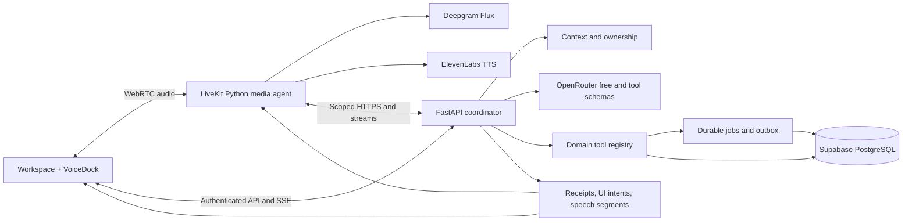

# Open Learn voice tutor: production implementation plan

Updated 5 October 2026. This replaces the earlier push-to-speak proposal with a complete production design. Work can be sequenced, but all launch requirements below belong to one release. No services, billing, or deployments are changed by this document.

## 1. Recommendation

Build **Talk to Buddy**, a persistent voice mode of the current workspace. Learners can discuss a concept, create and take a quiz, request a diagram, save notes, and schedule reminders in one conversation. Normal application panels show the work. Voice and clicks use the same domain services, permissions, and saved artifacts.

The product direction is strong. Buddy should know **how to use the platform and retrieve relevant information**, rather than claim to know everything. Give it active course, selected note, current question, recent conversation, and available capabilities. Retrieve deeper evidence on demand and clarify missing context.

Use one coordinator with typed tools. Quiz generation and graphics planning may contain specialist reasoning; reminders do not need another autonomous agent. Delegate substantial work through durable jobs. Keep permissions, mutations, and success receipts deterministic.

**Selected services:** LiveKit Cloud + Python Agents for media; Deepgram Flux for transcription; ElevenLabs Flash/Turbo streaming TTS; existing FastAPI tutor + OpenRouter for reasoning; Supabase for identity/data; Vercel web; always-on Render API and supervised application workers.

**Constraints:** preserve `openrouter/free` and prohibit automatic paid model fallback as previously requested. Variable availability/model selection limit predictable production latency and scale. Sleeping free compute cannot provide dependable background execution. This plan specifies production infrastructure, but paid activation requires a separate budget decision. Production code alone cannot remove these service constraints.

## 0. Current implementation status

The application-side implementation is present in this release candidate: authenticated room/session APIs, bounded LiveKit grants, owner-scoped durable turns/actions/events/usage, transcript and replay, provider-backed speech, reconnection, the persistent responsive dock, typed actions over existing learning services, and a disabled-by-default feature switch. LiveKit Cloud, Deepgram, and ElevenLabs accounts and credentials are provisioned, and the LiveKit production worker is running. The real provider/browser acceptance run has not passed yet; the voice backend release, migrations, and end-to-end acceptance remain release gates. The activation checklist and secret locations are in [VOICE_TUTOR_PROVIDER_SETUP.md](VOICE_TUTOR_PROVIDER_SETUP.md). Treat sections 20–22 as release gates; local UI fixtures and mocks do not satisfy them.

## 2. Research and alternatives

Primary documentation informs this recommendation. Product observations do not establish undocumented internal architectures. Prices are a dated snapshot, not a quote.

| Platform | Public integration pattern | Application to Open Learn |
| --- | --- | --- |
| Gemini Live | Voice operates connected apps, subject to account/connection availability. [Google help](https://support.google.com/gemini/answer/15274899), [announcement](https://blog.google/innovation-and-ai/products/gemini-app/productivity-features-gemini-live/) | One conversation spans capabilities; show actual action results and unavailable connections. |
| Duolingo Video Call | Speaking practice is embedded in learning; learning-designer instructions shape conversations. [Duolingo](https://blog.duolingo.com/ai-and-video-call/) | Pedagogical purpose and patient pacing matter more than a voice personality alone. |
| LiveKit Agents | Structured frontend RPC and configurable turn handling. [Frontend tools](https://docs.livekit.io/agents/logic/tools/forwarding/), [turns](https://docs.livekit.io/agents/logic/turns/) | Open normal artifacts while speaking; backend receipts remain authoritative. |
| ElevenLabs Speech Engine | Connects an existing backend over WebSocket while handling speech/conversation mechanics. [Documentation](https://elevenlabs.io/docs/overview/capabilities/speech-engine) | A valid integrated alternative that preserves our tutor logic. |
| ElevenLabs Agents | Exposes conversation-flow controls. [Documentation](https://elevenlabs.io/docs/eleven-agents/customization/conversation-flow) | Earlier claims that it inherently offers little turn-taking control were too strong. |
| Pipecat Cloud | Managed voice execution, separate inference costs. [Pricing](https://www.daily.co/pricing/pipecat-cloud/) | A credible alternative, not limited to phone applications. Choose one framework. |

Speech-to-speech models can invoke backend tools; they do not inherently remove a tutor harness. Separate STT/reasoning/TTS is our architectural preference for explicit text, controlled validation, provider replacement, and existing lesson artifacts. Vendor latency rankings are not measured Open Learn performance.

## 3. Providers and economics

| Layer | Selection | Boundary |
| --- | --- | --- |
| Media/hosting | LiveKit Cloud + Python Agents | Authorized room; hosted agent handles audio and interruption. No persistent audio proxy in Vercel functions. |
| STT | Deepgram Flux English; supported multilingual configuration for enabled languages | One authoritative endpointing strategy, not conflicting detectors. [Integration](https://docs.livekit.io/agents/models/stt/deepgram/) |
| TTS | ElevenLabs Flash/Turbo, supported pinned model and licensed stock voice | Stream approved text, use pronunciation dictionaries; keys remain server-side. [Streaming API](https://elevenlabs.io/docs/api-reference/text-to-speech/stream) |
| Speech alternative | Cartesia Sonic, evaluated/pinned | Approved fallback after quality, commercial and retention review; otherwise text fallback. |
| Reasoning | FastAPI coordinator → OpenRouter `openrouter/free` | Real tool schemas and validated results; no paid fallback. |
| Actions | Existing lesson/quiz/visualization/note/flashcard/reminder/execution services | Domain ownership, revisions, durable effects, jobs. |
| Persistence/auth | Supabase Auth, PostgreSQL, private storage | Server-owned access; no browser bypass around domain services. |
| Application hosting | Vercel web, always-on Render API and necessary workers | Scale jobs separately from media. |
| Operations | OpenTelemetry, redacted logs, provider dashboards | IDs/timings/outcomes/cost, no default audio or full-prompt recording. |

LiveKit fits the persistent web workspace. ElevenLabs is a preferred voice candidate, not an empirically proven winner: evaluate against Cartesia on math, accents, names, and long explanations. Flux is chosen for conversation handling, not minimum transcription price.

ElevenLabs Speech Engine reduces integration work but its listed speech price is higher than our illustrative modular usage. Pipecat Cloud lists agent-1x active compute at $0.01/minute and reserved capacity separately; competitive, but no clear reason to run both frameworks. [Pipecat pricing](https://www.daily.co/pricing/pipecat-cloud/)

Do not self-host speech GPUs without utilization evidence. Educational graphics use the existing structured renderer: editable, accessible diagrams without image-generation fees. Raster art, telephony, video, avatars, and arbitrary screen control are separate capabilities.

### Published prices and model

LiveKit Ship starts at $50/month, includes 5,000 agent minutes, lists $0.01/minute additional agent time and 20 concurrent sessions. Media/features have separate allowances. [LiveKit pricing](https://livekit.com/pricing)

Deepgram lists Flux English at $0.0065/minute with a $0.0077 regular rate shown; multilingual Flux is $0.0078/minute. Budget for non-promotional rates. [Deepgram pricing](https://deepgram.com/pricing)

ElevenLabs lists Flash/Turbo at $0.04/1,000 characters and Speech Engine at $0.08/minute. Avoid budgeting around temporary v4 discounts. Cartesia Sonic through LiveKit Inference is $50/million characters on Build/Ship; direct subscription economics differ. [ElevenLabs pricing](https://elevenlabs.io/pricing/api), [inference pricing](https://livekit.com/pricing/inference), [Cartesia pricing](https://www.cartesia.ai/pricing)

M = connected agent minutes, A = billable STT minutes, C = synthesized characters. Silence can consume session/STT time; interrupted synthesis may already be billed.

`Subtotal = $50 + $0.01 × max(0, M − 5,000) + $0.0065 × A + $0.04 × C / 1,000`

Assume A=M and 400 synthesized characters per connected minute:

| Monthly minutes | Agent plan/overage | STT | TTS | Subtotal |
| ---: | ---: | ---: | ---: | ---: |
| 1,000 | $50 | $6.50 | $16 | $72.50 |
| 10,000 | $100 | $65 | $160 | $325 |
| 100,000 | $1,000 | $650 | $1,600 | $3,250 |

These calculations exclude API/workers, database/backups, media/egress overages, monitoring, tax, and separately approved paid reasoning. Direct Deepgram/ElevenLabs billing is assumed; no duplicate gateway charge. Promotional credits ignored. Capacity-driven plan changes alter the bill; monthly minutes do not prove sufficient concurrency.

At 800 characters/minute, TTS doubles. Using $0.0077 STT adds $1.20/$12/$120 respectively. Above included agent time the illustrative marginal subtotal is $0.0325/minute, about $0.325 per ten minutes. Quote the full infrastructure after load sizing.

Enforce allowances, one active session/account by default, bounded tool loops/output, usage reservations and a server kill switch. Proposed defaults: 30-minute sessions with explicit extension; idle warning after two minutes and disconnect after a further minute, with accessibility extensions. Stop providers server-side: token expiry does not end an existing connection. Budget headroom covers billing lag.

### OpenRouter production constraint

The free router filters by requested capabilities but selects from a changing pool and documents availability/latency/rate-limit variability. [Free router](https://openrouter.ai/docs/guides/routing/routers/free-router), [limits](https://openrouter.ai/docs/api_reference/limits)

Retain it, record selected models, and fail visibly when a turn cannot complete. Predictable large-scale reasoning needs demonstrated free capacity for the launch envelope or separate authorization for a pinned paid route selected by evaluation. Do not promise a free-model SLA or quietly change billing. This is a launch dependency, not a reason to remove tool functionality.

## 4. UI/UX and placement

Add a waveform **Talk to Buddy** beside Send in `chat-composer.tsx`. Keep the compact top navigation; keep sidebar search removed. Voice is an interaction mode across the workspace, distinct from text Conversation and In-Class recording.

First activation: compact microphone selector/input meter, language, processing/transcript notice, Start. No capture before a user gesture. Returning users can start with existing permission. Denial leaves typing available and provides device guidance.

During a call, persistent **VoiceDock** above the composer shows Buddy, written state, restrained level animation, Mute mic, Stop speaking, Captions, settings, End. It survives panel changes. Minimize to a bottom-edge pill with visible mic state and End, never invisible background listening.

```text
+------------------+---------------------------------------------------------+
| Existing sidebar | Existing slim navigation                                |
| Courses/Recents  +---------------------------+-----------------------------+
|                  | Buddy conversation        | Study workspace             |
|                  | You: Make five questions. | Quiz: Photosynthesis        |
|                  | Creating quiz...          | Question 1 of 5             |
|                  | [Quiz ready · Open]       | [A] ... [B] ...             |
|                  |                           | Answer by voice or click     |
|                  +---------------------------+-----------------------------+
|                  | Buddy · Listening [Mute] [Stop] [Captions] [End]        |
| Account          | Type or talk...                        [Talk] [Send]   |
+------------------+---------------------------------------------------------+
```

Reuse split panels for quizzes/notes/flashcards. Diagrams render in the lesson with Expand; add a typed visualization panel only where needed. Reminder receipts show exact date/time, timezone, real channel, Edit and supported Undo. Do not block every artifact with a modal.

Mobile: active artifact in main viewport; 64–80px dock above safe area; captions/transcript in bottom sheet. Returning to chat keeps voice active. Focused voice screen is optional. Minimum 44px touch targets, keyboard equivalents, visible focus, screen-reader labels, reduced motion, and typed access to all tools. Announce states, not every caption token.

Background tabs, phone calls and audio-device changes can suspend media. Show Paused/Reconnecting; require resume when microphone state is uncertain. Do not promise background mobile-web listening. End/sign-out stop tracks, playback and connections.

### Interaction behavior

- Hands-free by default; optional hold-to-talk for noise/accessibility.
- Patient endpointing for student pauses; “I'm still thinking” and Done speaking controls. Tune against student examples, not a one-second silence cutoff.
- Barge-in stops local audio immediately. “Stop talking” stops speech; “cancel quiz creation” targets the task. Neither deletes committed work.
- Partial captions cannot mutate state. Clarify uncertain dates, names, equations, and choices. Transcript corrections cannot silently repeat writes.
- Speak concise explanations, then let the learner respond. Show exact equations with readable spoken forms; explain code rather than all punctuation.
- Resolve “this diagram” against versioned UI focus. Ask when ambiguous. Hidden/unrelated resources are not implied context.
- Background work completion creates a ready chip; mention it at a natural boundary.

Transport: idle → connecting → connected → reconnecting → ended/failed. Conversation: listening ↔ learner-speaking → thinking/tool-running → Buddy-speaking, with muted/paused overlays. Tasks separately track proposed/awaiting-input/confirmation/queued/running/succeeded/failed/cancelled/unknown.

End may leave already authorized jobs running. Explain pending work and offer separate Cancel pending work. Never silently cancel saved artifacts.

## 5. Voice capabilities

| Request | Tool and visible result | Rule |
| --- | --- | --- |
| Explain this simply | `tutor.explain` → lesson/citations/speech | Existing Journey/context pipeline. |
| Make five questions from this chapter | `quiz.create` → durable job → quiz panel | Resolve active material; ask only for missing context. |
| B… actually C / hint / next | `quiz.answer/hint/next` → grade/question update | Final accepted utterance, presentation ID and expected revision; never grade partial captions. |
| Draw how these processes connect | `visual.create` → diagram/chart/timeline/simulation | Validated spec, no model-generated executable JavaScript. |
| Label that arrow / increase the rate | `visual.update` → revised artifact | Supported schema operations and known target/revision. |
| Save the explanation | `note.create` → saved note or explicit draft | Saved means committed; existing-note replacement needs diff/confirmation. |
| Make flashcards from my mistakes | `flashcards.create` → deck/review | Actual attempts, not guessed mastery. |
| Remind me tomorrow at seven | `reminder.create` → schedule receipt | Clarify AM/PM; IANA timezone/exact date; configured channel. |
| Move that reminder / undo that | `reminder.update/cancel` → receipt | Known target; no fictional universal undo. |
| Open biology notes / what should I revise | `workspace.open`, `context.search`, `study.recommend` | Owner-scoped retrieval and evidence. |
| Summarize our conversation | `session.summarize` → summary/optional note | Summary is not assessed mastery. |

External calendar/messages, purchases, deletion, arbitrary browsing/code and raster art require real integrations and their policies. A microphone grants no extra authority. Complete voice supports actual platform capabilities, not imaginary tools.

Acceptance journey: create quiz from today's chapter → panel opens → read first question → spoken answer → existing grading → diagram of missed concept → explain diagram → save note → clarify/create reminder → linked summary. Artifacts survive reload.

## 6. Architecture and end-to-end flow



Media agent handles STT/TTS/interruptions. A custom pipeline adapter calls Open Learn rather than independently running another reasoning loop. LiveKit supports pipeline customization; pin and contract-test the SDK. [Pipeline nodes](https://docs.livekit.io/agents/logic/nodes/)

1. Browser authenticates and requests voice for the current chat. Backend checks ownership, entitlement, allowance and capacity, reserves usage, creates session.
2. Backend issues short-lived room-scoped participant token and dispatches one agent. Agent gets a separate backend capability bound to owner/session/room/operations/expiry, never database superuser credentials.
3. Browser publishes audio. Show Listening only when agent is ready. Final STT gets stable utterance ID; partial/eager recognition cannot execute tools.
4. Agent submits text; coordinator deduplicates, validates context IDs, retrieves bounded evidence/history.
5. Model proposes speech, clarification or typed calls. Policy validates schemas, ownership, revision, confirmation, budget. Long work returns job receipts.
6. Effects commit with outbox events. UI gets artifact references; agent gets truthful status. “Created” follows succeeded receipt, not a proposed call.
7. Validated speech segments are synthesized; agent reports played/interrupted state. UI renders canonical rich artifact/captions.
8. Reconnect retrieves snapshot/events after sequence, not write resubmission. End stops providers, settles usage, optionally queues idempotent summary.

## 7. Proposed contracts and policies

These are additions, not existing endpoints.

Tool request: `callId`, `voiceSessionId`, `turnId`, `toolName`, `schemaVersion`, `arguments`, `expectedRevision`, `idempotencyKey`. Trusted capability injects owner; model arguments never establish identity.

Result: `status`, `receiptId`, `jobId?`, `artifactRef?`, `revision?`, `userMessage`, `uiIntent?`, `retryable`, `errorCode?`. Distinguish pending/confirmed/succeeded/failed/unknown. Strict Pydantic schemas, bounds, and domain validation apply.

```json
{
  "sequence": 42,
  "type": "artifact.ready",
  "voiceSessionId": "voice_123",
  "turnId": "turn_8",
  "callId": "call_2",
  "receiptId": "receipt_2",
  "artifact": {"kind": "quiz", "id": "quiz_77", "revision": 1},
  "uiIntent": {"action": "open_quiz", "targetId": "quiz_77"}
}
```

Browser validates allow-listed intent, fetches resource through normal authenticated API, maps to `openWorkspaceQuiz`. Never arbitrary HTML/script/URL/DOM selectors. Protect unsaved editors. If focus changed, show Open chip instead of navigating. UI acknowledgement means displayed/declined/stale, not mutation success. LiveKit RPC can accelerate presentation; durable events/reconciliation remain authoritative.

| Proposed API | Purpose |
| --- | --- |
| `POST /v1/voice/sessions` | Idempotent create, room token, limits/expiry/context revision. |
| `GET /v1/voice/sessions/{id}` and `/events?after=...` | Owner-scoped snapshot/SSE replay. |
| `PATCH /v1/voice/sessions/{id}/context` | Versioned focus hints with ownership checks. |
| `POST /v1/voice/sessions/{id}/turns` | Scoped agent submission, bounded text, unique utterance. |
| `POST /v1/voice/actions/{id}/confirm` | Exact arguments/hash/revision and expiry. |
| `POST /v1/voice/sessions/{id}/interrupt` and `/end` | Speech cancellation separate from shutdown. |
| Internal agent callbacks / verified LiveKit webhooks | Playback, usage, lifecycle; explicit authentication/replay protection. |

Requested reversible creation/navigation can execute directly. Clarify missing fields. Confirm overwrite/deletion/external messages/consequential changes. Spoken yes can confirm ordinary actions; sensitive changes require visible confirmation. Bind yes to one pending action with expiry; changed arguments invalidate it.

Default four sequential tool steps/turn with bounded output and overall deadline. Parallel independent reads; serialize dependent writes. Multi-action requests become visible job chains. Stable IDs, unique constraints and transactions provide one effect where possible; never claim exactly-once network delivery. External timeout after submission becomes unknown until reconciled. Retrieved documents cannot confer authority.

## 8. Code integration map

This describes the local checkout, which contains unrelated uncommitted work. Reconcile with release branch before implementation.

| Existing code | Integration |
| --- | --- |
| `web/components/learning-workspace.tsx`, `learn-chat.tsx`, `chat-composer.tsx` | Session provider above changing panels; Talk/dock; existing course/Buddy/mode state. |
| `workspace-panel.tsx`, `quiz-workspace.tsx`, `buddy-reminders.tsx`, `visualization.tsx` in `web/components/` | Reuse artifact UI, add focused visual presentation where needed. |
| `web/lib/workspace-events.ts` | Existing quiz/note/source/flashcard open events; validated adapter, dedupe/stale-focus protection. |
| `web/lib/account-session.ts`, `api.ts` | Reuse authentication; explicit account-change/sign-out teardown. |
| `web/lib/generation-stream.ts`, `learning-workflows.ts` | Reuse replay/cancel/artifact identity; associate voice turns instead of isolated history. |
| `backend/app/generation_routes.py`, `generation_service.py` | Inject shared manager lifecycle; avoid duplicate managers interrupting existing generations. |
| `backend/app/model_provider.py` | Current stream emits strings, not a general tool loop. Add typed coordinator text/tool events, retain lesson compatibility. |
| `context_compiler.py`, `context_engine.py`, `journey_service.py` in `backend/app/` | Bounded owner-scoped retrieval and revisions; UI focus is a hint. |
| `backend/app/learning_routes.py`, `quiz_service.py` | Existing jobs/create/grade/hint, presentation identity and evidence rules. |
| `visualization_planner.py`, `visualization_models.py`, `visualization_service.py` in `backend/app/` | Typed creation/update adapters, no unrestricted generated code. |
| `reminder_routes.py`, `reminder_service.py`, `reminder_worker.py` in `backend/app/` | Idempotent scheduling/routines/delivery status; scheduling is not delivery. |
| `backend/app/agent_execution/{coordinator,tools,repository,worker}.py`, `backend/app/execution.py` | Compatible durable execution/leases/outbox; audit recovery, add voice provenance/policy. |
| `backend/app/identity_middleware.py` | Bypasses non-HTTP scopes; new WebSockets require explicit auth. Control API uses HTTP/SSE. |
| `backend/app/live_transcription.py`, `mobile_routes.py`, `web/lib/live-lecture-transcription.ts` | Class/dictation remain separate; their capture heuristics are not conversation runtime. |

Proposed additions: `web/components/voice/{voice-provider,voice-dock,voice-transcript,voice-settings,voice-action-card}.tsx`; `web/lib/voice/{client,events,ui-intents}.ts`; `backend/app/voice/{routes,contracts,coordinator,tools,store,policy,speech,usage}.py`; separate `voice-agent/` Python deployment with pinned dependencies. Add Alembic migrations, contract fixtures, consented evaluation data and runbook.

## 9. Context and teaching quality

Start with course/Buddy IDs, selected sources/text, quiz presentation, recent turns, timezone and small learner-state summary. Retrieve deeper evidence as needed. Recheck ownership/revisions. STT gets audio and bounded vocabulary hints; TTS gets speech text; reasoning gets necessary evidence, not the whole library.

Distinguish generated content, released speech and played content. Interrupted explanation is not fully heard. Playback is not assessment evidence. Existing grading updates learning state; ASR confidence and “I understand” do not prove mastery.

`generation.completed` means persisted, not independently fact-checked. Add explicit speech-release checks: grounding where applicable, equations/units, valid artifact schemas, no leaked quiz answers, faithful spoken form. Never pipe raw `text.delta` into TTS. Release validated semantic segments; hold dependent derivations until checked. Deterministic “I'm checking that” can precede slow output. Speaking unchecked claims and correcting them afterward is recovery, not standard verification.

Cache versioned authorized context and reusable pronunciation, never cross-owner private content. Summaries link artifacts, have idempotent identities and follow source retention policy.

## 10. Persistence, hosting and security

Persist `voice_sessions` (owner/chat/room/status/lease/budget), `voice_turns` (utterance/transcript/revision/state), `voice_actions` (tool/arguments hash/confirmation/idempotency/result), `voice_events` (sequence/payload), `voice_speech_segments` (text/artifact/release/playback), `voice_usage` (reservations/provider IDs/settled units). Owner-scoped indexes and unique constraints apply. Integrate retention/export/delete; reference domain artifacts rather than duplicating them.

Outbox and monotonic replay survive disconnect. Persist leases/fencing/cancellation so restarts cannot produce competing coordinators. Reconcile outstanding provider calls before billable retries. Separate live speech from authorized jobs that survive a call.

Admission control considers the smallest capacity among agents, STT, TTS, model quota, workers and DB pools. Queue/reject before capture. Approximate peak concurrency as peak arrivals/minute × average duration, then load-test bursts. Monthly minutes alone do not size concurrency. Media workers must not hold DB connections while waiting for speech.

Production requires always-on API and necessary learning/reminder/execution workers. Review the existing paid Blueprint, not blindly deploy every service. Render Free can sleep after inactivity and restart; it cannot be the sole executor of time-sensitive promised actions. [Render limits](https://render.com/docs/free)

Keep Supabase with tested backup/restore, pool limits, storage quotas, migration recovery. Hosted setup documents Oregon API/US East DB: measure cross-region latency and plan colocation if needed. Proposed general-artifact recovery targets: RPO 24 hours, RTO four hours, subject to verified backup coverage. Tighter commitments require corresponding infrastructure.

Room-specific grants, short credentials, server deadlines, verified callbacks, replay protection, strict origins, staging/production separation, and revocation are required. Account change/sign-out ends voice and cancels uncommitted actions. Renew capabilities only while authorized. No provider/database secrets in browser bundles.

Explain microphone processing and transcript retention before use. Default no raw-audio storage/provider dashboard recording; verify vendor settings/contracts rather than assuming application policy controls them. Proposed operational-event retention: 30 days; transcript follows chat policy; usage ledger retains non-content billing fields. Delete/export covers transcripts, summaries, artifacts and supported provider copies. Student/institutional launch requires appropriate consent, age, data-processing and school-agreement review; this plan is not legal-compliance certification.

## 11. Failure behavior and operational targets

| Failure | Experience and recovery |
| --- | --- |
| Mic denied/device missing | Device guidance, text available, no abandoned billable session. |
| Network loss | Reconnecting/muted until confirmed; replay receipts, dedupe utterances, never replay effects. |
| Uncertain date/answer | Short clarification, no speculative mutation. |
| Model timeout/quota | Honest unable-to-finish status; saved work accessible; bounded safe retry, no paid fallback. |
| Tool timeout after submission | Checking status; reconcile before retry or failure claim. |
| TTS outage | Text, optional approved fallback, preserved artifacts; stop failed synthesis. |
| Interruption | Immediate silence; invalidate old speech epoch, retain committed effects. |
| Allowance exhausted | Explain allowance, offer text, stop streams and settle usage. |
| Deploy/crash | Drain/reconnect, restore durable state, no duplicate execution. |

Acceptance targets, not current measurements: p95 local stop-speaking <200ms; p95 warm-path connection readiness <3s; p95 first useful audio <3s for simple turns on the qualified route; visible job status <1s after backend acceptance; 99.9% monthly successful session establishment excluding explicit permission denial. Measure all dependencies, not just vendor media uptime. Free-model performance may block these goals.

Trace final transcript/endpointing, retrieval, model first token, tool latency, validation, first audio, interruption, reconnect, duplicate effects, wrong tool selection, artifact-open success and cost/session. Correlate session/turn/call/generation/job IDs without private content. Alert on failures, quotas, orphaned sessions, leases and spend. Document incident owner, provider disablement, draining and rollback.

## 12. Workstreams and production gates

These are dependencies for one complete release, not limited product versions.

1. Contracts/audit: reconcile branch, inventory tools, define ownership/revisions/confirmations, establish evaluation set.
2. Durable coordinator: typed tool loop, shared generation lifecycle, context/jobs/outbox/receipts, idempotency, deletion/export.
3. Media runtime: room/auth/dispatch, Flux turns, ElevenLabs segments, barge-in/playback, quotas/recovery.
4. Workspace UX: dock/captions/settings/mobile, artifact intents, quiz answers, graphics, notes, flashcards, reminders, editor protection.
5. Operations: always-on execution, backups/privacy, capacity, telemetry, migrations and graceful drain.
6. Complete acceptance then monitored rollout under server flag. Controlled exposure protects production without removing scope.

Required launch evidence:

- Real authenticated quiz → answer → grade → diagram → note → reminder journey, with artifacts intact after reload.
- Concurrent voice/click edits preserve revisions and unsaved notes.
- Cross-account rooms/resources and forged intents rejected; uploaded prompt injection cannot authorize tools.
- Duplicate transcripts/webhooks/confirmations and crash between commit/acknowledgement cause no duplicate quiz/reminder/grade.
- Human review of thinking pauses, accents, math, noise, echo, interruption and supported languages. Suggested gates: ≥95% correct tool intent/required arguments on 200+ labeled commands; zero unauthorized effects in security suite; ≥90% complete task success across representative testers. Report sample limitations.
- Chrome, Edge, Safari/iOS Safari, Android Chrome: permissions/audio unlock/reconnect, keyboard/screen-reader/safe-area tests and clear text fallback.
- Forecast peak +50% burst headroom meets provider/DB/worker/admission/latency limits.
- Usage reconciles with vendor records within agreed tolerance; abandoned sessions close; cutoff handles billing lag.
- Reminder delivery with browser closed on the enabled channel; scheduling alone does not pass.
- Restore/export/delete/outage/drain/flag rollback exercised; no audio/secrets in ordinary logs or bundles.

Release only when the complete experience passes within a stated browser/language/capacity envelope. Keep OpenRouter free unchanged unless separately authorized. A polished voice interface cannot compensate for unavailable reasoning or sleeping workers.
